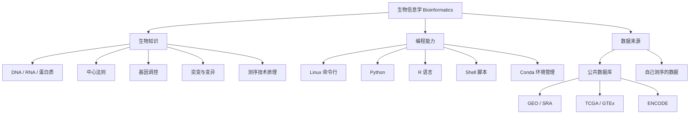
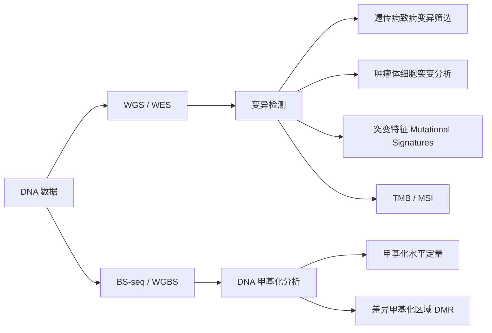
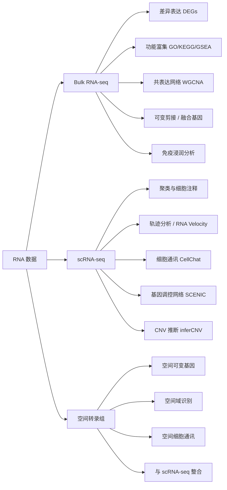
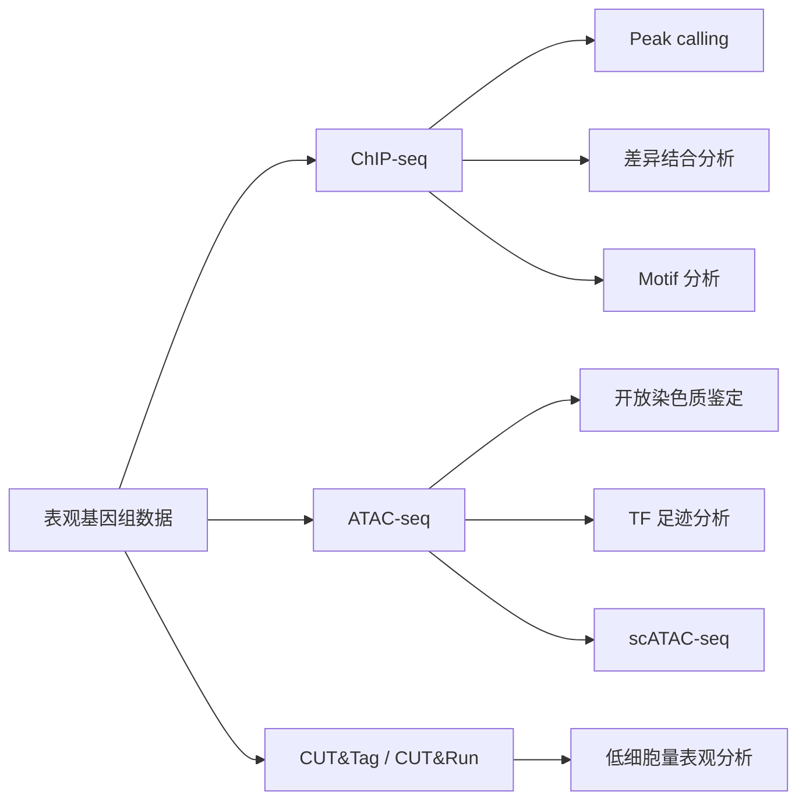
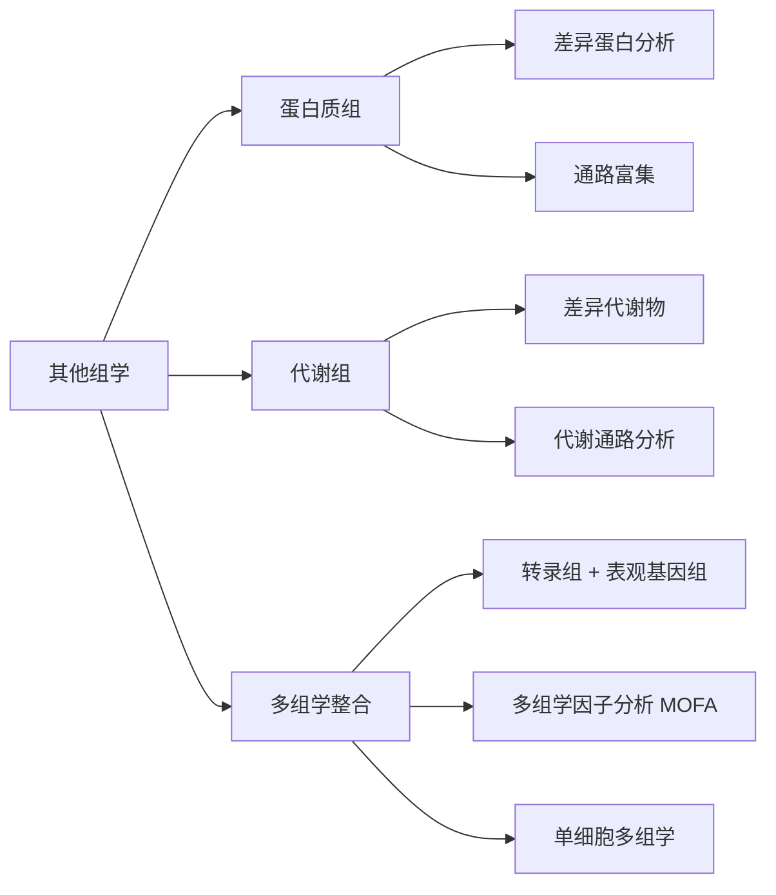
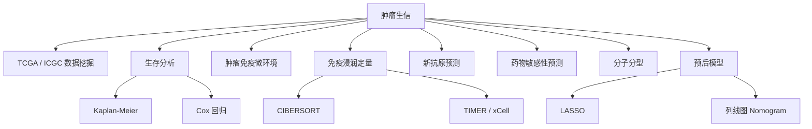
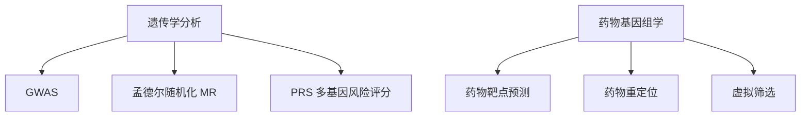
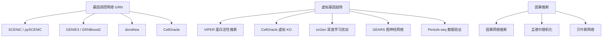
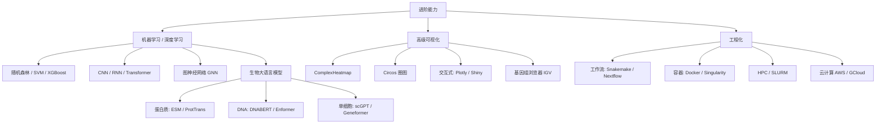
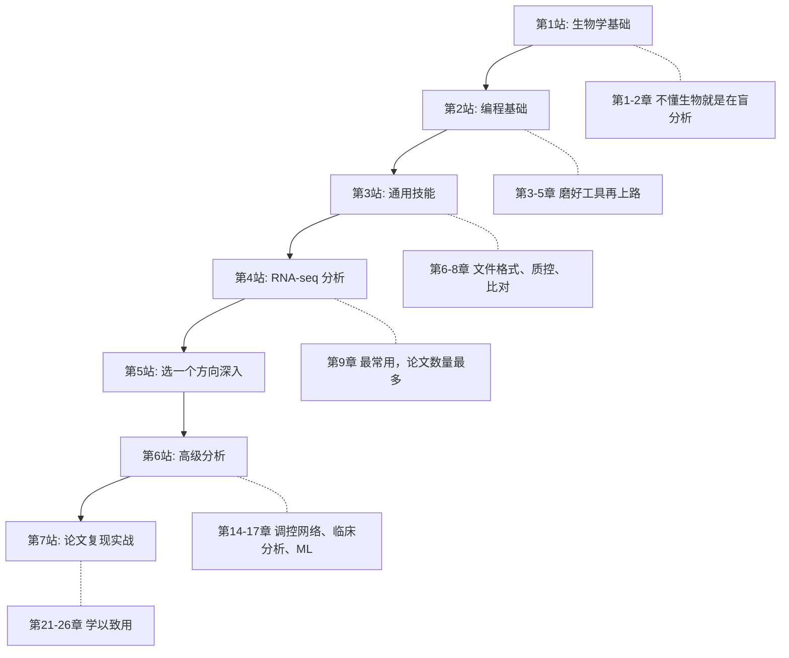

# 技能树导图 —— 一张图读懂生物信息学全貌

> 在开始学习之前，先用几张技能树看清楚：生信到底在干什么？每个技术解决什么问题？它们之间有什么关系？
> 不用背下来，随时回来查阅就好。

---

## 技能树总览

生物信息学 = **生物知识** + **编程能力** + **数据**。三者缺一不可。

**怎么理解这张图？**

- **左边**是你需要的生物学知识——不需要背教科书，但需要理解"数据代表什么意思"
- **中间**是你需要的编程工具——生信分析全靠命令行和代码
- **右边**是数据来源——你可以用公共数据库里的数据做分析，很多论文就是靠挖掘公共数据发表的

---

## 核心技术分支：我测了数据，能分析什么？

这是最重要的一张图。根据你手上的数据类型，对应不同的分析方向。

### DNA 数据（基因组）

- **WGS**（全基因组测序）/ **WES**（全外显子测序）：找 DNA 上的变异（SNP、Indel、CNV、结构变异）
- **BS-seq / WGBS**：看 DNA 上哪些位置被甲基化了（表观遗传调控）

### RNA 数据（转录组）

转录组是生信分析中**论文最多**的方向：
- **Bulk RNA-seq**：最成熟，一团细胞的平均表达
- **scRNA-seq**：近年最火，单个细胞分辨率
- **空间转录组**：最前沿，保留组织空间信息

### 表观基因组数据

### 蛋白质组 / 代谢组 / 多组学

---

## 临床/转化分析技能树

如果你的研究方向偏临床，这些是你要重点关注的分析：

### 肿瘤生信

> 肿瘤生信是目前**发文章数量最多**的方向，很多"生信文章"本质上就是 TCGA 数据挖掘 + 免疫浸润 + 生存分析 + 预后模型。

### 遗传学与药物基因组学

---

## 基因调控网络与虚拟扰动技能树

这是一个比较前沿的方向——**不做实验，用算法预测"敲掉一个基因会发生什么"**。

核心思路：
1. 先从数据中**推断出基因之间的调控关系**（GRN）
2. 然后在计算机里**模拟敲除某个基因**，看细胞状态会怎么变
3. 最后与真实实验（Perturb-seq / CRISPR）对比验证

---

## 进阶与工程化技能树

当你掌握了基础分析后，这些进阶能力会让你更强：

---

## 技能树阅读指南：推荐学习路线

不知道从哪开始？按这个顺序走：

**第5站：选一个方向深入**

| 方向 | 对应章节 | 热度 |
|------|---------|------|
| 肿瘤方向 | 第10章（变异）+ 第15章（肿瘤免疫） | ★★★★★ 发文最多 |
| 单细胞方向 | 第12章（scRNA-seq） | ★★★★★ 最火技术 |
| 空间组学 | 第13章（空间转录组） | ★★★★ 最前沿 |
| 表观方向 | 第11章（ChIP/ATAC-seq） | ★★★★ |
| 遗传学方向 | 第16章（GWAS / MR / PRS） | ★★★★ |
| 虚拟扰动方向 | 第14章（GRN / 虚拟 KO） | ★★★ 新兴方向 |

### 几点建议

1. **不要试图一口气学完所有分支**——先走通一条主线，再横向拓展
2. **RNA-seq 是必学的**——它是最基础也是应用最广的分析，很多其他分析（免疫浸润、WGCNA、GSEA）都建立在 RNA-seq 数据之上
3. **边学边做**——每学完一章就找一个公共数据集练手，光看不练是学不会的
4. **善用公共数据**——GEO、TCGA 里有海量免费数据，完全可以用来练习和发论文
5. **这份技能树会随着你的学习不断更新**——当你学完某个分支后再回来看，会有完全不同的理解

---

> **准备好了吗？让我们从第一站开始！** → [第1章 生命的语言：从 DNA 到蛋白质](01-dna-to-protein.md)
