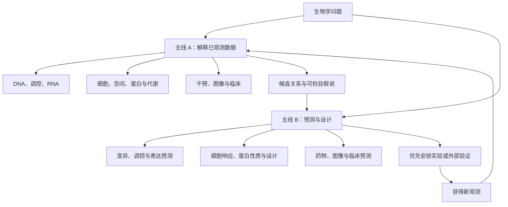
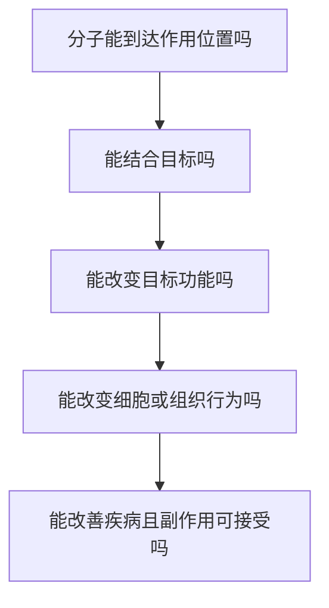

# 生物信息学总览：两条主线，把生物问题翻译成计算任务

> 先问“我要认识什么、预测什么、设计什么”，再问“需要什么数据和方法”。测序数据分析是生信的重要组成部分；序列功能预测、蛋白质设计、药物筛选等也属于这张地图。

本页按**研究目标**建立两条主线，再在每条主线下按生物层面展开。每个任务都说清五件事：**任务、输入 X、输出 Y、基本原理、输出的生物学含义**。这里不讲机器学习算法本身，重点是把问题定义清楚。

## 一、先看整个框架

| 主线 | 核心问题 | 典型交付 |
| --- | --- | --- |
| **主线 A：从观测数据识别生物状态与变化** | 已经测到的数据说明发生了什么、发生在哪里、有哪些关联？ | 变异列表、差异基因、细胞组成、空间区域、候选机制 |
| **主线 B：预测新对象或新条件的结果，并辅助设计** | 对尚未测量的对象、性质或条件，可能发生什么；下一步值得测什么？ | 功能/响应预测、风险估计、候选排序、新序列或分子设计 |



这两条主线不是按“自己有没有做湿实验”划分。主线 A 可以分析公共数据，也可以使用预训练模型；主线 B 的训练标签通常来自已有实验，预测之后仍需验证。测序本身也是实验，蛋白质组、图像和药物活性测量则可能完全不依赖测序。

一个项目可以来回经过两条主线，同一种工具也可能服务于不同目标。例如用参考模型为已测细胞注释，是解释当前观测的一部分；预测一个未做过的基因敲除，则以新条件的结果为目标。分类是为了明确任务，不是给算法贴永久标签。

### 把输入与输出写成能执行的约定

- **对象是谁**：一段序列、一个变异、一个蛋白、一个细胞、一位患者，还是一个“药物—靶点”组合？
- **生物背景是什么**：物种、组织/细胞类型、疾病、处理、剂量、时间、实验平台？
- **输入提供了哪些信息**：原始测量、处理后的矩阵、结构、图像、标签或知识库；新对象上是否也拿得到这些信息？
- **输出是什么单位**：计数、比例、概率、风险分数、坐标、排序或候选结构？
- **怎样判断正确**：技术质量、统计不确定性、独立样本、未见对象/条件、或实际实验验证？

“预测基因 A 的表达量”还不够明确；“给定某细胞类型、指定处理和时间，预测 A 的某种表达测量”才逐渐形成计算任务。表达量、蛋白活性、结合强度和治疗效果有不同标签，不能只用一个“有效”混在一起。

## 二、主线 A：从观测数据识别生物状态与变化

这条主线通常从**测量 + 样本信息 + 必要参考**出发，得到某个状态、变化或关联的估计。“已经测过”不表示直接看到了最终答案：变异、细胞类型和通讯等仍可能需要复杂推断。

### A1. DNA：遗传信息改了哪些地方

基因是 DNA 上具有特定功能的一段区域；变异可以发生在基因内部，也可以位于调控区。“拷贝数”则是一段 DNA 有多少份。

| 常见任务 | 输入 X | 输出 Y | 大概怎么做 | 生物学含义 |
| --- | --- | --- | --- | --- |
| 识别生殖系变异 | 样本 DNA reads、参考基因组、样本信息 | SNV/Indel 列表、基因型、置信度 | 比对定位，综合多条读段与局部单倍型证据 | 这个样本的 DNA 相对参考有哪些差异 |
| 识别肿瘤特有变异 | 同一患者的肿瘤与匹配正常 DNA 数据 | 候选体细胞变异、等位基因比例与过滤信息 | 比较肿瘤/正常支持，考虑污染、纯度和技术伪影 | 哪些变化可能在肿瘤形成中获得 |
| 识别 CNV/SV | DNA reads/比对结果、匹配参考或对照 | 拷贝数区段、重排断点及支持证据 | 汇总覆盖变化、异常双端、跨断点与长读长证据 | 某段 DNA 是否多了、少了、翻转或换了位置 |

例如一个碱基改变可能使蛋白质中一个氨基酸改变，即使 RNA 表达完全不变，也可能影响功能。**找 DNA 变化与找表达变化是两个任务。** 候选变异的后果预测属于 B1，实验后果的测量则可再回到主线 A。详见[第10章](10-variant.md)。

### A2. 基因调控：哪些“开关”改变了

启动子、增强子可以先理解为参与调控表达的 DNA 区域；转录因子是参与识别序列和调控表达的蛋白质。不同细胞的 DNA 大体相同，却会使用不同基因集合。

| 常见任务 | 输入 X | 输出 Y | 大概怎么做 | 生物学含义 |
| --- | --- | --- | --- | --- |
| 寻找开放性变化 | ATAC-seq、区域计数、样本/供体和分组 | 差异可及区域、变化幅度与统计证据 | 统一候选区域，按生物样本计数和比较 | 哪些区域在特定条件下更易被访问 |
| 检测结合或修饰富集 | ChIP/CUT&Tag 等、合适对照及重复 | 富集 peaks、差异结合/修饰区域 | 比较局部信号与背景，再在统一区间做组间比较 | 某蛋白或标记与哪些区域关联 |
| 分析甲基化变化 | 位点甲基化/未甲基化计数、覆盖和分组 | 甲基化比例、DMS/DMR | 考虑覆盖及样本变异，比较位点/区域 | 某些位置的化学标签是否变化 |
| 联系调控区与基因 | 开放性、表达、位置，可加 Hi-C 等接触信息 | “区域→基因”的候选联系及评分 | 结合共变化、距离和接触证据筛选 | 哪个开关可能控制哪个基因 |

A 表达升高后，可追问其增强子是否更活跃、某 TF 是否有更多支持。开放、结合、接触和表达都是不同测量，关联仍不足以证明完整因果链。详见[第11章](11-epigenomics.md)。

### A3. RNA：哪些基因被使用了，生成了什么版本

表达矩阵可以记成 **N 个样本 × G 个基因**，也有工具按“基因 × 样本”保存，读入时要核对方向。格子可能是原始计数，也可能是标准化表达，不能混用。

| 常见任务 | 输入 X | 输出 Y | 大概怎么做 | 生物学含义 |
| --- | --- | --- | --- | --- |
| 差异表达 | 原始计数矩阵、分组、批次/配对等 | 每基因 log2FC、统计量、校正显著性 | 调整测量尺度，用样本间变异评估组间效应 | 哪些基因在条件间表达不同 |
| 功能/通路富集 | 基因排序，或候选集合及可检验背景；已知基因集 | 富集条目、方向或统计量、相关成员 | 看某类基因是否比背景更集中，或集中在排序某一端 | 零散变化可能涉及哪些过程 |
| 剪接/转录本使用分析 | 剪接 reads、BAM 或转录本丰度及注释 | 事件使用比例 PSI、ΔPSI、转录本比例 | 利用连接位点/转录本支持比较不同拼接版本 | 同一基因的 RNA 版本是否改变 |
| 共表达分析 | 多样本的合适表达矩阵、表型 | 模块、模块与表型关联、候选 hub | 找在样本间共同变化的基因组并概括趋势 | 哪些基因可能共同反映一种状态 |

计数受测序深度和采样影响，不是每细胞绝对 RNA 分子的精确数量。通路富集也不直接证明酶活性升高。总表达不变而剪接版本改变，同样可能有功能后果。详见[第9章](09-rnaseq.md)。

### A4. 单细胞与空间：变化属于谁，位于哪里

组织平均表达升高可能来自**同类细胞每个表达更多**，也可能来自**高表达的细胞类型占比增加**。这是拆解组织信号最重要的区别之一。

| 常见任务 | 输入 X | 输出 Y | 大概怎么做 | 生物学含义 |
| --- | --- | --- | --- | --- |
| 细胞类型注释 | 细胞×基因矩阵、marker/参考标签、样本背景 | 每细胞类型或状态及不确定性 | 结合表达相似性、多 marker 和参考映射 | 组织里有哪些细胞 |
| 比较细胞组成 | 多个样本的注释细胞、供体与条件 | 各类型比例变化及统计证据 | 按独立样本汇总，考虑组成分母和采样偏差 | 哪些细胞群变多或变少 |
| 特定类型差异表达 | 同类型细胞原始计数，保留供体/条件 | 该类型的差异基因 | 按供体汇总或用适合层级结构的模型 | 变化具体发生在哪类细胞 |
| 识别空间域/空间基因 | 表达、位置，可加组织图像 | 区域标签、局部表达模式 | 联合表达相似性与空间邻接，检验位置关联 | 变化位于核心、边缘或其他区域 |
| 空间组成估计 | 混合 spot 表达、单细胞参考 | 类型丰度/权重及不确定性 | 用参考表达分解混合信号 | 一个位置可能由哪些细胞组成 |
| 推断细胞通讯 | 类型表达、配体–受体先验，可加空间关系 | 候选发送细胞—信号—接收细胞关系 | 检查发送/接收相关分子及位置支持 | 提出细胞相互影响的假说 |
| 轨迹/调控状态推断 | 表达及必要的剪接、调控先验等 | 相对状态顺序、局部趋势或调控模块活性 | 从邻近结构、动力学假设或模块一致性推断 | 概括已观测细胞中的可能状态关系 |

配体和受体像“信号”和“接收器”。RNA 共表达不等于真的发生通讯；轨迹也不是时间录像。干预新条件后的状态预测另见 B4。详见[第12章](12-scrna.md)、[第13章](13-spatial.md)。

### A5. 蛋白质与代谢：功能执行者及其产物发生了什么

蛋白质的**含量、三维结构、活性**要分开。蛋白多了不保证更活跃；某个磷酸化位点改变，也可能在 RNA 不变时影响功能。

| 常见任务 | 输入 X | 输出 Y | 大概怎么做 | 生物学含义 |
| --- | --- | --- | --- | --- |
| 蛋白质含量比较 | 质谱肽段/蛋白定量、样本分组 | 差异蛋白及不确定性 | 鉴定与错误控制、肽段归属、定量和组间比较 | 哪些执行功能的分子含量改变 |
| 修饰位点分析 | 磷酸化等修饰肽段、位点定位信息，可加总蛋白量 | 修饰位点变化及统计证据 | 核对位点归属，区分蛋白总量与修饰相关变化 | 某种化学标记是否改变 |
| 代谢物与通路分析 | LC-MS/GC-MS 等、注释、批次和分组 | 差异代谢物、候选代谢过程 | 峰识别、对齐、定量、注释与统计 | 细胞代谢产物的状态是否改变 |

质谱中的一个峰不必然唯一对应一个分子；修饰富集信号也不自动等于修饰占有率。结合其他组学能增加线索，但不是把表格拼在一起就得到机制。多组学方向见第 18 章的既有规划。

### A6. 药物与靶点：已有干预实验告诉我们什么

靶点是希望通过干预产生效果的生物对象，常见为蛋白质。疾病相关基因只是候选起点，**改变了什么**与**干预它能否改善结果**需要不同证据。

| 常见任务 | 输入 X | 输出 Y | 大概怎么做 | 生物学含义 |
| --- | --- | --- | --- | --- |
| 分析基因敲除/药物实验 | 干预身份、对照、剂量/时间、表达或生长测量 | 效应量、响应基因/状态及统计证据 | 比较合适对照，考虑重复、批次和实验设计 | 实际做了这次干预后观察到什么 |
| 分析剂量反应 | 多剂量、时间下的活性/存活测量及对照 | 反应曲线、IC50 或可支持的其他参数 | 拟合合适曲线，检查剂量范围与效应上下限 | 在这个实验条件中响应如何随剂量改变 |
| 整理靶点证据 | 遗传、扰动、表达、通路和已知功能 | 每候选的支持/冲突证据及优先级 | 对齐疾病背景、干预方向和不同证据来源 | 哪些靶点值得进一步验证 |

靶点排序可以连接 B6：用当前证据选择尚未测过的干预。单个药物降低细胞存活，可能由脱靶作用引起，不能直接证明它是通过目标蛋白完成的。

### A7. 图像与临床：分子变化表现成什么

| 常见任务 | 输入 X | 输出 Y | 大概怎么做 | 生物学/医学含义 |
| --- | --- | --- | --- | --- |
| 细胞图像量化 | 显微图像、尺度、必要标记 | 轮廓、计数、形态和强度特征 | 分割对象，提取可定义的几何/信号测量 | 细胞数量、形态、状态如何分布 |
| 药物形态响应分析 | 对照/用药图像、剂量时间、批次 | 形态变化、样本相似性与候选作用模式 | 对齐处理，比较可重复的形态特征 | 哪些药物引起相似的表型 |
| 病理组织分析 | 切片、病理标注及图像尺度 | 组织区域、细胞分布、形态指标 | 区域/细胞识别与空间量化 | 已观察组织的病变位置和结构 |
| 临床结局关联 | 临床/组学、随访时间、事件和混杂因素 | 生存曲线、关联效应和不确定性 | 正确处理删失、参照组和统计设计 | 哪些因素与已观测结局相关 |

图像分割可能本身由预测模型完成，但这里的研究目标是量化当前样本。把模型部署到新患者并评估其预测能力，则进入 B7。图像与临床涉及生物医学 AI 的交叉领域，并不都由当前教程详细覆盖。

## 三、主线 B：预测新对象或新条件的结果，并辅助设计

这条主线的关键是：**输出代表尚未测得的性质、条件结果或候选方案**。输入可以包含大量已有测量；“新”可以指未见过的变异、序列、分子、患者或干预组合。

训练标签的含义决定输出能解释什么。学习了某种细胞系的实验标签，不自动适用于另一种组织；只预测排序分数，也不能直接宣称得到了校准概率。

### B1. DNA：这个变异可能造成什么后果

| 常见任务 | 输入 X | 输出 Y | 大概怎么做 | 生物学含义 |
| --- | --- | --- | --- | --- |
| 预测变异功能影响 | 具体变异、参考/替代序列、注释和相关背景 | 对蛋白、剪接或调控的影响分数 | 比较改变前后序列/上下文，结合进化与实验标签 | 为未验证的 DNA 改动提出功能假说 |
| 估计遗传疾病风险 | 多位点基因型、效应权重，必要临床因素 | PRS 或经校准的风险估计 | 汇总遗传效应并在目标人群校准/验证 | 研究遗传背景与未来疾病风险 |

预测变异有害与判定患者致病变异不同；后者还需遗传方式、表型及证据评估。PRS 通常是相对遗传倾向，绝对风险还取决于人群、年龄、基线发病率等。相关方向在第 10、16、17 章中有不同程度的覆盖或规划。

### B2. 调控：一段序列在特定细胞里可能怎样工作

| 常见任务 | 输入 X | 输出 Y | 大概怎么做 | 生物学含义 |
| --- | --- | --- | --- | --- |
| 预测启动子/增强子活性 | DNA 序列、实验/细胞背景 | 活性或实验信号预测值 | 从序列模式与背景估计训练目标对应的测量 | 这段序列可能怎样影响调控 |
| 预测染色质开放信号 | 序列、细胞背景或相关测量 | 指定位置的可及性预测 | 学习序列/背景与已有开放性测量的关系 | 新区域或变异后的开放倾向 |
| 预测 TF 结合 | 序列、指定 TF、必要细胞状态 | 结合分数/概率或信号 | 综合序列偏好与可访问性等上下文 | 哪些位置值得做结合实验 |
| 预测调控区域—基因联系 | 位置、序列、表达/可及性、接触先验 | 未验证联系的评分 | 综合多种证据，为候选边排序 | 优先验证哪个“开关→基因”关系 |

模型若只接收序列，预测范围通常受训练时的背景与输出轨道限定。模型给出的结合概率也不等于体内该位点一直被占据。A2 侧重整理当前观测支持，B2 侧重对未验证对象或状态给出预测，两者常连接。

### B3. RNA：预测未测的状态、表达或剪接版本

| 常见任务 | 输入 X | 输出 Y | 大概怎么做 | 生物学含义 |
| --- | --- | --- | --- | --- |
| 根据表达预测状态 | 新样本表达，训练时有疾病/反应标签 | 类别、亚型或校准的概率 | 将表达模式与明确标签对应，在独立样本评估 | 新样本更可能属于何种状态 |
| 预测表达量 | 调控序列、细胞类型、处理/时间等，依模型而定 | 某基因或表达向量的预测值 | 从背景条件估计实验定义下的表达 | 尚未测量条件下可能有怎样的表达 |
| 预测剪接影响 | 含变异的 DNA/RNA 序列及必要背景 | 剪接位点使用概率、事件变化等 | 比较序列改变对剪接选择的预测影响 | 变异是否可能改变 RNA 版本 |

训练表中“治疗反应”必须明确，例如某时间点肿瘤缩小比例或细胞存活率，不能混成一个无定义的标签。表达预测也要写清是 counts、相对表达、标准化值还是其他实验读数。

### B4. 细胞与空间：干预后会怎样，未测的位置是什么状态

| 常见任务 | 输入 X | 输出 Y | 大概怎么做 | 生物学含义 |
| --- | --- | --- | --- | --- |
| 基因扰动响应预测 | 初始细胞状态、敲除/激活基因、时间等 | 处理后表达、变化向量或状态分布 | 学习已有扰动响应，或在调控模型上模拟干预 | 优先验证哪些干预可能改变细胞状态 |
| 药物扰动响应预测 | 细胞背景、药物、剂量、时间 | 表达响应、状态分布或存活等指定终点 | 将已有条件响应外推到未测条件 | 哪种药物/剂量值得进一步测试 |
| 空间表达/类型映射预测 | 图像、参考表达、坐标及已测区域，依任务而定 | 未测区域的表达或类型分布估计 | 用参考与空间/形态关系推断缺失信息 | 提出未测空间状态的候选地图 |

通俗地写就是：

```text
细胞初始状态 + 干预 + 剂量 + 时间 → 处理后的状态或状态分布
```

单细胞实验常破坏被测细胞，因此往往没有“同一个细胞处理前后”的精确配对。很多模型学习的是群体或条件之间的变化；输出一根箭头不代表实际追踪了这个细胞。

预测一个没见过的敲除、没见过的细胞类型和没见过的组合是不同泛化任务，评估需分别说明。CellOracle、GEARS 等提供不同形式的建模路线，具体方向对应第 14 章的既有规划。

### B5. 蛋白质：它可能长什么样、做什么，还能怎样设计

| 常见任务 | 输入 X | 输出 Y | 大概怎么做 | 生物学含义 |
| --- | --- | --- | --- | --- |
| 结构预测 | 氨基酸序列，可加同源序列、模板、伙伴 | 三维原子坐标及置信度 | 根据结构规律、进化与训练信息估计空间构象 | 提出蛋白或复合物的结构假说 |
| 功能预测 | 序列、结构或相关上下文 | 功能标签、酶类别、过程 | 根据与已有功能证据的关联估计未知性质 | 未知蛋白可能承担什么工作 |
| 突变效应预测 | 原始蛋白、氨基酸替换、实验背景 | 稳定性、活性或适应度相关分数 | 比较改变前后结构/序列及实验关系 | 哪些替换可能改变性质 |
| 相互作用预测 | 两个蛋白的序列/结构及必要背景 | 相互作用评分、界面或复合物结构 | 评估兼容性、共进化或接触构型 | 哪些伙伴可能一起工作、怎样接触 |
| 蛋白质设计 | 目标结构、结合对象、功能和可制造性约束 | 候选序列/结构及排序 | 在约束下提出候选，再预测、筛选、实验迭代 | 为目标功能设计待测试的分子 |

结构置信度不是对功能/结合/治疗效果的通用保证；预测结构也不覆盖蛋白所有动态构象。生成的序列还需检验表达、折叠、溶解性、稳定性和具体功能。当前教程没有完整的蛋白结构与设计实战，本页先建立任务位置。

### B6. 药物与靶点：把“有效”拆成具体终点

| 常见任务 | 输入 X | 输出 Y | 大概怎么做 | 生物学含义 |
| --- | --- | --- | --- | --- |
| 靶点优先级排序 | 疾病遗传、表达、扰动和机制证据 | 候选靶点及可能干预方向 | 汇总支持/冲突证据，估计值得测试的策略 | 优先抑制或激活谁 |
| 药物靶点预测 | 小分子与候选蛋白表示、必要背景 | 候选靶点或分子—蛋白作用分数 | 依据已知配对与分子特征评价新配对 | 一个分子可能作用于哪些对象 |
| 结合亲和力预测 | 分子、蛋白及实验背景 | Kd、Ki 等指定指标的估计 | 将结构/序列与明确的实验亲和标签联系 | 预测结合强弱 |
| 结合姿态预测 | 小分子与蛋白三维结构 | 位点中的坐标与朝向 | 搜索并评分可能接触构型 | 推测如何接触 |
| 功能活性预测 | 分子、靶点、实验条件 | 抑制/激活类别或 IC50 等读数 | 以功能实验而非仅结合标签建模 | 结合后是否改变被测功能 |
| 细胞药物响应预测 | 药物、细胞背景、剂量、时间 | 存活率、反应曲线或表达变化 | 建立药物—背景—条件与响应的关系 | 在特定细胞中可能产生什么效果 |
| 药代与毒性预测 | 分子结构、剂量/物种/体系等 | 溶解度、清除率、代谢或毒性指标 | 对不同性质分别定义标签和评估 | 是否可能达到暴露并有可接受的安全性 |
| 候选分子生成 | 靶点、性质目标、结构/合成约束 | 候选结构及排序 | 提出候选，按多目标筛选，再实验反馈 | 哪些分子值得合成和测试 |

**Kd** 描述结合平衡，在可比条件下通常越低亲和力越强。**Ki** 是特定模型下的抑制常数，**IC50** 是在指定实验条件下让所测响应降低 50% 的浓度，受底物、时间和实验体系等影响。它们不能不加区分地混为同一种训练标签。



每一步都有不同输入、标签和验证。对接分数高不等于亲和力已测得，亲和力强不等于抑制有效，细胞里有效也不等于患者获益。把这条链拆开，才知道当前模型实际解决了哪一段。

### B7. 图像与临床：对新样本预测状态或结局

| 常见任务 | 输入 X | 输出 Y | 大概怎么做 | 生物学/医学含义 |
| --- | --- | --- | --- | --- |
| 新图像的分割/识别 | 新显微/病理图像，训练有轮廓/类别标签 | 轮廓、区域类别或细胞状态 | 从标注建立图像到目标的对应并评估外部数据 | 自动识别新样本中的对象 |
| 药物作用模式预测 | 用药后图像、训练的机制/活性标签 | 机制类别、表型相似性或候选排序 | 将形态表示与已有标签关联 | 为新药物提出作用方式假说 |
| 预后与治疗结局预测 | 临床、组学、图像及已观测结局标签 | 生存/复发风险或特定治疗下响应概率 | 正确处理随访/删失，在独立人群评估区分与校准 | 估计新患者在指定背景下的结局 |

“接受治疗 A 的人可能怎样”与“同一个人换成 B 是否更好”是不同任务。后者涉及治疗因果效应，不能从一般的结果预测直接推导。临床部署还需要目标人群与时间范围的外部验证，图表相关概念可查[第20章](20-visualization.md)。

## 四、把两条主线连起来：为一种肿瘤寻找干预方法

下面是研究路径示例，**A 是假设的候选基因，不是已经得到的研究结论**。

| 步骤与主线 | 输入 | 输出 | 目前能认识什么，下一步缺什么 |
| --- | --- | --- | --- |
| 1. A：比较组织 | 肿瘤/正常 RNA-seq、样本设计 | A 表达升高及统计证据 | A 与肿瘤状态相关，尚不知道变化属于哪类细胞 |
| 2. A：定位细胞与区域 | 单细胞、空间与组织标注 | A 主要在某恶性细胞群/区域升高 | 找到来源，尚未证明干预 A 有益 |
| 3. A↔B：评估干预价值 | 遗传、CRISPR/药物扰动、机制证据 | 抑制/激活 A 的候选方向和支持证据 | 支持或削弱 A 作为靶点的理由 |
| 4. B：筛候选分子 | A 的序列/结构、候选分子及具体目标 | 结合或功能活性预测与排序 | 选出值得测试者，尚未证实真实效果 |
| 5. A：测量效果 | 候选处理后的活性、存活、表达与对照 | 实际剂量响应及机制相关测量 | 检查预期效应、脱靶和背景依赖 |
| 6. B→A：选择下一轮 | 新实验结果、模型和约束 | 更新候选/实验设计，再得到新观测 | 缩小不确定性并继续迭代 |

最关键的跨越是：**“A 发生变化” → “干预 A 能带来想要的改变”**。第一步是状态描述，后一步需要干预或其他足够有力的证据。总览的意义就是把这个缺口摆出来，而不是用一串软件名把它略过。

## 五、怎样进入后面的教程

### 两条主线共享的基础

生物知识帮助定义输出的含义；编程与统计帮助把任务实现和评估；数据来源、质量与版本决定输入是否可信。训练/验证划分要围绕真正的新对象，例如患者、供体、蛋白家族、分子骨架或未见扰动，不能仅随机拆分高度相似的记录后宣称广泛泛化。

| 学习入口 | 对应章节 | 在整个框架中的位置 |
| --- | --- | --- |
| 生物学概念与测量 | [第1章](01-dna-to-protein.md)、[第2章](02-sequencing.md) | 理解 DNA/RNA/蛋白与实验输出 |
| 编程和数据表达 | 第3–5章、[第6章](06-file-formats.md) | 两条主线共同的实现与数据基础 |
| 测序数据处理 | [第7章](07-data-qc.md)、[第8章](08-alignment.md) | 需要原始测序输入时的基础，并非所有生信任务的必经步骤 |
| 观测组学分析 | [第9章](09-rnaseq.md)至[第13章](13-spatial.md) | 当前正文主要展开 A1–A4 |
| 调控/扰动、临床、遗传、预测与多组学 | 第14–18章 | 既有规划含两条主线的连接点，目前仍以提纲为主 |
| 工作流与图表 | [第19章](19-workflow.md)、[第20章](20-visualization.md) | 让两条主线的结果可复现、可检查 |
| 蛋白设计、完整药物研发、图像预测 | 当前没有完整独立章节 | 本页先定位任务，不能当作已经提供了相应实战 |
| 六个论文复现方向 | 第21–26章 | 仍需落实具体论文、数据和运行结果 |

**走主线 A**：先选一个明确观测问题，确认数据和重复，跑通一种分析，再逐步连接多个层次。

**走主线 B**：先指定新对象/条件、输出单位、训练标签与真正独立的验证，再选方法。需要时学习对应生物学与测量背景；做蛋白结构预测并不要求先把所有 RNA-seq 流程学完。

这张总览是全领域的任务地图，后面的章节是其中若干路线的详细展开。你可以随时回到这里，判断一个新方法属于哪种任务，以及它的输入输出是否真正回答了你的问题。
