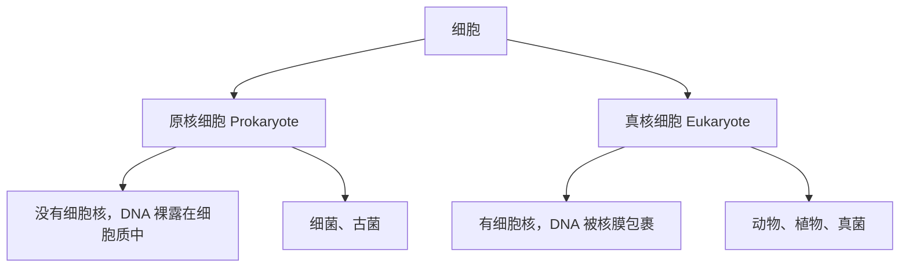
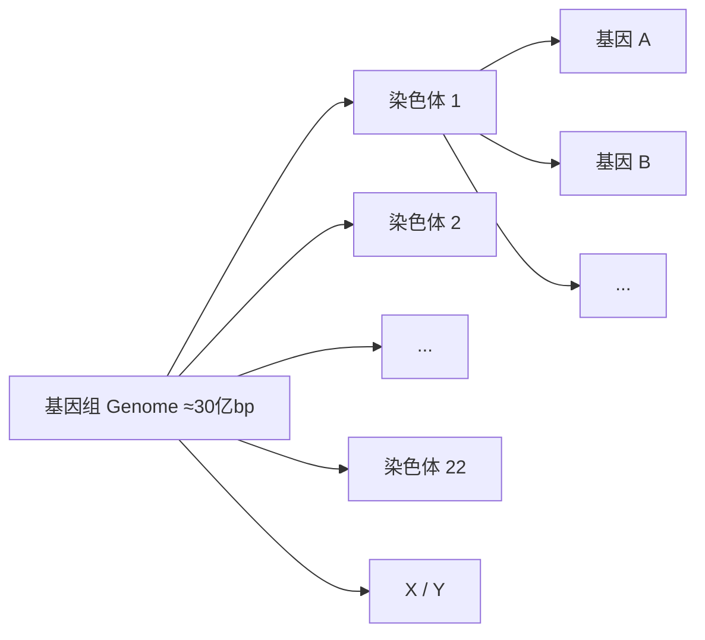
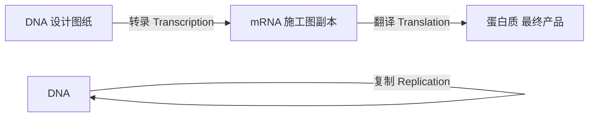
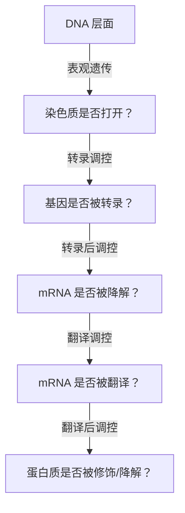
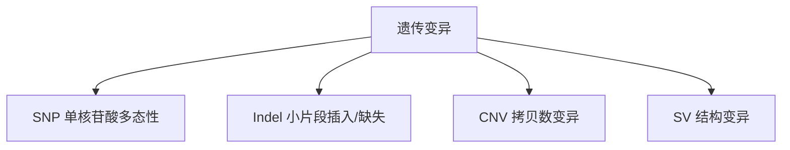
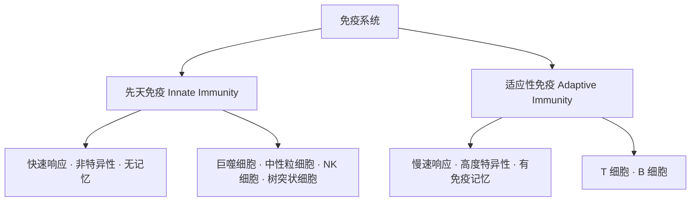
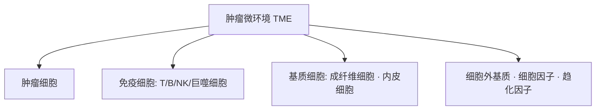
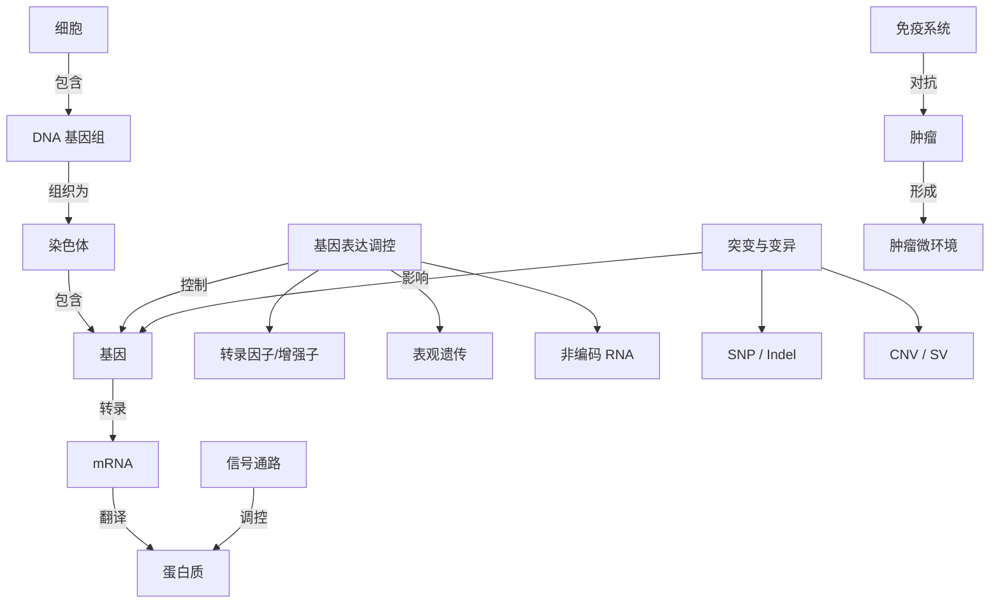

# 第1章 生命的语言：从 DNA 到蛋白质

> 不需要你背课本，只需要理解"数据从哪来、代表什么意思"。
> 这一章是整个教程的生物学基础，后面所有分析——RNA-seq、变异检测、单细胞——都建立在这些概念之上。

---

## 1.1 细胞是什么？—— 生命的基本单位

### 一句话版本

**细胞就是生命的最小"工厂"**，能自己获取原料、生产产品、处理废物、甚至复制自己。

### 为什么要从细胞讲起？

生物信息学分析的几乎所有数据——基因表达量、突变位点、甲基化水平——都来自细胞。理解细胞的基本结构，你才能明白"数据是从哪个房间里测出来的"。

### 细胞的基本结构

用一个比喻来理解：把细胞想象成一座**微型工厂**。

| 细胞结构 | 工厂比喻 | 功能 |
|---------|---------|------|
| **细胞膜** | 工厂围墙 + 门卫 | 控制物质进出，保护内部环境 |
| **细胞核** | 档案室 / 总经理办公室 | 存放 DNA（设计图纸），指挥全局 |
| **核糖体** | 生产车间 | 根据 RNA 指令生产蛋白质 |
| **线粒体** | 发电厂 | 产生能量（ATP） |
| **内质网** | 加工流水线 | 蛋白质折叠、脂质合成 |
| **高尔基体** | 包装与物流中心 | 蛋白质修饰、分拣、运输 |
| **细胞质** | 工厂车间的地面 | 各种化学反应发生的场所 |

### 两大类细胞



> **生信视角**：我们做的大多数分析都针对**真核细胞**（尤其是人类细胞）。但微生物组分析（16S rRNA、宏基因组）针对的是原核细胞。

### 关键概念：细胞类型的多样性

人体大约有 **200 多种**不同类型的细胞（神经细胞、肌肉细胞、免疫细胞……），但它们都携带**几乎相同的 DNA**。

那为什么长得不一样、干的活不一样？答案是：**不同的细胞打开了不同的基因**。这就是后面会讲到的"基因表达调控"，也是 RNA-seq 和单细胞分析要研究的核心问题。

---

## 1.2 DNA：生命的"源代码"

### 一句话版本

**DNA 是一本用 4 个字母写成的"生命说明书"**，人类的这本书大约有 30 亿个字母长。

### DNA 的化学结构

DNA（Deoxyribonucleic Acid，脱氧核糖核酸）是一种长链分子，由一个个**核苷酸**（nucleotide）串联而成。

每个核苷酸包含三个部分：
1. **磷酸基团** —— 骨架的一部分
2. **脱氧核糖**（一种糖）—— 骨架的另一部分
3. **碱基**（base）—— 真正携带信息的部分

碱基只有 4 种，就像只有 4 个字母的"字母表"：

| 碱基 | 缩写 | 全名 |
|------|------|------|
| 腺嘌呤 | **A** | Adenine |
| 胸腺嘧啶 | **T** | Thymine |
| 鸟嘌呤 | **G** | Guanine |
| 胞嘧啶 | **C** | Cytosine |

### 双螺旋与碱基配对

DNA 是**双链**结构，两条链像螺旋楼梯一样缠绕在一起——这就是著名的**双螺旋**（Double Helix），由 Watson 和 Crick 在 1953 年发现。

两条链之间靠碱基配对连接，规则非常简单：

```
A 只和 T 配对（2 个氢键）
G 只和 C 配对（3 个氢键）
```

这意味着：**知道一条链，就能推出另一条链。** 这个性质非常重要——DNA 复制和测序都依赖它。

```
5' --- A  T  G  C  C  A  T  G --- 3'    （正义链）
       |  |  |  |  |  |  |  |
3' --- T  A  C  G  G  T  A  C --- 5'    （反义链）
```

> **生信视角**：测序仪读出来的就是一条条 DNA 片段的碱基序列（如 `ATGCCATG...`），我们的分析就是在处理这些"字符串"。

### 基因组 → 染色体 → 基因

这三个概念经常搞混，用**电脑文件系统**打个比方：

| 生物学概念 | 电脑比喻 | 说明 |
|-----------|---------|------|
| **基因组**（Genome） | 整个硬盘 | 一个物种全部的遗传信息，人类约 30 亿碱基对 |
| **染色体**（Chromosome） | 文件夹 | 人类有 23 对（46 条）染色体，相当于 46 个文件夹 |
| **基因**（Gene） | 文件 | 染色体上有功能的片段，人类约 2 万个蛋白编码基因 |



一个令人惊讶的事实：**蛋白编码基因只占基因组的约 1.5%**。剩下的曾被叫做"垃圾 DNA"（junk DNA），但后来发现其中很多有调控功能（增强子、非编码 RNA 等），这些也是表观基因组学研究的重点。

### 几个容易混淆的数字

| 指标 | 人类参考值 |
|------|-----------|
| 基因组大小 | ≈ 3.2 × 10⁹ bp（32 亿碱基对） |
| 染色体数目 | 22 对常染色体 + 1 对性染色体 = 23 对 |
| 蛋白编码基因数 | ≈ 20,000 个 |
| 编码区占比 | ≈ 1.5% |
| 任意两人的基因组差异 | ≈ 0.1%（约 300 万个位点不同） |

---

## 1.3 中心法则：DNA → RNA → 蛋白质

### 一句话版本

**中心法则是生物学的"第一定律"**：遗传信息从 DNA 转录为 RNA，再翻译为蛋白质。

这是整个生物信息学的底层逻辑——你分析的几乎所有数据，都在这条信息流的某个环节上。

### 整体流程



### 第一步：转录（Transcription）

**转录 = 把 DNA 的信息"抄写"成 RNA。**

过程简述：
1. **RNA 聚合酶**（RNA Polymerase）结合到 DNA 上的特定位置（启动子）
2. 它沿着 DNA 模板链移动，按碱基配对规则合成一条 RNA 链
3. RNA 中用 **U**（尿嘧啶，Uracil）代替了 DNA 中的 **T**（胸腺嘧啶）

```
DNA 模板链:  3' --- T  A  C  G  G  T  A  C --- 5'
                     ↓  ↓  ↓  ↓  ↓  ↓  ↓  ↓
mRNA:        5' --- A  U  G  C  C  A  U  G --- 3'
```

> **为什么不直接用 DNA？** 因为 DNA 太珍贵了（只有一份），相当于"设计原图"。mRNA 是"施工副本"，用完可以降解，不影响原图。

### mRNA 的加工

在真核细胞中，刚转录出来的 RNA（前体 mRNA，pre-mRNA）还要经过加工才能变成成熟的 mRNA：

1. **5' 加帽**（5' Cap）：保护 mRNA 不被降解
2. **3' 加尾**（Poly-A Tail）：加一串 AAAA...，也起保护作用
3. **剪接**（Splicing）：去掉**内含子**（intron），保留**外显子**（exon）


> **生信视角**：RNA-seq 测到的就是这些成熟 mRNA。通过分析 mRNA 的种类和数量，我们就能知道细胞在"做什么"——这就是基因表达分析。Poly-A 尾巴还被用来在实验中富集 mRNA（Poly-A 选择）。

### 第二步：翻译（Translation）

**翻译 = 根据 mRNA 的序列，合成蛋白质。**

mRNA 上每连续 3 个碱基（称为**密码子**，codon）对应一种**氨基酸**：

| 密码子 | 氨基酸 | 说明 |
|-------|--------|------|
| AUG | 甲硫氨酸（Met） | **起始密码子**，翻译从这里开始 |
| UUU | 苯丙氨酸（Phe） | — |
| GCU | 丙氨酸（Ala） | — |
| UAA, UAG, UGA | —— | **终止密码子**，翻译到这里停止 |

翻译发生在**核糖体**上，**tRNA**（转运 RNA）负责把对应的氨基酸搬运过来。氨基酸一个个连接，最终折叠成具有特定功能的蛋白质。

### 为什么中心法则对生信很重要？

因为我们做的分析，本质上都是在追踪这条信息流上的"异常"或"差异"：

| 分析类型 | 对应的信息流环节 | 问题 |
|---------|----------------|------|
| **基因组变异分析** | DNA | 基因的"设计图"有没有写错？ |
| **RNA-seq 分析** | DNA → RNA（转录） | 哪些基因被抄写了？抄了多少份？ |
| **蛋白质组分析** | RNA → 蛋白质（翻译） | 最终产品有多少？功能正常吗？ |
| **表观基因组分析** | 调控转录的过程 | 什么控制了基因的开/关？ |

---

## 1.4 基因的"开关"：基因表达调控

### 一句话版本

人体每个细胞都有同样的 DNA，但**不同细胞会打开不同的基因**。控制基因开/关的机制，就是**基因表达调控**。

### 为什么需要调控？

你的皮肤细胞和神经细胞拥有完全相同的 DNA（都是受精卵分裂来的），但它们的形态和功能完全不同。原因就是：

- 皮肤细胞打开了"制造角蛋白"的基因，关闭了"产生神经递质"的基因
- 神经细胞则恰好相反

这就像同一台电脑，装了很多软件，但此刻只运行了其中几个。

### 调控发生在多个层面



### 转录调控：最核心的层面

#### 启动子（Promoter）

启动子是基因上游的一段 DNA 序列，相当于基因的"开关按钮"。RNA 聚合酶必须先结合到启动子上，才能开始转录。

#### 转录因子（Transcription Factor, TF）

转录因子是一类特殊的蛋白质，它们能**识别并结合 DNA 上的特定序列**，从而促进或抑制基因转录：

- **激活型转录因子**：帮 RNA 聚合酶就位 → 基因打开
- **抑制型转录因子**：阻止 RNA 聚合酶结合 → 基因关闭

> **生信视角**：转录因子分析是 ChIP-seq、ATAC-seq 分析的核心内容。SCENIC 算法可以从单细胞数据推断转录因子活性。

#### 增强子（Enhancer）

增强子是一段 DNA 序列，可能距离基因**几千甚至几百万碱基**远，但它能通过 DNA 环化（looping）与启动子"近距离接触"，大幅增强基因转录。

```
增强子                                    启动子 → 基因
──●───────────────────────────────────●→→→→→→→→
    \                                /
     \          DNA 环化            /
      \─────────────────────────────/
           增强子和启动子"碰面"
```

### 表观遗传调控

**表观遗传**（Epigenetics）= 不改变 DNA 序列，但能影响基因表达的机制。

#### DNA 甲基化（DNA Methylation）

在 DNA 的某些位置（通常是 CpG 位点）加上甲基基团（-CH₃）。就像在书页上贴了封条——被甲基化的区域，基因通常被**沉默**。

- **CpG 岛**：启动子区域富含 CpG 的区域。如果被甲基化，基因通常不表达
- 异常的 DNA 甲基化模式与肿瘤密切相关

> **生信视角**：BS-seq / WGBS 可以测量全基因组的甲基化水平。差异甲基化区域（DMR）分析是表观基因组学的重要内容。

#### 组蛋白修饰（Histone Modification）

DNA 缠绕在**组蛋白**上（就像线缠在线轴上）。组蛋白的"尾巴"可以被化学修饰（乙酰化、甲基化等），影响 DNA 的松紧程度：

- **松散** → 基因容易被读取 → 表达
- **紧密** → 基因被封闭 → 沉默

常见的组蛋白修饰标记：

| 修饰标记 | 含义 |
|---------|------|
| H3K4me3 | 活跃的启动子 |
| H3K27ac | 活跃的增强子 |
| H3K27me3 | 被沉默的基因 |
| H3K36me3 | 正在被转录的基因体 |

> **生信视角**：ChIP-seq 就是用来检测这些组蛋白修饰和转录因子结合位点的技术。

### 非编码 RNA 调控

不是所有 RNA 都会被翻译成蛋白质。有大量的**非编码 RNA**（ncRNA）在基因调控中扮演重要角色：

| 类型 | 全名 | 长度 | 功能 |
|------|-----|------|------|
| **miRNA** | microRNA | ≈22 nt | 结合 mRNA，促进其降解或抑制翻译 |
| **lncRNA** | 长链非编码 RNA | >200 nt | 多种调控功能，参与染色质重塑、转录调控 |
| **circRNA** | 环状 RNA | 可变 | 充当 miRNA "海绵"，调控基因表达 |

> **生信视角**：miRNA-mRNA 互作分析、lncRNA 功能预测、ceRNA（竞争性内源 RNA）网络分析，都是当前热门的生信方向。

---

## 1.5 突变与变异

### 一句话版本

**DNA 不是完美复制的**——复制过程中会出错，这些"错误"就是突变。有些突变无关紧要，有些会导致疾病。

### 变异的类型



#### SNP（Single Nucleotide Polymorphism，单核苷酸多态性）

**最常见的变异类型**。就是某个位置的碱基换了一个字母：

```
参考序列:  ...ATGC[C]ATGG...
突变序列:  ...ATGC[T]ATGG...
                  ↑ C→T，这就是一个 SNP
```

人与人之间大约有 **300~400 万个** SNP 差异。大部分 SNP 没有影响，少数会改变蛋白质功能或基因调控，与疾病相关。

#### Indel（Insertion / Deletion，插入/缺失）

短片段（通常 <50 bp）的插入或缺失：

```
参考序列:  ...ATGC---ATGG...     （缺失了 3 个碱基）
突变序列:  ...ATGCATGATGG...

参考序列:  ...ATGCCCATGG...
突变序列:  ...ATGCCC[GTA]ATGG...  （插入了 3 个碱基）
```

#### CNV（Copy Number Variation，拷贝数变异）

一段较大的 DNA（>1 kb）被重复了多份，或者缺失了。在肿瘤中非常常见——肿瘤细胞经常会多拷贝一些致癌基因（扩增），或丢失一些抑癌基因（缺失）。

#### SV（Structural Variation，结构变异）

更大尺度的基因组变化（通常 >50 bp），包括：
- **缺失**（Deletion）
- **重复**（Duplication）
- **倒位**（Inversion）：一段 DNA 翻转了方向
- **易位**（Translocation）：一段 DNA 跑到了另一条染色体上

> 经典案例：费城染色体（Philadelphia chromosome）——9 号和 22 号染色体的易位产生了 BCR-ABL 融合基因，导致慢性粒细胞白血病（CML）。

### 突变对蛋白质的影响

当突变发生在蛋白编码区时，根据对氨基酸序列的影响，可以分为：

| 突变类型 | 说明 | 后果 |
|---------|------|------|
| **同义突变**（Synonymous） | 密码子变了，但编码的氨基酸不变 | 通常无影响（因为密码子有冗余） |
| **错义突变**（Missense） | 密码子变了，编码了不同的氨基酸 | 可能影响蛋白质功能 |
| **无义突变**（Nonsense） | 密码子变成了终止密码子 | 蛋白质提前截断，通常丧失功能 |
| **移码突变**（Frameshift） | 插入/缺失导致阅读框移位 | 后续所有氨基酸全部改变，通常致命 |

```
正常:      AUG | GCA | UUG | CCA | UAA
              Met   Ala   Leu   Pro  Stop

错义突变:  AUG | GCA | UUG | CGA | UAA     （CCA→CGA，Pro→Arg）
              Met   Ala   Leu   Arg  Stop

无义突变:  AUG | GCA | UAG | ...            （UUG→UAG，变成终止密码子）
              Met   Ala  Stop                 蛋白质被截断！

移码突变:  AUG | GCA | U_G | CCA | ...      （删掉 1 个碱基，阅读框全乱）
```

> **生信视角**：变异注释工具（如 ANNOVAR、VEP、SnpEff）会自动判断每个变异属于哪种类型，并预测其对蛋白质功能的影响。这是基因组变异分析的核心步骤。

---

## 1.6 免疫系统基础（肿瘤免疫相关）

### 一句话版本

**免疫系统是身体的"军队"**，负责识别和消灭入侵者（细菌、病毒）和叛变者（肿瘤细胞）。

### 为什么生信要学免疫？

因为**肿瘤免疫**是当前生信分析最火的方向之一。免疫浸润分析、肿瘤微环境分析、免疫治疗疗效预测……这些都需要你了解免疫系统的基本框架。

### 两道防线



- **先天免疫**（天然免疫）：与生俱来，反应快但不精确。就像**巡逻保安**，发现可疑分子就上去处理，不管具体是谁。
- **适应性免疫**（获得性免疫）：后天产生，反应慢但极其精确，而且有**记忆功能**（这就是疫苗的原理）。就像**特种部队**，针对特定目标精准打击。

### 关键免疫细胞

| 细胞类型 | 归属 | 功能 | 生信中的角色 |
|---------|------|------|------------|
| **T 细胞** | 适应性免疫 | 直接杀伤异常细胞（CD8⁺杀伤 T 细胞）或协调免疫应答（CD4⁺辅助 T 细胞） | 肿瘤免疫浸润的核心指标 |
| **B 细胞** | 适应性免疫 | 产生抗体 | 体液免疫分析 |
| **NK 细胞** | 先天免疫 | 不需要提前"认识"目标就能杀伤异常细胞 | 肿瘤免疫微环境分析 |
| **巨噬细胞** | 先天免疫 | 吞噬病原体、清理残骸、呈递抗原 | M1/M2 极化分析 |
| **树突状细胞（DC）** | 先天免疫 | 抗原呈递：把"敌人的照片"展示给 T 细胞 | 免疫激活状态评估 |
| **调节性 T 细胞（Treg）** | 适应性免疫 | 抑制免疫反应，防止自身免疫 | 免疫抑制微环境分析 |

### 肿瘤微环境（TME）

肿瘤不是孤立的一堆癌细胞——它周围还有各种免疫细胞、成纤维细胞、血管内皮细胞等，它们共同构成了**肿瘤微环境**（Tumor Microenvironment, TME）。



肿瘤微环境的"好坏"直接影响免疫治疗的效果：
- **"热"肿瘤**（Hot tumor）：免疫细胞浸润多，免疫治疗效果较好
- **"冷"肿瘤**（Cold tumor）：免疫细胞很少进入，免疫治疗效果差

> **生信视角**：CIBERSORT、xCell、MCP-counter 等算法可以从 bulk RNA-seq 数据中**推算**肿瘤微环境中各类免疫细胞的比例。ESTIMATE 算法可以评估肿瘤纯度和免疫/基质得分。这些都是肿瘤生信论文的"标配分析"。

---

## 1.7 信号通路基础

### 一句话版本

**信号通路就是细胞内的"消息传递链"**——从细胞表面收到信号，一层层传递到细胞核，最终改变基因的表达。

### 用"快递接力"来理解

想象这样的场景：

1. **快递员**（信号分子/配体）到达你家**门铃**（受体）
2. 门铃一按，**家人 A** 被通知（第一级信号分子）
3. 家人 A 通知**家人 B**（第二级信号分子）
4. 家人 B 通知**家人 C**……
5. 最后一个家人走到**书房**（细胞核）打开了某本书（激活了某个基因）

这一条"通知链"就是一条**信号通路**（Signaling Pathway）。

### 几条经典通路

下面列出的通路在生信分析中出现频率极高，不需要背下来，但心里有个印象：

#### PI3K/AKT/mTOR 通路

- **功能**：促进细胞**生长和存活**
- **与肿瘤的关系**：该通路在很多肿瘤中过度激活，癌细胞"拒绝死亡"
- **常见突变基因**：PIK3CA、PTEN（抑制这条通路的基因，经常丢失）

#### MAPK/RAS/ERK 通路

- **功能**：促进细胞**增殖**
- **与肿瘤的关系**：RAS 基因是人类肿瘤中**突变频率最高的致癌基因**之一
- **常见突变基因**：KRAS、BRAF

#### Wnt/β-catenin 通路

- **功能**：调控细胞**增殖和分化**，在胚胎发育中极为重要
- **与肿瘤的关系**：结直肠癌中常因 APC 基因突变导致该通路异常激活

#### Notch 通路

- **功能**：调控细胞**命运决定**（一个细胞变成 A 类型还是 B 类型）
- **与肿瘤的关系**：在 T 细胞急性淋巴细胞白血病中常异常激活

#### JAK/STAT 通路

- **功能**：传递**免疫相关信号**（细胞因子、干扰素等）
- **与肿瘤的关系**：影响肿瘤免疫微环境，与免疫治疗响应相关

### 为什么通路分析在生信中这么重要？

单看一个基因的变化，往往很难得出生物学结论。但如果发现**一条通路上的多个基因都发生了变化**，那就有很强的生物学意义了。

| 分析方法 | 说明 |
|---------|------|
| **GO 富集分析** | 看差异基因在哪些生物学过程（通路）中富集 |
| **KEGG 通路分析** | 把差异基因映射到已知的通路图上 |
| **GSEA** | 不设阈值，看整个基因集是否整体上调/下调 |
| **SCENIC** | 从单细胞数据推断转录因子-靶基因调控网络 |

> **生信视角**：几乎每篇生信论文都会做通路分析。理解这些通路的基本功能，你在解读分析结果时才不会"只见树木不见森林"。

---

## 本章小结



**核心要点回顾**：

1. **细胞**是生命的基本单位，不同类型的细胞打开不同的基因
2. **DNA** 用 A、T、G、C 四个字母编码遗传信息，人类基因组约 30 亿碱基对
3. **中心法则**：DNA → RNA → 蛋白质，生信分析都在追踪这条信息流
4. **基因表达调控**通过启动子、转录因子、表观遗传等机制控制基因的开/关
5. **突变与变异**（SNP、Indel、CNV、SV）是基因组变异分析的对象
6. **免疫系统**的先天免疫和适应性免疫共同构成肿瘤微环境，是肿瘤生信的热点
7. **信号通路**把单个基因串联成网络，通路分析是理解生物学意义的关键工具

---

> **下一章**：[第2章 测序技术：数据是怎么来的？](02-sequencing.md) —— 了解测序仪是如何把 DNA/RNA 变成数据的。
