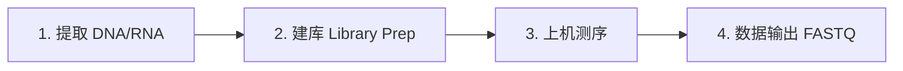
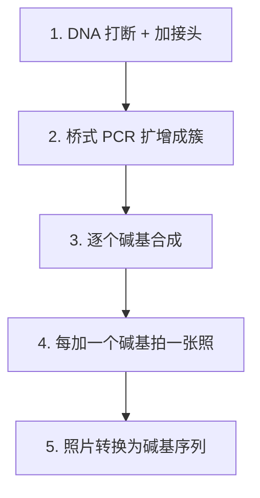
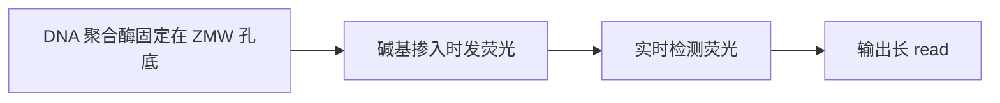
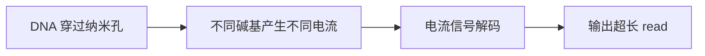
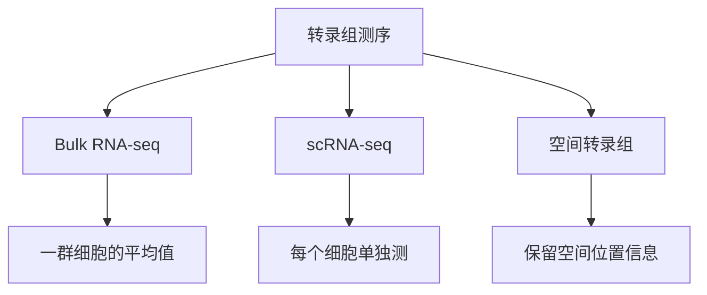
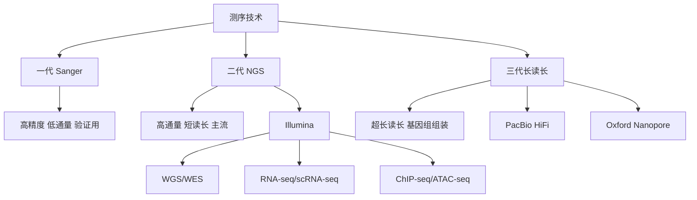

# 第2章 测序技术：数据是怎么来的？

> 生物信息学分析的起点，是测序仪吐出来的数据。
> 这一章帮你理解"数据从哪来"，这样你才能理解"数据为什么长这样"以及"分析时要注意什么"。

---

## 2.1 什么是测序？—— 读取 DNA/RNA 的"文字"

### 一句话版本

**测序（Sequencing）就是把 DNA 或 RNA 分子上的碱基顺序"读"出来，变成电脑能处理的文本。**

### 用比喻来理解

想象你有一本非常长的书（基因组），但你看不到里面的文字。测序技术就相当于一台**自动扫描仪**——它能把书页上的文字一个个识别出来，输出成电子文本。

不同代的测序技术，就像不同代的扫描仪：
- **一代**（Sanger）：一次只能扫一小段（几百个字），精度极高，但速度慢、成本高
- **二代**（Illumina 等）：同时扫几亿个小片段，速度极快，但每个片段较短
- **三代**（PacBio / Nanopore）：能读更长的片段，准确率取决于平台、读段模式和数据处理；PacBio HiFi 可兼具长读长与高准确率

### 测序的基本流程

不管哪一代技术，测序的大体流程都是：



1. **提取**：从细胞中把 DNA 或 RNA 分离出来
2. **建库**（Library Preparation）：把长链 DNA/RNA 打断成小片段，两端加上**接头**（adapter），让测序仪能"抓住"它们
3. **上机测序**：把文库放进测序仪，机器逐个读取碱基
4. **数据输出**：测序仪输出的原始数据就是 **FASTQ 文件**——每条序列（read）包含碱基序列和对应的质量分数

> **生信视角**：你拿到的数据就是 FASTQ 文件。后续所有分析——质控、比对、定量、变异检测——都是从这个文件开始的。

---

## 2.2 一代测序（Sanger 测序）

### 一句话版本

**Sanger 测序是测序技术的"鼻祖"**，准确率极高（>99.99%），但每次只能读一条序列（几百 bp），适合验证而非大规模分析。

### 原理简述

Sanger 测序由 Frederick Sanger 于 1977 年发明，基于**链终止法**：

1. 准备一条要测序的 DNA 模板
2. 加入正常的 dNTP（A、T、G、C）和少量**荧光标记的 ddNTP**（缺少 3'-OH，一旦掺入就终止延伸）
3. DNA 聚合酶开始合成新链，每次遇到 ddNTP 就停下来
4. 最终产生一系列**长度不同的片段**，每个片段的末端都是一个已知的碱基
5. 通过**毛细管电泳**按长度分离，检测荧光信号，就能逐个读出碱基

```
片段长度:  3   4   5   6   7   8   9  ...
末端碱基:  A   T   G   C   C   A   T  ...
                    ↓
读出序列:  A T G C C A T ...
```

### 优缺点

| 优点 | 缺点 |
|------|------|
| 准确率极高（金标准） | 通量极低（一次只测一条） |
| 读长较长（700-1000 bp） | 成本高（按条计费） |
| 技术成熟、操作简单 | 不适合大规模测序 |

### 现在还在用吗？

**还在用！** 但主要用于：
- **验证**：二代测序发现的突变，用 Sanger 测序做最终确认
- **小片段测序**：克隆验证、质粒测序
- **临床诊断**：某些单基因遗传病检测

> **生信视角**：Sanger 测序产生的数据通常是 `.ab1` 格式的色谱图文件，不需要复杂的生信分析。你更多会在论文的"验证实验"部分看到它。

---

## 2.3 二代测序（NGS）—— 当前主流

### 一句话版本

**二代测序（Next-Generation Sequencing, NGS）能同时读取数亿条序列**，是当前生物学研究和临床检测的主力技术。以 **Illumina** 平台为代表。

### Illumina 测序原理：边合成边测序

Illumina 测序的核心思想是 **Sequencing by Synthesis（SBS，边合成边测序）**：



详细步骤：

**第一步：建库与上机**
- DNA 被随机打断成小片段（通常 200-600 bp）
- 两端连接上特定的接头序列（adapter）
- 文库变性为单链，固定到测序芯片（Flow Cell）表面

**第二步：桥式 PCR 扩增（Bridge Amplification）**
- 每条 DNA 片段在芯片上弯曲成"桥"，进行 PCR 扩增
- 最终每条原始片段被扩增成一个**簇**（cluster），包含上千条相同的拷贝
- 为什么要扩增？因为单个分子的荧光信号太弱，需要成簇才能被相机捕捉到

**第三步：边合成边测序**
- 加入带荧光标记的碱基（每种碱基一种颜色），还带有可逆终止基团
- DNA 聚合酶每次只加入一个碱基，然后暂停
- 相机拍照，记录每个簇发出的荧光颜色 → 确定加入的碱基
- 去掉终止基团，进入下一轮

**第四步：数据输出**
- 经过 100-300 轮循环，每条序列被读出 100-300 个碱基
- 数亿个簇同时被读取 → 产生数亿条 reads → 输出为 FASTQ 文件

### 单端测序 vs 双端测序

| 模式 | 英文 | 读取方式 | 典型标记 |
|------|------|---------|---------|
| **单端测序** | Single-End (SE) | 只从片段的一端读取 | SE50, SE100 |
| **双端测序** | Paired-End (PE) | 从两端分别读取 | PE150, PE250 |

```
DNA 片段:  5'──────────────────────────────3'
                    ≈300-500 bp

单端测序:  →→→→→→→ (Read 1, 150bp)

双端测序:  →→→→→→→ (Read 1, 150bp)
                              ←←←←←←← (Read 2, 150bp)
```

**双端测序的优势**：
- 两条 read 来自同一个片段，提供**配对信息**，有助于比对和变异检测
- 能检测**结构变异**（两条 read 的距离或方向异常）
- 目前大多数分析都使用 **PE150**（双端各 150 bp）

### 三个关键概念：读长、深度、覆盖度

这三个概念在看论文和设计实验时不断出现，必须搞清楚：

#### 读长（Read Length）

**每条 read 包含多少个碱基**。

- Illumina 常见读长：75 bp、100 bp、150 bp、250 bp、300 bp
- 读长越长，比对越准确，但测序成本也越高
- 目前最常用的是 **150 bp**

#### 测序深度（Sequencing Depth / Coverage Depth）

**基因组上每个位置平均被读到了多少次**，通常用 **"X"** 表示。

```
基因组某个位置:     G
Read 1:            G
Read 2:            G
Read 3:            A  ← 可能是突变，也可能是测序错误
Read 4:            G
Read 5:            G
                   → 这个位置的深度 = 5X
```

计算公式：

```
测序深度 = (read 数量 × 读长) / 基因组大小
```

例如：10 亿条 150 bp 的 reads，人类基因组 30 亿 bp：
```
深度 = (1,000,000,000 × 150) / 3,000,000,000 = 50X
```

#### 覆盖度（Coverage / Breadth of Coverage）

**基因组有多大比例的区域被至少一条 read 覆盖到了**，用百分比表示。

- 30X WGS 通常能覆盖 >95% 的基因组
- 覆盖度 ≠ 深度：深度是"读了多少次"，覆盖度是"覆盖了多大范围"

```
基因组:  ████████████████████████████████
Reads:   ═══  ═══  ═══     ═══  ═══  ═══
覆盖:    ███  ███  ███     ███  ███  ███
未覆盖:              ↑ 这里没有 read 覆盖到
```

### Illumina 常见平台

| 平台 | 数据量 | 典型用途 |
|------|--------|---------|
| **MiSeq** | 最多 ~15 Gb | 小基因组、扩增子测序、16S |
| **NextSeq** | 最多 ~120 Gb | 中等通量，外显组、RNA-seq |
| **NovaSeq** | 最多 ~6000 Gb | 大规模项目，WGS、大队列 |

> **生信视角**：你拿到数据后第一步就是看 FASTQ 文件的质量（FastQC），Illumina 数据的特点是读长短但准确率高（单碱基错误率 <0.1%），但在 read 末端质量会下降——这就是为什么需要做**质控和修剪（trimming）**。

---

## 2.4 三代测序

### 一句话版本

**三代测序能读取超长片段（几千到几百万 bp）**，解决了二代测序读长短的局限，但错误率相对较高。

### 两大三代测序平台

#### PacBio SMRT 测序

**SMRT**（Single Molecule Real-Time，单分子实时测序）的核心思想：

1. DNA 聚合酶固定在一个极小的孔底部（ZMW，零模波导孔）
2. 加入带荧光标记的碱基
3. 聚合酶每合成一个碱基，就发出一次荧光
4. 实时检测荧光信号 → 直接读出序列



**特点**：
- 平均读长：10-25 kb（HiFi 模式），最长可达数十 kb
- **HiFi reads**（高保真读长）：通过环形一致性测序（CCS），将同一分子反复读取多次取一致，准确率 >99.9%
- 能直接检测**碱基修饰**（如甲基化），无需额外化学处理

#### Oxford Nanopore（纳米孔测序）

纳米孔测序的原理更加直观：

1. 在膜上打一个**纳米级的小孔**（蛋白质孔道）
2. 施加电压，DNA 单链穿过小孔
3. 不同碱基通过时，会**改变电流的大小**
4. 通过电流信号的变化 → 推算出碱基序列



**特点**：
- 读长理论上**无上限**，最长记录超过 4 Mb（400 万碱基！）
- 设备小巧（MinION 只有 U 盘大小），可现场测序
- **实时出数据**，边测边分析
- 原始错误率较高（~5-10%），但新版本持续改进
- 也能直接检测碱基修饰

### 三代测序的优势与应用

| 优势 | 应用场景 |
|------|---------|
| **超长读长** | 基因组组装（填补 gap）、结构变异检测 |
| **跨越重复区域** | 端粒-着丝粒（T2T）完整基因组组装 |
| **直接检测修饰** | 表观遗传研究（无需亚硫酸盐处理） |
| **全长转录本** | Iso-seq：直接读出完整 mRNA，无需拼接 |
| **便携性** | 现场快速检测（病原体鉴定、疫情监控） |

### 三代测序的代表性成果

- **T2T 基因组**（2022 年）：利用 PacBio HiFi + ONT 超长 reads，首次完成人类基因组的端到端完整组装，补齐了之前 8% 的空白
- **新冠病毒监控**：Oxford Nanopore 的便携测序仪在全球疫情中被广泛用于病毒基因组实时监测

### 三代技术对比

| 特性 | PacBio HiFi | Oxford Nanopore |
|------|-------------|-----------------|
| 读长 | 10-25 kb | 可达数 Mb |
| 准确率 | >99.9%（HiFi） | ~95-99%（最新版本） |
| 通量 | 中等 | 灵活（MinION 到 PromethION） |
| 设备大小 | 大型仪器 | U 盘到桌面级 |
| 检测修饰 | 支持 | 支持 |
| 成本 | 较高 | 相对较低 |

> **生信视角**：三代测序数据的分析工具与二代不同。长 reads 比对用 **minimap2**（而非 BWA），变异检测可以直接用长 reads 做相位分析（phasing）。三代数据格式通常是 BAM（PacBio）或 FAST5/POD5（Nanopore），最终也会转换为 FASTQ。

---

## 2.5 常见测序类型一览（按组学分类）

### 为什么要按"组学"分类？

前面讲了测序技术的"硬件"（一代、二代、三代），但**同一台测序仪，放进去的样本不同，回答的生物学问题就完全不同**。

回忆一下第1章的中心法则：

```
DNA  →  RNA  →  蛋白质
         ↑         ↑
     表观调控    代谢产物
```

生命活动的每一层都承载着不同的信息。如果把细胞比作一家公司：

| 层面 | 公司比喻 | 对应的"组学" | 回答的核心问题 |
|------|---------|-------------|--------------|
| **DNA** | 公司章程（不常变） | 基因组学 Genomics | 设计图纸有没有写错？（突变、变异） |
| **RNA** | 当天的工作指令 | 转录组学 Transcriptomics | 今天在执行哪些指令？执行了多少？ |
| **表观修饰** | 哪些章程被划重点/被封存 | 表观基因组学 Epigenomics | 哪些基因被打开/关闭了？为什么？ |
| **蛋白质** | 实际干活的员工 | 蛋白质组学 Proteomics | 最终产出了哪些产品？ |
| **代谢物** | 公司的产出和库存 | 代谢组学 Metabolomics | 公司的运营状况如何？ |

**同一个生物学问题，从不同组学层面去看，会得到互补的信息。** 比如研究"为什么这个肿瘤对药物耐药"：

- **基因组**告诉你：是不是某个基因发生了突变？
- **转录组**告诉你：耐药相关的基因是不是表达上调了？
- **表观基因组**告诉你：是不是某些基因的启动子被甲基化沉默了？
- **蛋白质组**告诉你：蛋白质水平是否真的变了？（mRNA 多不代表蛋白质多）

所以，**"组学"不是按技术分类，而是按你想回答的生物学问题分类**。测序只是获取数据的手段，组学才是你研究的维度。

下面按各组学逐一介绍对应的测序方案。

### 基因组测序

| 测序类型 | 全名 | 测什么 | 典型应用 |
|---------|------|--------|---------|
| **WGS** | Whole Genome Sequencing | 全基因组所有 DNA | 全面发现变异（SNP/Indel/SV/CNV） |
| **WES** | Whole Exome Sequencing | 只测外显子区域（约占 1.5%） | 性价比高的变异检测，聚焦蛋白编码区 |

```
基因组:  ████░░░░████░░████░░░░░░████░░████
         外显子    内含子   外显子

WGS:     ════════════════════════════════════  全部读
WES:     ════    ════  ════        ════  ════  只读深色部分
```

WES 只需要约 WGS 1/50 的数据量，成本低得多，但会漏掉非编码区的变异。

### 转录组测序

| 测序类型 | 测什么 | 分辨率 | 典型应用 |
|---------|--------|--------|---------|
| **Bulk RNA-seq** | 一团细胞的平均 mRNA 表达 | 群体水平 | 差异表达分析、通路分析 |
| **scRNA-seq** | 每个单细胞的 mRNA 表达 | 单细胞水平 | 细胞类型鉴定、发育轨迹 |
| **空间转录组** | 组织切片上每个位置的表达 | 空间水平 | 肿瘤微环境、组织结构 |



- **Bulk RNA-seq** 是最成熟、应用最广的转录组技术
- **scRNA-seq**（以 10X Genomics 为代表）是近年最火的技术
- **空间转录组**（Visium、MERFISH 等）是最新的前沿方向

### 表观基因组测序

| 测序类型 | 测什么 | 典型应用 |
|---------|--------|---------|
| **ChIP-seq** | 蛋白质在 DNA 上的结合位点 | 转录因子结合位点、组蛋白修饰 |
| **ATAC-seq** | 染色质开放区域 | 基因调控区域鉴定 |
| **CUT&Tag** | 类似 ChIP-seq，但更灵敏 | 低细胞量的蛋白-DNA 互作 |
| **BS-seq / WGBS** | DNA 甲基化水平 | 全基因组甲基化图谱 |

### 其他重要的测序类型

| 测序类型 | 测什么 | 典型应用 |
|---------|--------|---------|
| **Hi-C** | 染色质三维结构 | TAD、染色质环、A/B 区室 |
| **CLIP-seq** | RNA 与蛋白质的互作位点 | RNA 结合蛋白研究 |
| **Ribo-seq** | 正在被翻译的 mRNA | 翻译调控研究 |
| **16S rRNA** | 微生物群落组成 | 肠道菌群、环境微生物 |
| **宏基因组** | 微生物群落全部 DNA | 微生物功能分析 |

### 蛋白质组与代谢组

严格来说，蛋白质组和代谢组不是"测序"，而是基于**质谱**（Mass Spectrometry）的技术，但在多组学研究中经常与测序数据一起分析：

| 组学 | 技术 | 测什么 |
|------|------|--------|
| **蛋白质组** | LC-MS/MS | 蛋白质种类与含量 |
| **代谢组** | LC-MS / GC-MS | 小分子代谢物 |

> **生信视角**：不同的测序类型产生不同格式的数据，需要不同的分析流程。但核心步骤（质控 → 比对/定量 → 统计分析 → 可视化）是相通的。后面的章节会逐一介绍每种测序数据的分析方法。

---

## 2.6 实验设计要点

### 为什么要讲实验设计？

因为**再好的分析方法也救不了一个糟糕的实验设计**。如果实验设计有问题，测出来的数据可能根本无法回答你的科学问题——这时候你拿到数据也白搭。

### 生物学重复 vs 技术重复

这两个概念经常被混淆，但它们完全不同：

| 类型 | 定义 | 例子 | 目的 |
|------|------|------|------|
| **生物学重复** | 来自不同个体/样本的重复 | 3 只不同的小鼠 | 反映真实的生物学变异 |
| **技术重复** | 同一个样本重复测量多次 | 同一只小鼠的样本测 3 次 | 评估实验技术的稳定性 |

```
实验组（药物处理）                对照组（未处理）
┌─────────────────────┐     ┌─────────────────────┐
│ 小鼠 A  → 样本 A     │     │ 小鼠 D  → 样本 D     │
│ 小鼠 B  → 样本 B     │     │ 小鼠 E  → 样本 E     │
│ 小鼠 C  → 样本 C     │     │ 小鼠 F  → 样本 F     │
└─────────────────────┘     └─────────────────────┘
    3 个生物学重复                3 个生物学重复
```

**关键原则**：
- **生物学重复才有统计意义**，技术重复通常不需要（NGS 技术已经很稳定）
- 做差异分析应有足够的独立生物学重复；每组 **3 个**是常见的小型实验起点，具体数量要由效应、变异和功效决定
- 很多早期的测序研究没有重复（每组只有 1 个样本），结果可信度很低

> **生信视角**：如果有人给你"每组 1 个样本"的 RNA-seq 数据让你做差异分析，你要明确告诉他：**没有生物学重复，无法做可靠的统计检验**。这不是分析方法的问题，是实验设计的问题。

### 测序深度怎么选？

不同的分析目的需要不同的测序深度。以下是常见推荐值：

| 测序类型 | 推荐深度 | 说明 |
|---------|---------|------|
| **WGS（人类）** | 30-50X | 低于 30X 变异检测灵敏度下降 |
| **WES** | 100-200X | 因为只测外显子，需要更深 |
| **Bulk RNA-seq** | 每样本 20-30M reads | 用于差异表达分析 |
| **scRNA-seq（10X）** | 每细胞 20,000-50,000 reads | 约 1,000-3,000 基因/细胞 |
| **ChIP-seq** | 20-40M reads | 具体取决于抗体和蛋白 |
| **ATAC-seq** | 50-75M reads | 推荐双端测序 |
| **WGBS** | 10-30X | 每个 CpG 位点需要足够深度 |

**深度不是越高越好**：

```
       检测效果
       │
       │        ╱──────── 边际收益递减
       │      ╱
       │    ╱
       │  ╱
       │╱
       └──────────────────── 测序深度
           最优区间
```

超过一定深度后，增加数据量带来的新发现非常有限，但成本却线性增加。所以需要根据分析目的选择**恰当的**深度。

### 多少样本才够？—— 统计功效

**统计功效（Statistical Power）** 是指"当差异真实存在时，你的实验有多大概率能检测到它"。

- 通常要求功效 ≥ 80%（即有 80% 的概率检测到真实差异）
- 功效与以下因素相关：

| 因素 | 对功效的影响 |
|------|------------|
| **样本量**↑ | 功效↑（最直接的方式） |
| **效应量**↑ | 功效↑（差异越大越容易检测） |
| **变异性**↓ | 功效↑（样本间差异越小，信号越清晰） |
| **显著性阈值**↓ | 功效↓（标准越严格，越难达到） |

**不同分析的样本量建议**：

| 分析类型 | 最低样本量 | 推荐样本量 |
|---------|-----------|-----------|
| Bulk RNA-seq 差异分析 | 每组 3 个 | 每组 5-8 个 |
| 临床预后模型 | 50-100 例 | 200+ 例 |
| GWAS | 数千例 | 数万-数十万例 |
| scRNA-seq | 视细胞类型而定 | 每组 3-5 个样本 |

> **生信视角**：样本量计算可以用 R 包 `RNASeqPower` 或 `pwr` 来做。在项目开始前做**功效分析**（power analysis）是非常好的习惯——它能告诉你需要多少样本才能检测到你关心的差异大小。

### 批次效应：一个隐形杀手

**批次效应**（Batch Effect）是指由于实验操作条件不同（不同时间、不同操作员、不同试剂批号）导致的系统性技术差异。

```
真实的生物学差异      +     批次效应         =     你看到的数据

  ●●● 处理组             ●●●→ 批次1偏移           结果混在一起
  ○○○ 对照组             ○○○→ 批次2偏移           无法区分
```

**如何最小化批次效应**：

1. **最好的方案**：所有样本在同一批次处理
2. **次优方案**：如果必须分批，确保每批都包含所有组别的样本（**均衡设计**）
3. **不要这样做**：处理组全部在 batch 1，对照组全部在 batch 2 ← 生物学差异和批次效应完全混淆！

```
好的设计:                    坏的设计:
Batch 1: 处理A 处理B 对照    Batch 1: 所有处理组
Batch 2: 处理A 处理B 对照    Batch 2: 所有对照组
  → 批次效应可以被校正         → 无法区分批次和处理效果
```

> **生信视角**：如果已经存在批次效应，可以用 ComBat（sva 包）或 limma::removeBatchEffect 进行计算校正，但这只是"补救"措施——好的实验设计永远优于事后校正。PCA 图是检查批次效应最直观的工具：如果样本按批次聚类而非按生物条件聚类，说明批次效应很严重。

---

## 2.7 测序之后怎么用：从一份数据走到一个生物问题

前面介绍了“数据怎么来”，这一节把它与实际问题接起来。先记住：**测序是获取证据的一种方式**。总览中的[两条主线](00-skill-tree.md)还包括蛋白结构、药物和新条件预测；有些任务使用已有序列或模型，并不要求你先开展一次测序实验。

### 同一台测序仪，为什么能研究不同问题

把测序仪当作读字机器。它读出的都是字母，但**实验前选了什么材料、如何建库和加标签**，决定这些字母代表什么。

| 想问的生物问题 | 选什么数据 | 后面大概怎么做 | 得到什么，以及怎样理解 |
| --- | --- | --- | --- |
| 这个人的 DNA 哪些位置不同 | WGS/WES | 检查 reads，把它们定位到参考，综合多条证据检测变异 | 变异列表与置信度；不等于每条都致病 |
| 药物处理后哪些基因改变 | bulk RNA-seq + 分组和重复 | 统计每基因表达，比较处理与对照，再归纳功能集合 | 差异基因与通路线索；可能受细胞组成影响 |
| 组织里哪类细胞发生变化 | scRNA-seq + 供体信息 | 依条码分细胞，质控、聚类、注释，按样本比较 | 类型、组成、同类型表达变化 |
| 变化在组织的什么位置 | 空间表达 + 坐标/图像 | 把表达放回地图，找区域和位置相关模式 | 组织区域与局部状态；传统 spot 可能混合多个细胞 |
| 哪些调控区域更容易打开 | ATAC-seq | 找富集开放区，再比较相同区域的片段数 | 差异开放区域；不直接证明具体 TF 结合 |
| 某个蛋白在哪些区域富集 | ChIP-seq / CUT&Tag 等 | 与合适背景比较，找 peaks 并核对重复 | 候选结合/修饰区域；仍受抗体和实验影响 |
| 哪些 DNA 标签改变 | WGBS 等甲基化测量 | 根据转换特征比对，统计位点支持，比较区域 | 甲基化比例与 DMR；零覆盖不是零甲基化 |
| 哪段基因组难以拼接、是否有大重排 | 合适的长读长数据 | 长片段比对或组装，检查跨重复与断点证据 | 更连续序列、结构变异或单倍型信息 |
| 哪些远处 DNA 区域接近 | Hi-C | 找成对位置，汇总接触矩阵 | 接触区室、边界或环的候选证据 |

这里的“怎么做”是思路，不要求现在记住软件。测序技术和问题不一一对应：短读长也能研究部分结构变异，长读长也能测转录本版本；应按问题所需的分辨率、成本和实验条件选择。

### 案例一：药物有没有改变细胞的工作方式

**问题**：某种药物处理后，细胞的炎症相关活动是否改变？

**输入**：多个独立来源的细胞，分别处理/对照的 RNA-seq，加上来源、批次、剂量和时间表。

**大概做法**：把 reads 归到基因，得到计数表；考虑来源和测量量差异，比较每个基因；再看变化是否集中在已知炎症相关基因集合里。

**输出和含义**：一份带变化方向与统计证据的基因表，以及相关功能集合。它支持“在这个实验条件下，炎症相关表达模式改变”的说法，不能只凭富集就说药物已被证明能治疗炎症。[第9章](09-rnaseq.md)会用真实 airway 数据动手完成类似流程。

### 案例二：肿瘤里免疫基因升高，是谁变了

bulk RNA-seq 看到免疫基因升高，可能是免疫细胞变多，也可能是同类细胞每个表达更多。好比一杯果汁变甜，可能因为多加了甜水果，也可能因为原来的水果本身更甜。

**输入**：多名个体的单细胞表达及条件，必要时加空间数据。**做法**：识别细胞类型，按个体比较比例，再在同类细胞中比较表达。**输出**：哪些类型增多、哪些类型内部表达改变、这些变化在哪里。

这让问题从“整团组织变了”细化到“哪类细胞发生什么变化”。同一个人的一万个细胞仍不能代替一万个独立个体，详见[第12章](12-scrna.md)和[第13章](13-spatial.md)。

### 案例三：发现 DNA 变异后，还能往哪里走

**输入**：肿瘤和匹配正常组织的 DNA reads。**做法**：比较 DNA 证据，过滤常见伪影。**输出**：候选肿瘤体细胞变异。

接下来可以进入预测主线：把某个具体变异及序列背景交给功能影响方法，得到剪接、蛋白或调控影响评分，再挑选值得验证的候选。前一环节回答“可能改了哪里”，后一环节回答“这个改动可能影响什么”，两者都不自动证明治疗价值。详见[第10章](10-variant.md)与总览的 DNA 任务。

### 案例四：基因升高，是否因为开关变了

观察到基因 A 表达升高，可结合 ATAC 看候选区域是否更开放、ChIP/CUT&Tag 看相关蛋白或修饰是否更富集，再结合位置或三维接触提出“某区域可能联系 A”的假说。

**输入**是不同类型的测量，**输出**是相互支持的候选关系。即使三种信号一起变化，仍可能由共同上游因素引起；真正想知道“这个开关是否控制 A”，还需要合适的干预验证。[第11章](11-epigenomics.md)会拆解各项证据。

### 怎样决定自己的第一步

先写一句话：“我想在什么对象、什么条件下，知道或预测什么结果。”然后检查你有的文件是否包含所需信息。只有 TPM 表，不能重新做原始 reads 的质控；只有普通单细胞计数，不能凭空得到 RNA velocity 所需的剪接层；只有候选序列，也可以开展适配的性质预测任务。

对测序分析，第一次练习可先用公开的小计数矩阵理解输出，再按需要回到 FASTQ。对蛋白或药物预测，先定义目标性质与验证方式。不要为了把某个流程全部跑一遍，忘了原先要回答的问题。

---

## 本章小结



**核心要点回顾**：

1. **测序**就是把 DNA/RNA 的碱基序列读出来，变成计算机可处理的数据（FASTQ 文件）
2. **一代测序（Sanger）** 适合高质量的小片段读取和验证，但通量低
3. **二代测序（Illumina）** 是当前主流，高通量、低成本，但读长短（~150 bp）
4. **三代测序**（PacBio / Nanopore）能读超长片段，解决重复区域和结构变异问题
5. 不同组学问题（基因组、转录组、表观基因组）对应不同的测序方案
6. 实验设计至关重要：**生物学重复**（数量由问题和功效决定）、**合理的测序深度**、**避免批次效应**

---

> **下一章**：[第3章 Linux/命令行基础](03-linux.md) —— 开始动手，学习生信分析的第一个工具。
