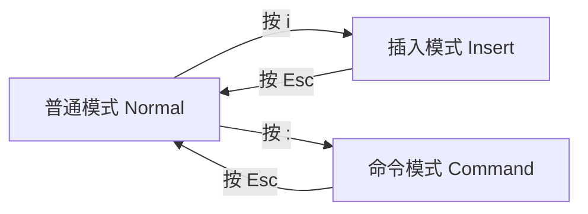
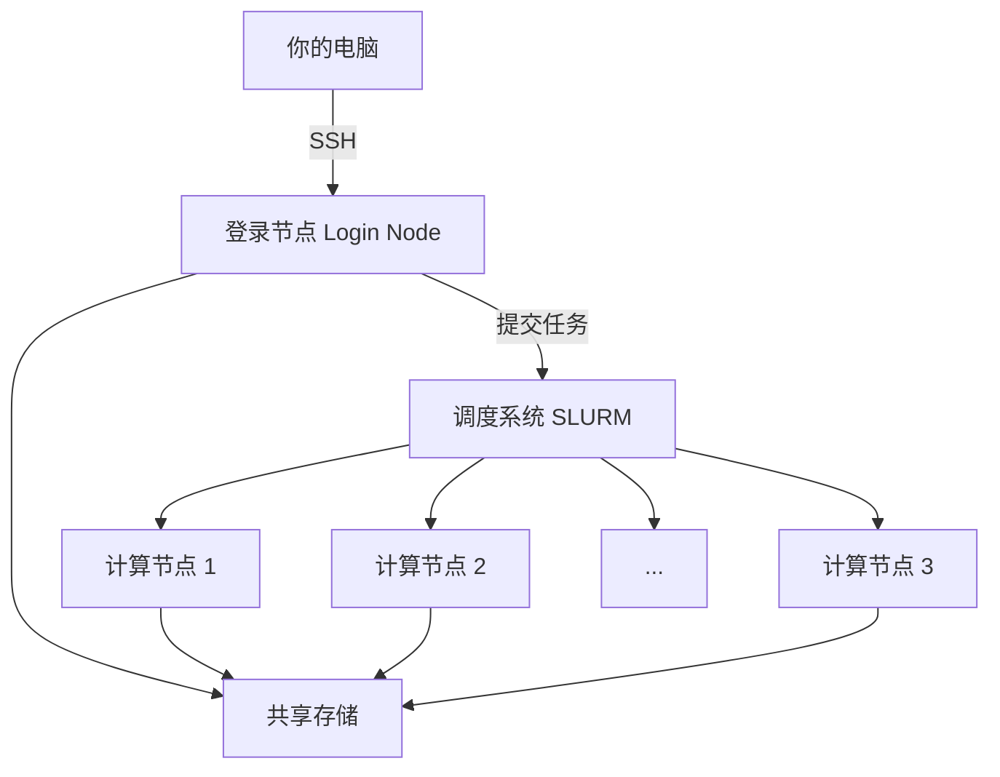
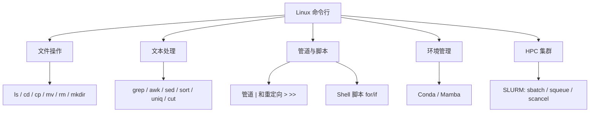

# 第3章 Linux/命令行基础

> 生信分析几乎都在命令行下完成。这一章教你掌握最核心的 Linux 技能——不需要成为系统管理员，但需要能熟练地"跟电脑对话"。

---

## 3.1 为什么生信要用 Linux？

### 一句话版本

**绝大多数生信工具只能在 Linux 下运行**，所以学生信 = 必须学 Linux 命令行。

### 具体原因

1. **工具生态**：BWA、STAR、SAMtools、GATK、Cell Ranger……这些核心工具几乎全部只提供 Linux 版本
2. **服务器/集群**：测序数据动辄几十 GB，分析需要大量内存和 CPU，通常在远程 Linux 服务器或 HPC 集群上跑
3. **自动化**：命令行可以写脚本批量处理，比点鼠标高效几百倍
4. **可重复性**：一行命令记录了你做了什么，下次直接重跑，不会忘记"当时点了哪个按钮"

### 不用害怕

命令行看起来像黑客电影里的画面，但其实：
- 日常生信分析只需要 **20 个左右的命令**
- 大部分操作就是"查看文件、移动文件、运行程序"
- 用几天就能上手，用几周就能熟练

### 命令行的基本使用理念

在学具体命令之前，先理解几个核心理念，会让你后面学得更快、少踩很多坑。

#### 理念一：一切皆文件

在 Linux 中，**几乎所有东西都被当作文件来处理**——普通文本是文件，目录是文件，甚至硬件设备（硬盘、键盘）也被抽象成文件。

这意味着：你学会了处理文件的命令，就学会了和系统打交道的基本方式。

#### 理念二：命令的基本格式

所有命令都遵循同一个模式：

```
命令  [选项]  [参数]
```

```bash
ls   -l     /data/        # 命令=ls，选项=-l（长格式），参数=/data/（目标目录）
grep -i     "TP53" gene.txt  # 命令=grep，选项=-i（忽略大小写），参数=搜索词和文件
```

- **选项**（Options）：用 `-` 或 `--` 开头，修改命令的行为。短选项可以合并：`ls -l -a -h` = `ls -lah`
- **参数**（Arguments）：告诉命令"对什么东西操作"

#### 理念三：路径——绝对路径和相对路径

路径是你告诉系统"文件在哪里"的方式。这是初学者最容易犯错的地方。

| 类型 | 特征 | 例子 | 含义 |
|------|------|------|------|
| **绝对路径** | 以 `/` 开头 | `/home/zhangsan/data/sample.fastq` | 从根目录开始的完整地址 |
| **相对路径** | 不以 `/` 开头 | `data/sample.fastq` | 从当前目录出发的相对位置 |

几个特殊路径符号：

| 符号 | 含义 | 例子 |
|------|------|------|
| `/` | 根目录（最顶层） | `cd /` |
| `~` | 家目录（你的"大本营"） | `cd ~` 等同于 `cd /home/zhangsan` |
| `.` | 当前目录 | `./run.sh`（运行当前目录下的脚本） |
| `..` | 上一级目录 | `cd ..`（往上退一层） |

```bash
# 你在 /home/zhangsan/project/ 目录下
pwd                     # → /home/zhangsan/project/

# 绝对路径：不管你在哪，都能找到
cat /home/zhangsan/data/gene.txt

# 相对路径：从当前位置出发
cat ../data/gene.txt    # .. = 上一级 = /home/zhangsan/，再进 data/
```

> **新手常见错误**：脚本里写相对路径，换个目录跑就找不到文件了。**建议在脚本中始终使用绝对路径**。

#### 理念四：Tab 补全和历史命令

这两个技巧能让你的效率翻倍：

- **Tab 键补全**：输入文件名或命令的前几个字母，按 `Tab` 键自动补全。按两下 `Tab` 列出所有匹配项
  ```bash
  cd /data/proj   # 按 Tab → 自动补全为 cd /data/project/
  samto            # 按 Tab → 自动补全为 samtools
  ```
- **上下箭头**：翻看历史命令，找到之前用过的命令直接重用
- **`history`**：列出所有历史命令
- **`Ctrl + R`**：反向搜索历史命令（输入关键词，找到匹配的历史命令）

#### 理念五：不懂就看帮助文档

```bash
# 方法 1：--help 选项（最常用）
samtools --help
fastqc --help

# 方法 2：man 手册（更详细）
man grep
man awk

# 方法 3：tldr（太长不看版，需要安装）
tldr tar     # 只显示最常用的几个例子
```

养成习惯：遇到不认识的命令或不确定的选项，先 `command --help` 看一眼。

#### 理念六：遇到错误不要慌

命令行的错误信息虽然看起来吓人，但其实很直白。常见错误：

| 错误信息 | 含义 | 解决方法 |
|---------|------|---------|
| `command not found` | 命令没装或拼错了 | 检查拼写、安装软件、激活 Conda 环境 |
| `No such file or directory` | 路径不对或文件不存在 | 用 `ls` 确认文件位置，检查路径拼写 |
| `Permission denied` | 没有权限 | 检查文件权限（`ls -l`），或加 `chmod` |
| `command killed` / `out of memory` | 内存不够 | 减少数据量或申请更多内存 |

---

## 3.2 环境搭建

### Mac 用户

Mac 自带终端（Terminal），底层就是 Unix 系统，直接可用：

1. 打开 **Terminal**（在"应用程序 → 实用工具"中，或 Spotlight 搜索 `Terminal`）
2. 你已经在 Linux/Unix 环境中了！

建议安装 **Homebrew**（Mac 的包管理器）：

```bash
/bin/bash -c "$(curl -fsSL https://raw.githubusercontent.com/Homebrew/install/HEAD/install.sh)"
```

之后就可以用 `brew install` 安装各种工具。

### 远程服务器连接（SSH）

大多数情况下，你不会在自己电脑上跑生信分析，而是连接到实验室或学校的**远程服务器**。连接方式是 **SSH**（Secure Shell）：

```bash
# 基本连接
ssh username@server_address

# 例子
ssh zhangsan@bioserver.university.edu

# 指定端口（如果不是默认的 22 端口）
ssh -p 2222 zhangsan@bioserver.university.edu
```

**首次连接**会问你是否信任这个服务器，输入 `yes` 即可。然后输入密码，就登录了。

#### 免密登录（SSH 密钥）

每次输密码很麻烦，可以设置密钥认证：

```bash
# 1. 在本地生成密钥对（一路回车即可）
ssh-keygen -t ed25519

# 2. 把公钥复制到服务器
ssh-copy-id username@server_address

# 3. 之后连接就不需要密码了
ssh username@server_address
```

#### 文件传输（scp / rsync）

```bash
# 从本地上传文件到服务器
scp local_file.txt username@server:/remote/path/

# 从服务器下载文件到本地
scp username@server:/remote/path/file.txt ./

# rsync（更智能，支持断点续传、增量同步）
rsync -avzP local_dir/ username@server:/remote/dir/
```

> **生信视角**：你的日常工作模式通常是：本地电脑用 SSH 连接远程服务器 → 在服务器上运行分析 → 把结果图表下载到本地查看。

---

## 3.3 必会命令 20 个

不需要一次全背下来。先过一遍有个印象，用的时候回来查。

### 文件与目录操作

#### `pwd` —— 我在哪？

```bash
$ pwd
/home/zhangsan
```

显示当前所在目录的完整路径。迷路的时候先 `pwd`。

#### `ls` —— 看看这里有什么

```bash
# 基本用法
ls

# 显示详细信息（权限、大小、时间）
ls -l

# 显示隐藏文件（以 . 开头的文件）
ls -a

# 组合使用 + 人类可读的文件大小
ls -lah

# 查看某个目录
ls -l /data/rawdata/
```

**`ls -l` 输出解读**：

```
-rw-r--r-- 1 zhangsan biogroup 4.2G Mar 10 14:30 sample1.fastq.gz
│          │ │        │        │    │             │
│          │ 所有者    所属组    大小  修改时间       文件名
│          链接数
文件类型和权限
```

#### `cd` —— 移动到另一个目录

```bash
# 进入某个目录
cd /data/project/rnaseq/

# 回到上一级目录
cd ..

# 回到家目录
cd ~
# 或者直接
cd

# 回到上一次所在的目录
cd -
```

#### `mkdir` —— 创建目录

```bash
# 创建单个目录
mkdir results

# 创建多层嵌套目录（-p：父目录不存在则自动创建）
mkdir -p project/data/raw
```

#### `cp` —— 复制

```bash
# 复制文件
cp file1.txt file2.txt

# 复制目录（必须加 -r，递归复制）
cp -r dir1/ dir2/
```

#### `mv` —— 移动 / 重命名

```bash
# 移动文件到另一个目录
mv file.txt /data/archive/

# 重命名文件（本质就是"移动到同目录下的新名字"）
mv old_name.txt new_name.txt
```

#### `rm` —— 删除

```bash
# 删除文件
rm unwanted_file.txt

# 删除目录（-r 递归删除）
rm -r unwanted_dir/

# ⚠️ 危险命令！Linux 没有回收站，删了就没了
# 建议先用 ls 确认要删什么，再执行 rm
```

> **重要提醒**：永远不要运行 `rm -rf /` 或 `rm -rf *`（不加确认地删除所有内容）。在生产环境中，删除前先 `ls` 确认。

### 文件查看

#### `cat` —— 查看文件全部内容

```bash
# 查看文件
cat README.txt

# 合并多个文件
cat file1.txt file2.txt > combined.txt
```

`cat` 适合看短文件。如果文件很大（比如 FASTQ 文件），内容会刷屏，用 `head`/`tail`/`less` 更合适。

#### `head` / `tail` —— 看开头/结尾

```bash
# 看前 10 行（默认）
head file.txt

# 看前 20 行
head -n 20 file.txt

# 看最后 10 行
tail file.txt

# 看最后 20 行
tail -n 20 file.txt

# 实时追踪文件末尾（看日志非常有用）
tail -f running_log.txt
```

> **生信场景**：FASTQ 文件每 4 行是一条 read，所以经常用 `head -n 8 sample.fastq` 来快速看前两条 read。

#### `less` —— 翻页查看大文件

```bash
less huge_file.txt
```

进入 `less` 后的操作：

| 按键 | 功能 |
|------|------|
| 空格 / `f` | 下翻一页 |
| `b` | 上翻一页 |
| `g` | 跳到开头 |
| `G` | 跳到结尾 |
| `/关键词` | 向下搜索 |
| `q` | 退出 |

#### `wc` —— 统计行数/字数

```bash
# 统计行数、单词数、字节数
wc file.txt

# 只看行数（最常用）
wc -l file.txt

# 统计 FASTQ 文件有多少条 reads（总行数 ÷ 4）
wc -l sample.fastq
```

### 搜索与过滤

#### `grep` —— 文本搜索（极其常用）

```bash
# 在文件中搜索包含 "TP53" 的行
grep "TP53" gene_list.txt

# 忽略大小写
grep -i "tp53" gene_list.txt

# 显示行号
grep -n "TP53" gene_list.txt

# 反向搜索（不包含某关键词的行）
grep -v "chrM" alignment.sam

# 统计匹配行数
grep -c "TP53" results.txt

# 在多个文件中搜索
grep "BRCA1" *.txt

# 搜索压缩文件
zgrep "TP53" gene_list.txt.gz
```

> **生信场景**：`grep` 可能是你用得最多的命令之一。比如从 VCF 文件中筛选某个基因的变异、从 GTF 文件中提取某个基因的注释。

#### `find` —— 查找文件

```bash
# 在当前目录下查找所有 .fastq.gz 文件
find . -name "*.fastq.gz"

# 查找大于 1G 的文件
find /data/ -size +1G

# 查找 7 天内修改过的文件
find . -mtime -7
```

#### `sort` —— 排序

```bash
# 按字母排序
sort gene_list.txt

# 按数值排序
sort -n counts.txt

# 按第 2 列数值排序（tab 分隔）
sort -t$'\t' -k2 -n results.tsv

# 逆序
sort -r file.txt
```

#### `uniq` —— 去重（必须先排序）

```bash
# 去重
sort gene_list.txt | uniq

# 统计每个元素出现次数
sort gene_list.txt | uniq -c

# 只显示重复的行
sort gene_list.txt | uniq -d
```

#### `cut` —— 按列提取

```bash
# 提取第 1 列（tab 分隔，默认）
cut -f1 data.tsv

# 提取第 1 和第 3 列
cut -f1,3 data.tsv

# 指定分隔符（例如逗号）
cut -d',' -f2 data.csv
```

#### `awk` —— 强大的文本处理（简单用法）

```bash
# 打印第 1 列和第 3 列（默认空格/tab 分隔）
awk '{print $1, $3}' data.txt

# 指定 tab 分隔
awk -F'\t' '{print $1, $3}' data.tsv

# 筛选第 3 列大于 2 的行（比如筛选 log2FC > 2 的基因）
awk '$3 > 2' results.tsv

# 筛选并打印特定列
awk -F'\t' '$5 < 0.05 {print $1, $5}' deg_results.tsv
```

> **生信场景**：`awk` 非常适合快速处理 TSV/CSV 格式的结果文件，比如筛选差异表达基因（p-value < 0.05 且 |log2FC| > 1）。

#### `sed` —— 文本替换

```bash
# 将 "chr" 替换为空（去掉染色体前缀）
sed 's/chr//' file.bed

# 全局替换（每行所有匹配）
sed 's/old/new/g' file.txt

# 直接修改文件（-i）
sed -i 's/old/new/g' file.txt
```

### 权限与压缩

#### `chmod` —— 修改文件权限

```bash
# 给脚本添加执行权限
chmod +x run_analysis.sh

# 常见权限数字
chmod 755 script.sh   # 所有者可读写执行，其他人可读可执行
chmod 644 data.txt    # 所有者可读写，其他人只读
```

#### `tar` / `gzip` —— 压缩与解压

```bash
# 压缩目录为 .tar.gz
tar -czf archive.tar.gz my_project/

# 解压 .tar.gz
tar -xzf archive.tar.gz

# 解压到指定目录
tar -xzf archive.tar.gz -C /target/dir/

# 单个文件压缩/解压
gzip file.txt          # → file.txt.gz
gunzip file.txt.gz     # → file.txt

# 查看压缩文件内容（不解压）
zcat file.txt.gz | head
zless file.txt.gz
```

> **生信场景**：FASTQ 文件几乎总是 gzip 压缩的（`.fastq.gz`），很多工具可以直接读取压缩文件。`zcat`、`zgrep`、`zless` 是处理压缩文件的好帮手。

### Vim 编辑器：在命令行中编辑文件

前面讲的命令都是"看"文件，但你经常需要**改**文件——修改配置、写脚本、调参数。在远程服务器上没有图形界面，你需要一个**命令行文本编辑器**。

**Vim** 是 Linux 上最常用的编辑器，几乎每台服务器都预装了它。Vim 的学习曲线比较陡，但你只需要掌握最基本的操作就够用了。

#### 为什么要学 Vim？

- 远程服务器上**没有 VS Code、没有记事本**，Vim 是你唯一的选择
- 修改一个配置文件、改一行脚本参数，不需要下载到本地改完再传回去
- 很多工具（比如 `git commit`）默认会打开 Vim 让你编辑——不会用 Vim 的话会被"困在里面出不来"

#### Vim 的核心概念：模式

Vim 和普通编辑器最大的区别是它有**模式**。打开 Vim 后，你不能直接打字——你要先告诉它"我现在要做什么"。



| 模式 | 进入方式 | 用途 | 标志 |
|------|---------|------|------|
| **普通模式** | 打开文件时默认 / 按 `Esc` | 移动光标、删除、复制粘贴 | 左下角无提示 |
| **插入模式** | 按 `i` | 像普通编辑器一样打字 | 左下角显示 `-- INSERT --` |
| **命令模式** | 按 `:` | 保存、退出、搜索替换 | 左下角出现 `:` |

**最重要的一条：不管你在什么状态，按 `Esc` 就能回到普通模式。** 迷路了就一直按 `Esc`。

#### 最小生存指南（只需要记这些）

##### 打开 / 创建文件

```bash
vim filename.txt        # 打开文件（不存在则创建）
```

##### 编辑文件（完整流程）

```
1. vim filename.txt     ← 打开文件，进入普通模式
2. 按 i                 ← 进入插入模式，左下角出现 -- INSERT --
3. 正常打字编辑         ← 像普通编辑器一样输入内容
4. 按 Esc               ← 回到普通模式
5. 输入 :wq 然后回车    ← 保存并退出
```

##### 保存和退出

| 命令 | 含义 | 助记 |
|------|------|------|
| `:w` | 保存（不退出） | **w**rite |
| `:q` | 退出（未修改时） | **q**uit |
| `:wq` | 保存并退出 | **w**rite + **q**uit |
| `:q!` | 不保存强制退出 | 加 `!` 表示强制 |
| `:wq!` | 强制保存并退出 | 文件只读时用 |

> **救命技巧**：如果你不知道自己在 Vim 里做了什么，想放弃所有修改退出，按 `Esc` 然后输入 `:q!` 回车。

##### 普通模式下的常用操作

**移动光标**：

| 按键 | 移动 |
|------|------|
| `h` `j` `k` `l` | 左 / 下 / 上 / 右（也可以用方向键） |
| `gg` | 跳到文件开头 |
| `G` | 跳到文件结尾 |
| `0` | 跳到行首 |
| `$` | 跳到行尾 |
| `:数字` | 跳到指定行（如 `:42` 跳到第 42 行） |

**编辑操作**：

| 按键 | 操作 |
|------|------|
| `i` | 在光标前进入插入模式 |
| `a` | 在光标后进入插入模式 |
| `o` | 在当前行下方新建一行并进入插入模式 |
| `dd` | 删除（剪切）当前行 |
| `yy` | 复制当前行 |
| `p` | 粘贴 |
| `u` | 撤销 |
| `Ctrl + r` | 重做 |

**搜索**：

| 按键 | 操作 |
|------|------|
| `/关键词` | 向下搜索（回车确认，`n` 下一个，`N` 上一个） |
| `?关键词` | 向上搜索 |

#### 实际生信场景中的 Vim 操作

```bash
# 场景 1：快速修改脚本中的路径参数
vim run_star.sh
# 按 /INPUT_DIR 回车 → 找到路径那行
# 按 i 进入插入模式 → 修改路径
# 按 Esc → 输入 :wq 保存退出

# 场景 2：查看一个配置文件的第 50 行附近
vim config.yaml
# 输入 :50 回车 → 跳到第 50 行
# 看完后 :q 退出

# 场景 3：在文件中替换所有 "chr" 为空
vim data.bed
# 输入 :%s/chr//g 回车 → 全局替换
# 输入 :wq 保存退出
```

#### nano：更简单的替代方案

如果实在不习惯 Vim 的模式，**nano** 是另一个命令行编辑器，操作方式接近普通编辑器：

```bash
nano filename.txt
# 直接打字编辑
# Ctrl + O → 保存
# Ctrl + X → 退出
```

nano 更简单，但功能也更弱。**建议至少学会 Vim 的基本操作**——因为某些场景下（git、crontab 等）系统会默认打开 Vim，你不会用就会"被困住"。

> **生信视角**：你不需要成为 Vim 高手。掌握"打开 → `i` 编辑 → `Esc` → `:wq` 保存退出"这个流程，就能应付 90% 的场景。随着使用次数增加，你会自然记住更多快捷键。

---

## 3.4 管道与重定向：命令的"流水线"

### 一句话版本

**管道（`|`）把一个命令的输出直接送给下一个命令作为输入**，就像工厂流水线一样把多个步骤串起来。

### 重定向：把结果存到文件

```bash
# > 覆盖写入文件
echo "hello" > output.txt

# >> 追加写入文件
echo "world" >> output.txt

# 2> 重定向错误信息
command 2> error.log

# 同时重定向输出和错误
command > output.txt 2> error.log

# 输出和错误都写到同一个文件
command > all.log 2>&1
```

### 管道：命令间的"传送带"

```bash
# 统计 FASTQ 文件的 read 数量
cat sample.fastq | wc -l | awk '{print $1/4}'

# 找出表达量最高的 10 个基因
sort -t$'\t' -k2 -nr expression.tsv | head -n 10

# 从 VCF 文件中筛选 PASS 的变异，提取基因名，去重统计
grep "PASS" variants.vcf | awk -F'\t' '{print $7}' | sort | uniq -c | sort -rn
```

### 实际生信管道示例

```bash
# 统计 BAM 文件中比对到每条染色体的 read 数
samtools view sample.bam | cut -f3 | sort | uniq -c | sort -rn

# 从 GTF 文件提取所有蛋白编码基因的名称
grep 'gene_biotype "protein_coding"' gencode.gtf | \
  awk -F'\t' '$3 == "gene"' | \
  grep -o 'gene_name "[^"]*"' | \
  cut -d'"' -f2 | \
  sort -u > protein_coding_genes.txt

# 快速查看 FASTQ 质量（统计 read 长度分布）
awk 'NR%4==2 {print length($0)}' sample.fastq | sort -n | uniq -c
```

> **核心思想**：Linux 的哲学是"每个命令只做一件事，做到极致"。通过管道把简单命令组合起来，就能完成复杂的数据处理任务。

---

## 3.5 Shell 脚本入门：把重复的事自动化

### 为什么要写脚本？

如果你要对 20 个样本跑同样的分析流程，难道每个样本手动敲一遍命令？Shell 脚本就是把一系列命令写进一个文件，一次运行全部执行。

### 第一个脚本

```bash
#!/bin/bash
# 这是注释，#! 后面指定用 bash 解释器

echo "分析开始: $(date)"
echo "当前目录: $(pwd)"
echo "分析完成!"
```

保存为 `my_script.sh`，然后运行：

```bash
chmod +x my_script.sh    # 添加执行权限
./my_script.sh            # 运行
```

### 变量

```bash
#!/bin/bash

# 定义变量（等号两边不能有空格！）
SAMPLE="sample1"
INPUT_DIR="/data/raw"
OUTPUT_DIR="/data/results"

# 使用变量（$变量名 或 ${变量名}）
echo "正在处理样本: ${SAMPLE}"
echo "输入文件: ${INPUT_DIR}/${SAMPLE}.fastq.gz"
```

### 循环：批量处理多个样本

```bash
#!/bin/bash

# 方法 1：列出所有样本名
for SAMPLE in sample1 sample2 sample3 sample4
do
    echo "正在处理: ${SAMPLE}"
    fastqc ${SAMPLE}.fastq.gz -o qc_results/
done

# 方法 2：自动找到所有 .fastq.gz 文件
for FILE in /data/raw/*.fastq.gz
do
    SAMPLE=$(basename ${FILE} .fastq.gz)
    echo "正在处理: ${SAMPLE}"
    fastqc ${FILE} -o qc_results/
done
```

### 条件判断

```bash
#!/bin/bash

INPUT=$1  # 第一个命令行参数

# 检查文件是否存在
if [ -f "${INPUT}" ]; then
    echo "文件存在，开始分析..."
    wc -l "${INPUT}"
else
    echo "错误：文件 ${INPUT} 不存在！"
    exit 1
fi
```

### 一个完整的生信脚本示例

```bash
#!/bin/bash
# RNA-seq 质控脚本：对所有样本运行 FastQC + MultiQC

# ============ 参数设置 ============
RAW_DIR="/data/raw"
QC_DIR="/data/qc_results"
THREADS=8

# ============ 准备工作 ============
mkdir -p ${QC_DIR}
echo "=== RNA-seq 质控流程 ==="
echo "开始时间: $(date)"
echo "输入目录: ${RAW_DIR}"
echo "输出目录: ${QC_DIR}"

# ============ FastQC ============
echo "--- 运行 FastQC ---"
for FILE in ${RAW_DIR}/*.fastq.gz
do
    SAMPLE=$(basename ${FILE})
    echo "  处理: ${SAMPLE}"
    fastqc ${FILE} -o ${QC_DIR} -t ${THREADS}
done

# ============ MultiQC ============
echo "--- 运行 MultiQC ---"
multiqc ${QC_DIR} -o ${QC_DIR}/multiqc_report

echo "=== 质控完成 ==="
echo "结束时间: $(date)"
echo "请查看报告: ${QC_DIR}/multiqc_report/multiqc_report.html"
```

> **生信视角**：真实项目中的脚本会更复杂（加错误处理、日志记录、参数解析），但核心思路就是上面这些。写好脚本后，下次换一批数据只需要改 `RAW_DIR` 的路径就能重跑整个流程。

---

## 3.6 Conda 环境管理：告别"装软件地狱"

### 一句话版本

**Conda 是一个包管理和环境管理工具**，能让你在同一台电脑上同时维护多个互不干扰的软件环境。

### 为什么需要 Conda？

生信工具的安装曾经是一个巨大的痛苦：

- 工具 A 需要 Python 3.8，工具 B 需要 Python 3.10
- 安装 STAR 需要先装 gcc、zlib、还有一堆依赖……
- 你装的版本和论文用的版本不一样，结果就不一样

Conda 解决了这些问题：**每个项目一个独立环境，互不影响**。

### 安装 Conda

推荐安装 **Miniforge**（轻量版，默认使用 conda-forge 源）：

```bash
# Linux / Mac
curl -L -O "https://github.com/conda-forge/miniforge/releases/latest/download/Miniforge3-$(uname)-$(uname -m).sh"
bash Miniforge3-$(uname)-$(uname -m).sh
```

安装完成后，重新打开终端，命令行前面会出现 `(base)`，说明 Conda 已激活。

### 核心操作

#### 创建环境

```bash
# 创建一个名为 rnaseq 的环境，指定 Python 版本
conda create -n rnaseq python=3.10

# 激活环境
conda activate rnaseq

# 退出环境
conda deactivate
```

#### 安装软件

```bash
# 在当前环境中安装软件
conda install -c bioconda samtools
conda install -c bioconda star
conda install -c bioconda fastqc

# 一次安装多个
conda install -c bioconda samtools bwa fastqc multiqc

# 指定版本
conda install -c bioconda samtools=1.17
```

**Bioconda** 是一个专门收录生信工具的 Conda 频道，几乎所有主流生信工具都能用 `conda install -c bioconda` 安装。

#### 管理环境

```bash
# 查看所有环境
conda env list

# 查看当前环境安装了哪些包
conda list

# 删除环境
conda env remove -n old_env

# 导出环境配置（方便分享和重现）
conda env export > environment.yml

# 从配置文件创建环境
conda env create -f environment.yml
```

### 推荐的环境组织方式

```bash
# 按项目/分析类型创建环境
conda create -n rnaseq python=3.10 # RNA-seq 分析
conda create -n variant python=3.10 # 变异检测
conda create -n scanpy python=3.10  # 单细胞分析
conda create -n r-bindbindenv r-base=4.3  # R 语言环境
```

### Mamba：更快的 Conda

Conda 安装包的时候有时候很慢（解决依赖关系要算很久）。**Mamba** 是 Conda 的加速替代品，用法完全一样，但速度快很多：

```bash
# Miniforge 已自带 mamba，直接用
mamba install -c bioconda star hisat2 salmon

# 如果用的 Anaconda/Miniconda，先安装 mamba
conda install -n base -c conda-forge mamba
```

> **生信视角**：养成好习惯——每个项目/分析类型一个 Conda 环境，并用 `conda env export` 记录环境配置。这样你的分析就是**可重复的**——别人只要用你的 `environment.yml` 就能复现完全相同的软件环境。

---

## 3.7 HPC 集群使用入门

### 什么是 HPC？

**HPC**（High Performance Computing，高性能计算）集群就是一堆计算机连在一起，共享计算资源。大学和研究所通常都有 HPC 集群供科研使用。

为什么需要 HPC？因为很多生信分析：
- 需要 **几十 GB 甚至上百 GB 内存**（比如 STAR 比对人类基因组需要约 32 GB）
- 需要跑**几个小时甚至几天**
- 需要**同时处理几十个样本**

你的笔记本电脑搞不定这些任务。

### HPC 的基本结构



**重要规则**：
- **登录节点**只用来写脚本、提交任务、查看结果，**不要在上面跑大任务**
- 大任务必须通过调度系统提交到**计算节点**上运行

### SLURM 调度系统

SLURM 是最常用的 HPC 任务调度系统。核心思路：你写一个脚本描述"需要多少资源、运行什么命令"，然后提交给 SLURM，它会排队分配资源。

#### 提交任务脚本（sbatch）

```bash
#!/bin/bash
#SBATCH --job-name=star_align       # 任务名称
#SBATCH --output=logs/%j_star.out   # 标准输出文件（%j 会替换为任务 ID）
#SBATCH --error=logs/%j_star.err    # 错误输出文件
#SBATCH --cpus-per-task=8           # 需要 8 个 CPU 核心
#SBATCH --mem=32G                   # 需要 32GB 内存
#SBATCH --time=04:00:00             # 最长运行 4 小时
#SBATCH --partition=normal          # 使用 normal 队列

# 激活 Conda 环境
source ~/miniforge3/etc/profile.d/conda.sh
conda activate rnaseq

# 运行 STAR 比对
STAR --runThreadN 8 \
     --genomeDir /data/ref/star_index \
     --readFilesIn sample1_R1.fastq.gz sample1_R2.fastq.gz \
     --readFilesCommand zcat \
     --outSAMtype BAM SortedByCoordinate \
     --outFileNamePrefix results/sample1_
```

保存为 `run_star.sh`，然后提交：

```bash
sbatch run_star.sh
```

#### 常用 SLURM 命令

| 命令 | 功能 | 用法示例 |
|------|------|---------|
| `sbatch` | 提交任务 | `sbatch run_star.sh` |
| `squeue` | 查看任务队列 | `squeue -u zhangsan` |
| `scancel` | 取消任务 | `scancel 12345` |
| `sinfo` | 查看集群状态 | `sinfo` |
| `sacct` | 查看历史任务 | `sacct -j 12345 --format=JobID,Elapsed,MaxRSS` |

#### 查看任务状态

```bash
# 查看自己的所有任务
squeue -u $(whoami)

# 输出示例
  JOBID PARTITION     NAME     USER ST       TIME  NODES
  12345    normal star_ali zhangsan  R    1:23:45      1
  12346    normal fastqc   zhangsan PD       0:00      1
```

状态说明：
- `R`（Running）：正在运行
- `PD`（Pending）：排队等待中
- `CG`（Completing）：即将完成

#### 批量提交：用循环处理多个样本

```bash
#!/bin/bash
# 批量提交脚本：对每个样本都提交一个 STAR 比对任务

for SAMPLE in sample1 sample2 sample3 sample4 sample5
do
    sbatch --job-name=${SAMPLE}_star \
           --output=logs/${SAMPLE}_star.out \
           --error=logs/${SAMPLE}_star.err \
           --cpus-per-task=8 \
           --mem=32G \
           --time=04:00:00 \
           --wrap="
source ~/miniforge3/etc/profile.d/conda.sh
conda activate rnaseq
STAR --runThreadN 8 \
     --genomeDir /data/ref/star_index \
     --readFilesIn /data/raw/${SAMPLE}_R1.fastq.gz /data/raw/${SAMPLE}_R2.fastq.gz \
     --readFilesCommand zcat \
     --outSAMtype BAM SortedByCoordinate \
     --outFileNamePrefix results/${SAMPLE}_
"
done

echo "已提交所有样本的比对任务！"
```

### 资源申请建议

| 分析类型 | CPU | 内存 | 预计时间 |
|---------|-----|------|---------|
| FastQC | 2-4 | 4 GB | 几分钟/样本 |
| STAR 比对（人类） | 8 | 32 GB | 30-60 分钟/样本 |
| HISAT2 比对 | 8 | 8 GB | 15-30 分钟/样本 |
| featureCounts 定量 | 4 | 4 GB | 几分钟/样本 |
| Cell Ranger（scRNA） | 16 | 64 GB | 数小时/样本 |
| GATK HaplotypeCaller | 4 | 16 GB | 数小时/样本 |

> **生信视角**：不要申请过多资源（浪费集群资源，也可能排队更久），也不要申请太少（任务会被系统杀掉）。先用一个样本试跑，通过 `sacct` 看实际用了多少资源，再调整后续样本的资源申请。

---

## 本章小结



**核心要点回顾**：

1. 生信分析几乎都在 **Linux 命令行**下完成，必须掌握
2. **20 个核心命令**覆盖日常 90% 的操作：文件操作、文本查看、搜索过滤、压缩解压
3. **管道（`|`）** 是 Linux 的精髓——把简单命令组合成强大的数据处理流水线
4. **Shell 脚本**让你把重复操作自动化，一次编写反复使用
5. **Conda** 解决软件安装和环境管理问题，每个项目一个独立环境
6. **HPC 集群**通过 SLURM 提交大规模计算任务，注意合理申请资源

---

> **下一章**：[第4章 Python 编程基础](04-python.md) —— 学习生信分析的第一门编程语言。
