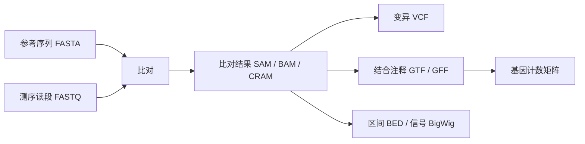

# 第6章 生信文件格式大全

> 把生信分析想成做饭：FASTQ 是买回来的食材，BAM 是整理过的食材，表达矩阵是称重记录，图表是端上桌的菜。认清文件，才能知道下一步该做什么。

学完本章，你应当能看懂一条测序记录、一条比对记录和一个表达矩阵，并避免最常见的“坐标差一个碱基”错误。暂时不用背所有字段；遇到文件时回来查就好。



## 6.1 序列文件：FASTA、FASTQ

### FASTA：只有文字内容的“参考书”

FASTA 保存核酸或蛋白质序列。每条记录以 `>` 开头，后面是序列名称及可选描述；下一行开始是序列，可以折行。

```text
>gene_demo illustrative_sequence
ATGAAATTTGGG
CCCTAA
```

上面是一条 18 个碱基的记录，不是两条。许多工具把第一个空格前的 `gene_demo` 当作 ID，因此同一 FASTA 内的 ID 必须唯一。`.fa`、`.fasta`、`.fna` 通常是核酸序列，`.faa` 常见于蛋白质序列，最终仍应查看内容。

**常见用途**：参考基因组比对、转录本定量、蛋白序列检索。FASTA 本身没有每个碱基的可信程度。

### FASTQ：给每个字附上“把握有多大”

常见的测序 FASTQ 每条记录四行：

```text
@read_demo
ACGTACGT
+
IIII!!!!
```

| 行 | 含义 | 检查点 |
| --- | --- | --- |
| 1 | 以 `@` 开头的 read 名称 | 双端数据的两个 mate 应相互对应 |
| 2 | 测到的碱基 | `N` 表示不能确定是哪种碱基 |
| 3 | `+`，分隔符，可带标识 | 不能直接删掉 |
| 4 | 每个碱基的质量编码 | 字符数必须等于第二行碱基数 |

现代常见 FASTQ 使用 Phred+33：`Q = 字符的 ASCII 编码 − 33`，错误概率为 `10^(-Q/10)`。因此 `I` 是 Q40，单碱基错误概率约万分之一；`!` 是 Q0。Q20 和 Q30 分别对应约 1% 和 0.1% 的错误概率。极老数据可能使用其他编码，需要查来源。

`.fastq.gz` 是 gzip 压缩的 FASTQ，很多软件能直接读取，不必先解压。双端的 `R1` 和 `R2` 是同一片段的两端，**不是两个生物学样本**。测 100 万对 reads，按单条读段数计算就是 200 万 reads；记录数据量时说清单位。

### 动手：生成本章和后面章节共用的小数据

在项目根目录的 PowerShell、Linux 或 macOS 终端执行，Python 3 即可：

```bash
python examples/make_demo_data.py --out demo-data
```

[数据生成脚本](../examples/make_demo_data.py ':ignore') 会生成一条 3000 bp 的人工染色体、两个样本各 20 对 75 bp reads，以及独立演示用的 GTF、BED、VCF 和计数表。固定随机种子使序列可重现。它们用于理解格式，不代表真实生物学实验；计数表和变异表不是从这些 reads 分析出来的。

在同一目录启动 Python，或者把以下代码保存为 `.py` 文件运行：

```python
import gzip

with gzip.open("demo-data/treated_R1.fastq.gz", "rt") as handle:
    name = handle.readline().strip()
    sequence = handle.readline().strip()
    separator = handle.readline().strip()
    quality = handle.readline().strip()

assert name.startswith("@") and separator.startswith("+")
assert len(sequence) == len(quality)
scores = [ord(character) - 33 for character in quality]
print("读段长度:", len(sequence))
print("Q30 碱基比例:", sum(q >= 30 for q in scores) / len(scores))
```

预期长度是 `75`，Q30 比例是 `0.8`。我们故意让这个 read 的末尾 15 个碱基质量很低，下一章会解释如何处理。

## 6.2 比对文件：SAM、BAM、CRAM

它们回答同一个问题：**这条 read 被放在参考基因组的什么位置？放得可靠吗？**

SAM 是可读文本；BAM 是其二进制压缩表示；CRAM 通常通过参考序列进一步压缩。同一分析结果可以采用不同存储格式，但 CRAM 解码常需要完全匹配的参考序列，不能只保存 CRAM 后把参考版本忘掉。

SAM 的开头可包含 `@HD`、`@SQ`、`@RG` 等头信息，分别记录格式、参考序列和读段组。数据行至少有 11 列：

| 字段 | 大意 | 例如 |
| --- | --- | --- |
| QNAME | read 名称 | `read1` |
| FLAG | 多个状态打包成的整数 | 是否双端、反向、重复、未比对等 |
| RNAME、POS | 染色体、比对起点 | `chr1`、`101`，POS 从 1 开始 |
| MAPQ | 比对位置的可信程度 | 低分常见于重复序列，255 通常表示不可用 |
| CIGAR | 匹配、插入、缺失、剪接情况 | `50M100N25M` |
| RNEXT、PNEXT、TLEN | 另一端的位置和模板长度 | 双端分析用 |
| SEQ、QUAL | 序列与碱基质量 | 类似 FASTQ |

**碱基质量 Q 与 MAPQ 是两件事**：一个字读得很清楚，也可能因为它在书里出现很多次而不知道该放哪一页。不同比对软件的 MAPQ 标定不完全一致，不能机械横向比较。

CIGAR 中 `M` 表示对齐段，可能包含匹配与错配；`=` 和 `X` 才明确区分一致与不一致；`I` 是相对参考的插入，`D` 是缺失，`N` 是跳过参考区间，RNA 比对中常对应内含子；`S` 是软剪切，碱基还保留在 SEQ 中。例如 `50M100N25M` 消耗 read 的 75 个碱基和参考的 175 个碱基。

FLAG 是位标志，不能把“FLAG 等于某个数字”当作通用筛选。常用 `0x4` 表示未比对，`0x100` 次级比对，`0x400` 重复，`0x800` 补充比对。筛选时应理解要排除哪类记录，结构变异分析往往需要补充比对信息。

**排序与索引像书的正文和目录**：坐标排序的 BAM 通常配 `.bai` 或 `.csi`，CRAM 配 `.crai`。索引帮助快速跳到区间，不会修复文件，也不能脱离原文件使用。第 8 章会实际生成 BAM 和索引。

## 6.3 变异文件 VCF 与区间文件 BED

### VCF：列出“和参考书不一样的地方”

VCF 元信息以 `##` 开头，表头以 `#CHROM` 开头。核心列是染色体、位置、ID、参考碱基 REF、替代碱基 ALT、质量 QUAL、过滤状态 FILTER、附加信息 INFO；有样本时后面还有 FORMAT 和样本列。

| 内容 | 示例 | 解读 |
| --- | --- | --- |
| REF / ALT | `A` / `G` | 在这个位置观察到 A→G 的替代 |
| GT | `0/1` | 一份参考等位基因、一份第一种替代等位基因 |
| GT | `1\|0` | 竖线表示已定相，保留单倍型顺序 |
| DP | `20` | 此工具定义下的深度，需查看头信息 |
| AD | `11,9` | 参考和替代等位基因的支持 read 数 |
| FILTER | `PASS` | 通过已执行的过滤，不等于已经证实为真 |

`ALT` 可以有多个值，此时 `1`、`2` 对应不同替代等位基因。`./.` 是基因型缺失，不能改成 `0/0`。对于插入、缺失，VCF 经常用共同的锚定碱基表示，所以不要把 POS 当成缺失片段的完整范围。

### BED：只圈出“第几页到第几页”

BED 前三列是 `chrom start end`，后面可带名称、分值、链方向等。它用于基因区域、peaks（富集区间）、捕获区间及黑名单区域，本身不描述变异基因型。

| 格式 | 起始计数 | 结束位置 | 同一段 100 个碱基 |
| --- | --- | --- | --- |
| BED | 0 起始 | 不包含 end，半开区间 | `chr1 100 200` |
| GTF/GFF | 1 起始 | 包含 end | `chr1 101 200` |
| VCF POS、SAM POS | 1 起始 | POS 只是位置，范围需结合记录解释 | 起点 `101` |

BED 长度等于 `end − start`。把单个 SNP 的 VCF 位置 `1200` 转成 BED，应为 `[1199, 1200)`。把多碱基变异转区间时还需结合 REF 和具体分析目的，不能全部当 SNP。

## 6.4 注释文件：GFF、GTF

参考 FASTA 只告诉你“字是什么”，注释文件才告诉你“哪里是基因、外显子和编码区”。常见 GTF/GFF 有九列，前八列描述位置、类型、链方向等，第九列保存属性。

```text
chrDemo  demo  exon  101  400  .  +  .  gene_id "geneA"; transcript_id "txA";
```

上面为便于阅读使用空格，真实文件以 Tab 分隔。它表示 `txA` 的一个外显子，属于 `geneA`。一个基因可以有多个转录本，一个转录本又可以有多个外显子。

GTF 常见 `gene_id "..."; transcript_id "...";` 属性；GFF3 常见 `ID=...;Parent=...`，通过父子关系连接层级。两者不是简单改扩展名就能互换。

**配套原则**：FASTA、GTF/GFF 必须使用匹配的物种、参考版本和染色体命名。人类 GRCh37 与 GRCh38 的坐标不能混用；`chr1` 和 `1` 也不会自动被所有软件视为同一条染色体。Ensembl 基因 ID 与基因符号不同，删版本后缀、合并重复符号之前都要保存映射关系。

## 6.5 表达矩阵：Counts、CPM、FPKM、TPM

表达矩阵通常是“行 = 基因，列 = 样本”，格子中是该基因的测量值。单细胞对象的方向要核实：AnnData 的 `.X` 是“行 = 细胞，列 = 基因”，与许多 R 输入表相反。

| 名称 | 调整了什么 | 适合做什么 | 容易误用的地方 |
| --- | --- | --- | --- |
| 原始 Counts | 通常未按文库大小或长度标准化 | DESeq2/edgeR 的常见输入 | 直接比较不同测序量样本的绝对大小 |
| CPM | 每百万计数，调整文库总量 | 表达过滤、部分展示 | 未调整基因长度 |
| FPKM/RPKM | 调整长度和文库量 | 一些旧数据的表达描述 | FPKM 与 RPKM 的片段/read 单位不同 |
| TPM | 先按长度调整，再缩放到一百万 | 同一样本表达组成的描述 | 组成量不等于每细胞绝对 RNA 分子数 |

对一个样本，简化 TPM 的计算是：先做 `Counts / 基因长度(kb)`，再除以这些数的总和，乘一百万。实际转录本软件还会估计有效长度等因素。

```python
counts = [100, 100]
length_kb = [1, 2]
rates = [count / length for count, length in zip(counts, length_kb)]
tpm = [rate / sum(rates) * 1_000_000 for rate in rates]
print([round(value, 1) for value in tpm])
print(round(sum(tpm)))
```

输出约 `[666666.7, 333333.3]`，总和为 `1000000`。长基因更容易接到 reads，长度校正后，相同计数不再意味着相同相对丰度。

DESeq2 不应直接输入 TPM、FPKM 或对数表达量。Salmon/Kallisto 的转录本估计结果可通过 **tximport/tximeta** 按对应流程导入，不能为了满足“整数矩阵”就随意取整或乘系数。第 9 章会使用真实计数做差异分析。

## 6.6 BigWig、HDF5、h5ad、MEX、loom

| 格式 | 装的是什么 | 常见打开方式 |
| --- | --- | --- |
| BigWig，`.bw` | 沿基因组位置变化的连续信号，支持快速区间查询 | IGV、UCSC、deepTools |
| HDF5，`.h5` | 多个数组和元信息的分层容器 | h5py，或产生它的软件 |
| AnnData，`.h5ad` | 表达矩阵、细胞信息、基因信息、降维坐标、数据层 | Scanpy/AnnData |
| 10X MEX | `matrix.mtx.gz` + `features.tsv.gz` + `barcodes.tsv.gz` | Scanpy `read_10x_mtx`、Seurat `Read10X` |
| loom | 基于 HDF5 的矩阵与属性，常见于部分 velocity/GRN 工具 | loompy、对应分析工具 |

MEX 就像“只记有货的货架位置”：大量零不必逐个写出，所以省空间。**三个文件的行列顺序必须匹配**；单独重排 barcodes 会让表达量配错细胞。`.h5` 只是容器后缀，不保证一定是 10X 格式。

AnnData 中 `.obs` 保存细胞/spot 元信息，`.var` 保存基因信息，`.obsm` 保存多维坐标，`.layers` 可保存原始 counts 等。`.raw` 的内容取决于何时赋值，名字叫 raw 不代表里面必然是原始整数计数。

## 6.7 格式转换实战与检查

### 把 GTF 外显子转成 BED

先运行 6.1 的数据生成命令，再在项目根目录运行：

```python
import csv
from pathlib import Path

rows = []
with open("demo-data/genes.gtf", encoding="utf-8") as handle:
    for line in handle:
        if line.startswith("#") or not line.strip():
            continue
        fields = line.rstrip("\n").split("\t")
        if fields[2] == "exon":
            rows.append([fields[0], int(fields[3]) - 1, int(fields[4])])
with Path("demo-data/exons.bed").open("w", newline="", encoding="utf-8") as handle:
    csv.writer(handle, delimiter="\t").writerows(rows)
print(rows)
```

预期是 `chrDemo 100 400` 和 `chrDemo 800 1200`。这个例子只做外显子坐标转换，没有合并同基因不同转录本的重叠区间。

### 每次接到文件，先问五件事

1. 来源、物种和参考版本是什么？能否回到下载页面？
2. 文件是原始测量、处理后结果还是标准化矩阵？
3. 样本名与分组表能否一一对应？行列方向正确吗？
4. 序列 ID、坐标体系和注释是否一致？
5. 文件是否完整，解压、索引和工具读取能否通过？

不要把二进制 BAM 当文本修改，不要用 Excel 打开再保存超大的基因表达表，不要只更改扩展名“转换格式”。保留原始文件，转换后记录命令和输出文件名。

### 小练习

BED 的 `chr1 0 10` 有多少个碱基？一个 read 的 Q30 很高而 MAPQ 很低可能是什么原因？两个各有一百万条记录的 R1/R2 文件表示多少对 reads？

答案依次是 **10 个**、**序列读得清楚但可能匹配多个位置**、**一百万对**。

进一步查阅：[SAM/VCF 格式规范](https://samtools.github.io/hts-specs/)、[UCSC BED 格式说明](https://genome.ucsc.edu/FAQ/FAQformat.html#format1)、[AnnData 数据结构](https://anndata.readthedocs.io/en/stable/)。

> **下一章**：[第7章 数据获取与质控](07-data-qc.md) —— 先把数据拿对，再检查它是否适合分析。
