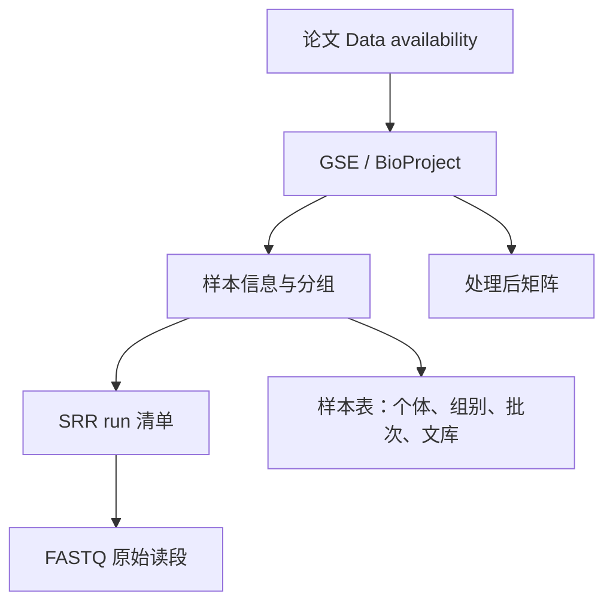

# 第7章 数据获取与质控

> 下载数据像网购食材：先确认买的是你需要的东西，再验货。下载成功不代表样本选对了，报告一片绿色也不代表实验设计合理。

本章完成两件事：从论文追到公开数据；用 FastQC、fastp 和 MultiQC 理解一份质控报告。先做小数据练习，再下载几十 GB 的真实测序文件。

## 7.1 公共数据库：从科学问题找到合适的数据

### 先写问题，再挑数据库

“找乳腺癌数据”太宽泛；“比较未经治疗的肿瘤和邻近组织中某通路的表达，并考虑配对患者”才会告诉你需要哪些样本。下载前列清楚物种、组织、组别、处理、重复数、测序类型和所需数据层级。

| 数据库 | 像什么 | 常见内容 | 适用问题 |
| --- | --- | --- | --- |
| [GEO](https://www.ncbi.nlm.nih.gov/geo/) | 论文附带的实验档案室 | 样本说明、表达矩阵、补充文件、SRA 链接 | 找 RNA-seq、单细胞、表观组实验 |
| [SRA](https://www.ncbi.nlm.nih.gov/sra) / [ENA](https://www.ebi.ac.uk/ena/browser/home) | 原始读段仓库 | 测序 run、FASTQ/SRA 文件及元数据 | 从原始数据复现流程 |
| [ENCODE](https://www.encodeproject.org/) | 有较规范注释的功能元件地图 | ChIP-seq、ATAC-seq、RNA-seq、peaks、信号轨道 | 研究染色质和调控元件 |
| [GDC](https://portal.gdc.cancer.gov/) | 癌症多组学资料库 | TCGA 等项目的表达、变异、临床数据 | 肿瘤组学分析 |
| [GTEx](https://gtexportal.org/home/) | 正常组织表达参照 | 多组织表达、eQTL、样本信息 | 组织特异性表达 |
| [ICGC ARGO](https://www.icgc-argo.org/) | 国际癌症研究数据平台 | 队列、基因组和临床资料 | 癌症跨队列研究 |

数据库门户、访问政策和旧项目迁移会变化，应从官方入口确认可下载的文件。TCGA 与 GTEx 的实验和处理流程不同，不能直接拼起来把差异全部解释成“癌症效应”。

### 看懂 GEO/SRA 的编号

- **GSE**：一个系列/研究，例如论文的一组实验。
- **GSM**：GEO 中的一份样本记录。
- **SRP / PRJNA**：SRA 项目或 BioProject。
- **SRX**：实验记录，描述文库和测序设置。
- **SRR**：实际测序 run；同一个样本可能对应多个 run。

这些层级不是一一对应的。一个人可能贡献多个组织，一个组织可能建多个文库，一个文库可能分几次上机。**生物学重复要数独立个体或实验单位，不能数 SRR 编号。**



### 一个真实案例：airway 数据

Himes 等人在 2014 年发表的气道平滑肌细胞研究使用地塞米松处理，并提供了公开 RNA-seq 数据，GEO 编号是 **[GSE52778](https://www.ncbi.nlm.nih.gov/geo/query/acc.cgi?acc=GSE52778)**。Bioconductor 的 `airway` 教学数据取其中四个细胞来源各一个未处理/处理样本，共八个样本。

打开页面后依次找：研究摘要、总体设计、样本列表、补充文件和 SRA 链接。这个系列包含的条件不止教学包中的八个样本，不能把 GSE 下全部文件直接当作同一个两组实验。第 9 章会直接使用 `airway` 包提供的已整理计数，减少首次练习的下载量。

如果你想研究剪接，需要原始读段或剪接比对结果；如果只练差异表达，可靠的原始计数表加样本表即可。仅有 TPM 表则不能直接套用普通 DESeq2 计数输入流程。

### 建一张样本表，比立刻下载更重要

建议至少包含以下列，使用真实样本信息填写，未知值明确标注：

| 字段 | 为什么需要 |
| --- | --- |
| sample_id、donor_id | 区分测序样本与独立个体 |
| condition、batch | 表示处理组和技术批次 |
| species、tissue | 防止混用物种、组织 |
| run_accession、source_url | 回溯下载来源 |
| layout、strandedness | 单端/双端、链特异性，影响后续命令 |
| reference、annotation | 参考与注释版本 |
| file、checksum | 本地文件路径和完整性校验 |

GDC 下载时可先筛选项目、样本类型、实验策略和数据类型，再导出 **manifest（下载清单）** 与样本元信息。开放的表达结果与需要授权的原始测序文件访问方式不同；使用 GDC Data Transfer Tool 时依官方说明读取清单，需要凭证的文件不能靠换工具绕过。

### 下载工具怎么选

| 工具 | 典型使用方式 | 你需要知道的事 |
| --- | --- | --- |
| 浏览器 / `curl` / `wget` | 下载 GEO 补充矩阵或 ENA 提供的文件地址 | 大文件应支持续传，并核对服务器校验值 |
| SRA Toolkit | `prefetch` 获取 accession，再由 `fasterq-dump` 导出 FASTQ | 转换会产生很大的临时文件；导出默认不是 gzip 压缩 |
| GDC Client | 根据导出的 manifest 批量下载 | 保留 UUID 与样本的映射 |
| Aspera | 使用提供方给出的传输端点和官方客户端 | 并非每个端点都支持，网络策略也可能限制 |

不在这里放随意挑选的 SRR 下载命令：真实 run 可能很大，也可能与研究问题不符。首次原始数据复现的正确步骤是先查文件大小和样本信息，选一个目标 run，核实单端/双端，再按官方文档下载与转换，最后推广到全部样本。

完整性可用 Python 跨平台检查。先运行第 6 章的数据生成命令，再运行：

```python
import gzip
import hashlib
from pathlib import Path

path = Path("demo-data/control_R1.fastq.gz")
digest = hashlib.md5()
with path.open("rb") as handle:
    for block in iter(lambda: handle.read(1024 * 1024), b""):
        digest.update(block)
with gzip.open(path, "rt") as handle:
    lines = sum(1 for _ in handle)
assert lines % 4 == 0
print("MD5:", digest.hexdigest())
print("reads:", lines // 4)
```

这里应读到 20 条记录。MD5 要与提供方公布的值比较才算下载校验；“算出了一个 MD5”本身并不能证明文件正确。gzip 文件重建后压缩头可能变化，不要拿不同次生成的演示文件哈希当固定答案。

## 7.2 原始数据质控：看体检报告，决定如何处理

### FastQC、fastp、MultiQC 分别做什么

**FastQC 是体检单，fastp 是按规则清理读段的工具，MultiQC 是把多份体检单放到同一张总表。** FastQC 和 MultiQC 本身不会把坏碱基修好，也不会修改 FASTQ。

| 指标 | 含义 | 异常时先查什么 |
| --- | --- | --- |
| 每碱基质量 | read 不同位置读得多可靠 | 末端是否下降，是否需质量修剪 |
| 接头含量 | 读到了人工接头 | 文库插入片段是否短、接头类型是否正确 |
| GC 分布 | G/C 碱基比例的分布 | 物种、污染、富集实验、文库偏好 |
| 重复序列比例 | 读段是否高度重复 | PCR 扩增、文库复杂度、高表达 RNA |
| 过度代表序列 | 某些序列异常多 | rRNA、接头、特定高表达转录本或污染 |
| 长度分布 | reads 长度是否符合预期 | 是否已修剪、是否为小 RNA 或长读长 |
| N 含量 | 无法判定的碱基比例 | 测序质量或特定周期异常 |

FastQC 的红/黄灯是**提醒检查**，不是一票否决。RNA-seq 中高表达基因可能产生大量相同读段；ATAC-seq 和靶向实验也不符合均匀随机基因组文库的所有假设。对 RNA-seq 直接按序列去重，可能把真实表达信号一并删掉。

### 可运行练习：同一份数据清理前后有什么变化

以下命令在 **Linux / WSL 的 Bash** 中运行，项目位于 Windows 桌面时可在 WSL 使用 `/mnt/c/Users/29748/Desktop/BioInfo`。需要已初始化的 Conda；Windows 原生 PowerShell 不直接运行这些生信工具。

先在项目根目录生成 `demo-data`，然后建立专用环境：

```bash
conda create -n bioinfo-qc -c conda-forge -c bioconda python=3.11 fastqc=0.12.1 fastp=0.23.4 multiqc=1.25 -y
conda activate bioinfo-qc
mkdir -p results/qc/raw results/qc/clean results/clean
fastqc demo-data/*_R*.fastq.gz --outdir results/qc/raw --threads 2
fastp --in1 demo-data/treated_R1.fastq.gz --in2 demo-data/treated_R2.fastq.gz \
  --out1 results/clean/treated_R1.fastq.gz --out2 results/clean/treated_R2.fastq.gz \
  --cut_tail --cut_tail_window_size 4 --cut_tail_mean_quality 20 \
  --length_required 30 --thread 2 \
  --html results/qc/fastp.html --json results/qc/fastp.json
fastqc results/clean/*.fastq.gz --outdir results/qc/clean --threads 2
multiqc results/qc --outdir results/qc --filename overview.html --force
conda list --explicit > results/qc/conda-explicit.txt
```

`--cut_tail` 从前往后检查滑动窗口，遇到平均质量不足时剪掉后面部分；它与单纯“质量不过关就整条丢掉”的过滤不同。`--length_required 30` 避免保留过短片段。窗口平均是对 Phred 分数的处理，不等于直接平均错误概率。

打开 `results/qc/fastp.html` 看处理前后读段长度、质量和过滤原因；打开 `results/qc/overview.html` 对比样本。人工数据中的 `treated` 第一对 reads 含低质量尾部，所以开启质量修剪后能看到变化。**只有 20 对 reads 时，接头自动识别和分布统计没有真实项目中的代表性**；不要从这份演示报告得出生物学结论。

真实项目不能把这组参数原封不动用于所有实验。small RNA 有特定接头和长度范围；UMI 文库需要先保留/提取分子条码；单细胞 R1 可能主要保存 cell barcode 和 UMI，不应像普通 RNA read 一样修剪。

### Trimmomatic 与 fastp 如何选择

两者都能做接头去除和质量处理。Trimmomatic 常见于既有 Java 流程，可明确指定接头 FASTA、滑窗和最短长度；fastp 集成质量控制、部分接头识别和报告，初学较方便。复现论文时优先按原方法和版本，不能为了“更干净”把两套工具连续跑一遍却不记录额外损失。

### 从一份报告到一个决定

假设 6 个 RNA-seq 样本中，5 个比对率都在相近范围，只有 1 个明显偏低。合理的排查顺序是：

1. 样本和文件是否配错，R1/R2 是否对应？
2. 原始数据的碱基质量、接头和 read 长度是否异常？
3. 物种、参考版本和链特异性是否正确？
4. 是否有 rRNA、微生物或其他来源污染？
5. 是否需要结合实验记录决定重测或剔除，并如实记录理由？

不应只因为样本“让 PCA 不好看”就删除。剔除标准最好事先约定，并保留剔除前后的分析比较。

### 本章交付物与练习

一个可继续分析的数据包应包括原始文件、样本表、下载来源/日期、校验信息、质控报告、清理参数和清理后的文件。原始数据始终保留。

练习：两个 SRR 来自同一个样本，能当作两个重复吗？不能。FastQC 的重复率红灯需要立即去重吗？不能，需要结合实验类型判断。只想练习 DESeq2 是否必须下载原始 FASTQ？不必，有可信的原始计数及样本信息即可。

官方资料：[SRA Toolkit](https://github.com/ncbi/sra-tools/wiki)、[FastQC](https://www.bioinformatics.babraham.ac.uk/projects/fastqc/)、[fastp](https://github.com/OpenGene/fastp)、[MultiQC](https://docs.seqera.io/multiqc)。

> **下一章**：[第8章 序列比对](08-alignment.md) —— 把读段放回参考基因组。
