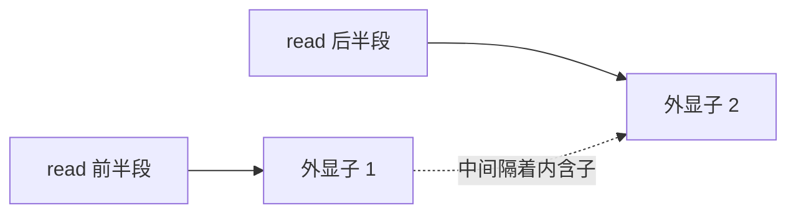

# 第8章 序列比对

> 参考基因组像一本很长的书，测序 reads 像散落的小纸条。比对就是判断：每张纸条最可能来自书里的哪一页。

本章会实际把第 6 章生成的人工 reads 比对到人工参考，产出可查看的 BAM。它帮助理解操作顺序；真实人类基因组的时间、内存和异常情况会多得多。

## 8.1 为什么要比对？

你手里只有 `ACGT...`，并不知道它来自哪个基因。把 reads 定位后，才可以统计某个基因收到多少片段、某个位置是否有替代碱基、某段染色体是否有信号富集。

比对不是搜索“完全一样的字符串”这么简单，因为会遇到：

- **测序错误**：某个字读错了，仍应能找到大致位置。
- **真实变异**：这个人的序列本来就与参考不同。
- **重复序列**：多个位置都很像，不能硬说只来自其中一个。
- **RNA 剪接**：一条 read 的两段可能在基因组上隔着很长的内含子。

**参考基因组是一套坐标系统，不是每个人的标准答案。** 与参考不同不一定有害，未比对也不一定是垃圾，可能来自未包含的序列、污染或不适合当前算法的数据。


## 8.2 参考基因组获取与索引构建

### 选参考时，先对齐三件事

**物种与组装版本、染色体命名、注释版本**需要匹配。可从 [Ensembl](https://www.ensembl.org/)、[GENCODE](https://www.gencodegenes.org/) 或 [NCBI Datasets](https://www.ncbi.nlm.nih.gov/datasets/) 获取参考；尽量从同一套发布中取 FASTA 与 GTF，保存下载地址、版本和校验值。

人类 GRCh38 的不同参考包可能含不同的替代序列、decoy（用于吸收易误比对读段的序列）和病毒序列，不能只因为名字含“hg38”就混用索引、注释和变异资源。参考升级也不是改文件名，必要时须重新比对或使用有记录的坐标转换。

索引像书的检索目录。BWA、Bowtie2、HISAT2、STAR 各有自己的索引格式，不能互用。索引应在同一参考与软件版本下复用，不必每个样本建一次。SAMtools 的 `.fai` 只是 FASTA 随机访问索引，也不是 BWA/STAR 的比对索引。

### 本章运行环境

先在项目根目录运行 `python examples/make_demo_data.py --out demo-data`。后面的命令使用 **Linux/WSL Bash** 和 Conda：

```bash
conda create -n bioinfo-align -c conda-forge -c bioconda bwa=0.7.18 bowtie2=2.5.4 samtools=1.21 -y
conda activate bioinfo-align
mkdir -p results/alignment
samtools faidx demo-data/reference.fa
bwa index demo-data/reference.fa
```

人工参考只有 3000 bp，几乎不占资源。真实人类 STAR 索引常需要数十 GB 内存；选择服务器前查看所用参考包的要求，不能根据这个练习的耗时估算真实项目。

## 8.3 DNA 比对工具：BWA、BWA-MEM2、Bowtie2

| 工具 | 常见场景 | 选择依据 |
| --- | --- | --- |
| BWA-MEM | Illumina DNA 短读长，变异检测常见 | 成熟、与许多既有流程一致 |
| BWA-MEM2 | 与 BWA-MEM 类似的使用目标 | 优化速度，但要核对平台与资源 |
| Bowtie2 | DNA 短读长、ChIP/ATAC 等 | 可选择端到端或局部比对策略 |
| minimap2 | PacBio / Nanopore 等长读长 | 按数据类型使用合适预设，不能照搬短读长参数 |

### 完整练习：FASTQ → BAM → 统计

在上一节环境中依次执行：

```bash
set -euo pipefail
bwa mem -t 2 -R '@RG\tID:control\tSM:control\tPL:ILLUMINA' \
  demo-data/reference.fa demo-data/control_R1.fastq.gz demo-data/control_R2.fastq.gz \
  2> results/alignment/control.bwa.log \
  | samtools sort -@ 2 -o results/alignment/control.sorted.bam -
samtools index results/alignment/control.sorted.bam
samtools quickcheck -v results/alignment/control.sorted.bam
samtools flagstat results/alignment/control.sorted.bam > results/alignment/control.flagstat.txt
samtools idxstats results/alignment/control.sorted.bam > results/alignment/control.idxstats.tsv
samtools view results/alignment/control.sorted.bam chrDemo:1-1000
```

这里 `-R` 添加 read group（读段组），`SM` 指明样本名。真实数据不同 lane/文库可有不同 `ID`，同一生物样本的 `SM` 要保持一致。双端文件的顺序不可颠倒；管道把 SAM 直接交给排序，避免写一个庞大的中间 SAM。

`set -o pipefail` 保证比对器失败时管道也报错，否则下游“成功退出”可能掩盖前一步的问题。`quickcheck` 正常时通常没有输出，但它只检查基本完整性，并不逐条证明比对正确。

人工数据为完整匹配的 DNA reads，预计绝大多数能比对；总共 20 对，即 40 条主要 read 记录。看日志时注意次级/补充记录会影响某些统计口径。不要为了追求 100% 比对率随意放松真实数据的参数。

### 用 Bowtie2 比较结果

继续使用同一套人工输入：

```bash
bowtie2-build demo-data/reference.fa results/alignment/demo_bt2
bowtie2 -x results/alignment/demo_bt2 \
  -1 demo-data/control_R1.fastq.gz -2 demo-data/control_R2.fastq.gz \
  -p 2 --end-to-end -S results/alignment/control.bowtie2.sam \
  2> results/alignment/control.bowtie2.log
samtools sort -o results/alignment/control.bowtie2.bam results/alignment/control.bowtie2.sam
samtools index results/alignment/control.bowtie2.bam
```

端到端比对要求处理整条 read；局部比对允许部分末端软剪切。允许局部比对并不表示被剪掉的部分“不重要”，那里也可能藏着接头、真实结构变异或融合线索。记录选择理由，不要在不同样本中随意使用不同策略。

## 8.4 RNA 比对：HISAT2 与 STAR 为什么特别

成熟 RNA 已经去掉内含子。一条跨外显子连接处的 read，映射到基因组时需要“跳过一段”：



DNA 比对器通常不是为识别这种剪接设计的，所以把 RNA-seq 直接交给 BWA 可能漏掉连接位点。**HISAT2 和 STAR 是剪接感知比对器**，能结合注释与数据发现剪接连接。

| 项目 | HISAT2 | STAR |
| --- | --- | --- |
| 常见特点 | 内存相对友好 | 速度快，常需较多内存 |
| 参考准备 | 基因组索引，可加入已知剪接位点/外显子信息 | 基因组索引，通常同时提供 GTF |
| 主要输出 | SAM，之后排序成 BAM | 可直接输出排序 BAM、连接位点和日志 |
| 后续用途 | 基因定量、剪接等 | 基因定量、剪接、融合流程等 |

真实 RNA-seq 的操作顺序是：下载配套 FASTA/GTF → 按所用版本文档建索引 → 输入 R1/R2 和文库信息 → 输出排序 BAM 与日志 → 用 featureCounts 等结合注释计数。STAR 常用双遍策略收集并利用剪接位点；HISAT2 可使用注释提供的已知位点。保留日志中的唯一比对、多重比对、剪接连接和未比对原因。

**链特异性**决定 read 的方向与原 RNA 有什么关系，主要影响后续计数以及部分比对设置。不要凭 R1/R2 文件名猜；先查建库试剂/论文方法，必要时用 RSeQC `infer_experiment.py` 辅助判断。无法确认时记录不确定性，而不是默认所有项目都为同一种链方向。

如果目标只是基因/转录本表达，Salmon/Kallisto 等方法可从转录本集合直接估计丰度，减少完整基因组比对的开销。它们不是所有任务的替代品：检查局部变异、剪接和融合仍需要相应证据。第 9 章会讲如何选择定量路线。

## 8.5 比对后处理：先检查，再决定过滤

### 排序、索引、统计各解决什么问题

坐标排序将同一区域的记录放到一起；索引允许按区间取数据；统计用于发现异常。必须在最终排序/过滤结果上重新建索引，旧 `.bai` 不应配新的 BAM。

| 观察项 | 含义 | 低或高可能意味着什么 |
| --- | --- | --- |
| 比对率 | 有多少 reads 找到位置 | 参考不匹配、污染、低质量、算法不合适 |
| 唯一比对率 / MAPQ | 位置是否明确 | 重复序列、旁系同源基因、短 read |
| properly paired | 双端关系是否符合软件预期 | 文库方向、插入片段、结构变异等 |
| 覆盖深度与均匀性 | 区域被读到多少次 | 捕获偏差、GC 偏差、CNV 或目标富集 |
| 重复比例 | 可能重复测到同一分子 | PCR 扩增、文库复杂度，也可能有生物学原因 |

可以看 `samtools coverage` 的区域统计，而不是只看总比对率：

```bash
samtools coverage results/alignment/control.sorted.bam
samtools depth -a results/alignment/control.sorted.bam > results/alignment/control.depth.tsv
```

这个小参考覆盖很稀疏，是正常的。真实 WGS、WES、RNA-seq 的覆盖分布本来就不同，不存在一个适合全部实验的“好覆盖形状”。

### 重复标记不等于无条件去重

Picard `MarkDuplicates` 和 SAMtools `markdup` 能按位置等信息标记可能的 PCR/光学重复。**标记**一般保留记录并设置 FLAG，**删除**会丢掉记录，是不同动作。使用 SAMtools 标记双端重复还需按其流程先进行按名称分组/排序、`fixmate -m` 和坐标排序，不能随便把任意 BAM 交进去。

DNA 变异流程常要求重复标记并让下游按规则处理；普通 bulk RNA-seq 不应简单删除所有重复；UMI 数据应结合分子条码和位置判断重复；ATAC/ChIP 要按实验与流程标准考虑重复和复杂度。人工数据只有少量 reads，无需为了“流程完整”强行去重。

### 用 IGV 肉眼检查一个区域

[IGV](https://igv.org/) 像地图浏览器：加载 `demo-data/reference.fa`（同目录保留 `.fai`），再加载 `control.sorted.bam`（同目录保留 `.bai`），搜索 `chrDemo:1-1000`。放大后会看到叠放的 reads 与覆盖轨道。

真实项目重点检查：疑似变异是否得到多个独立片段支持，是否集中在末端/同一方向，是否存在大量软剪切，RNA reads 是否按注释跨外显子。IGV 有助于识别明显伪影，但不能取代统计模型和完整质控。

### 常见错误与练习

| 现象 | 优先排查 |
| --- | --- |
| 几乎没有 reads 比上 | 参考物种、read 类型、输入是否完整 |
| 基因计数几乎全零但比对率高 | GTF/FASTA 命名、版本、链特异性、feature 类型 |
| IGV 找不到染色体 | `chr1`/`1` 命名和参考版本 |
| 无法建立 BAM 索引 | 是否坐标排序、文件是否完整 |
| 双端关系异常 | 配对文件是否混样、是否独立修剪后丢失对应关系 |

练习：一条 RNA read 的 CIGAR 是 `40M500N35M`，read 有多长？答案是 **75 bp**，中间 500 bp 消耗参考位置但不消耗 read。为什么高比对率还可能得到错误结论？因为参考、注释、样本身份、文库方向和统计设计仍可能出错。

官方资料：[SAMtools](https://www.htslib.org/doc/)、[BWA](https://github.com/lh3/bwa)、[Bowtie2](https://bowtie-bio.sourceforge.net/bowtie2/manual.shtml)、[HISAT2](https://daehwankimlab.github.io/hisat2/)、[STAR](https://github.com/alexdobin/STAR)。

> **下一章**：[第9章 RNA-seq](09-rnaseq.md) —— 从“落在哪里”走到“哪些基因发生变化”。
