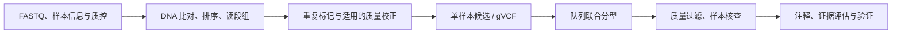

# 第10章 基因组变异分析

> 如果 RNA-seq 在看“今天打印了多少订单”，变异分析就在校对“菜谱本身改了哪些字”。改一个字、删一段、复印一整页，生物学含义和检测方法都不同。

学完本章，你应能区分遗传变异与肿瘤体细胞变异，读懂 VCF 的基本证据，并知道为什么“检测到变异”离“解释其作用”还有一段路。本章用小 VCF 做练习，不需要下载人类全基因组。

## 10.1 Germline：寻找生殖系变异

### 生殖系和体细胞的区别

**生殖系变异**存在于卵子/精子来源的遗传信息中，通常可在个体多种组织检测到；有些从父母遗传，有些新发生。**体细胞变异**在个体发育或后续生活中出现，可能只存在于部分细胞。嵌合、肿瘤纯度和克隆比例会让实际情况更复杂。

| 类型 | 像修改书的什么地方 | 例子 |
| --- | --- | --- |
| SNV，单核苷酸变异 | 换一个字 | A→G |
| 小 Indel，插入/缺失 | 加减几个字 | 缺失 2 bp |
| SV，结构变异 | 挪动、翻转或删除一大段 | 倒位、易位、大片段缺失 |
| CNV，拷贝数变异 | 某些页多印或少印 | 一段染色体扩增 |

SNP 通常强调群体中的单核苷酸多态性，SNV 是更一般的序列变化说法。小变异和结构变异没有一套“运行一个软件就全部找齐”的万能流程。

### 从 reads 到可信候选



GATK Best Practices 是一组按数据类型组织的建议流程。短读长 germline 的典型路线包含 HaplotypeCaller：在局部区域重新考虑可能的单倍型，以区分真实小变异和读段错误。**gVCF** 还记录非变异区域的参考置信度信息，便于多个样本联合分型；普通 VCF 缺少某位置记录，不等价于那个样本一定为参考型。

**BQSR，碱基质量分数重校准**，使用观测到的系统误差和可信已知变异资源改善质量估计。资源需匹配物种和参考版本；没有合适资源的小项目不要从人类教程照搬。联合分型可更一致地评价队列中的候选位点，但不会弥补样本覆盖不足。

DeepVariant 使用训练好的模型识别变异。必须选择匹配的测序技术/模型与参考，WGS、WES、PacBio HiFi 等输入不能随意交换模型。深度学习输出也需要样本质控、区域覆盖和过滤评估。

### 真项目要多保存哪些信息

记录参考 FASTA、版本、索引、已知位点资源、捕获区间（WES）、read group、软件/模型版本与参数。检查样本身份、污染、覆盖、杂合度、性别相关信号与预期是否一致。族系分析还要核对亲缘关系。

过滤常结合深度 DP、基因型质量 GQ、链偏倚、比对质量和局部序列环境。QUAL 是位点层面的质量，GQ 是样本基因型层面的质量；它们不能互换。GATK 的 VQSR 需要足够数据和适配资源，小队列不一定适合，硬过滤阈值也需根据变异类型和平台制定。

## 10.2 Somatic：寻找肿瘤后来积累的变化

肿瘤样本是混合物：肿瘤细胞、免疫细胞、基质细胞，以及多个肿瘤亚克隆。一个真正的体细胞变异，替代等位基因比例可能远低于 50%。

**VAF，变异等位基因频率**，可粗略理解为支持替代等位基因的 reads 占比。例如参考支持 11 条、替代支持 9 条，则 VAF 为 9/20=0.45。但 VAF 不是肿瘤细胞比例：拷贝数、纯度、亚克隆和比对偏差都会影响它。

| 方法 | 常见用途 | 需要关注 |
| --- | --- | --- |
| Mutect2 | 肿瘤/正常配对或肿瘤单样本的小变异检测 | 人群资源、正常样本面板、污染/方向性伪影和后续过滤 |
| VarScan2 | 根据 pileup 等证据检测 germline/somatic 变异 | 深度、质量、配对比较和过滤策略 |
| Strelka2 | 短读长小变异，含肿瘤正常配对模式 | 输入要求、版本和数据类型适配 |

配对正常样本像“同一个人的原始版本”，可以帮助排除原本就存在的遗传差异。它也要有足够覆盖，且不能被肿瘤污染。**正常样本没检测到**可能只是覆盖不够，不自动证明变异只在肿瘤里。

Mutect2 的未过滤输出还需相应过滤步骤，例如 FilterMutectCalls，并按实验条件评估污染和文库方向性伪影。Panel of Normals（正常样本面板）帮助识别平台/流程常见伪影，不能替代病人的配对正常样本。只有肿瘤样本也能分析，但区分生殖系与体细胞的依据更有限。

### 案例：为什么一个“低频热点”仍要查看原始证据

某肿瘤样本出现候选热点，VAF 约 5%。先看局部深度与替代支持数，再看支持 reads 是否都来自同一方向、末端、重复分子或低复杂度区域。5/100 和 50/1000 都是 5%，证据稳定性却不同。最后结合匹配正常和正交验证，不靠“这个基因很有名”直接判真。

## 10.3 结构变异与拷贝数变异

小变异检测器在逐字校对；SV/CNV 方法还要检查书页顺序和份数。

| 信号 | 能提示什么 | 局限 |
| --- | --- | --- |
| read depth，覆盖深度 | 某区段可能多拷贝或缺失 | GC、捕获效率和比对偏差也改变深度 |
| discordant pairs，异常双端关系 | 距离/方向不符，可能有重排 | 文库异常和重复区也可能产生 |
| split reads，分裂比对 | 一条 read 的两段支持断点 | 需要足够独特的序列及覆盖 |
| 长读长跨越 | 直接跨过复杂区域/断点 | 平台误差、覆盖和算法仍需考虑 |

**CNVkit** 常用于肿瘤靶向/WES 等数据的拷贝数分析：统计目标/非目标区间覆盖 → 使用合适参考做归一化 → 分段 → 结合纯度与倍性解释。输出的 log2 ratio 通常表示相对参考的信号，不是直接测到整数拷贝数。

**Manta、DELLY** 等利用不同的断点证据找结构变异，需区分 germline/somatic 模式及平台适配。长读长可选择 Sniffles 等适配工具。平衡易位可能不改变拷贝数，所以“没有 CNV”不等于“没有结构变异”。

**GISTIC2** 是队列层面的分析：寻找多个肿瘤中反复出现的扩增/缺失区域。输入通常是符合规范的分段结果和标记信息；不是把单个样本 BAM 放进去就能得到驱动基因。

## 10.4 变异注释与过滤：给变化加上背景

### 先统一表示，再解释

相同 Indel 在重复序列中可能有不同写法。通常需要按同一参考进行规范化，例如左对齐、拆分多等位位点，并保留原始文件与转换记录。基因组版本与转录本版本不一致时，变异名称和蛋白后果也会不同。

| 工具/资源 | 提供什么 | 不能直接推导什么 |
| --- | --- | --- |
| VEP、ANNOVAR | 所在基因、转录本、外显子/剪接位点、功能后果与数据库注释 | 被标为“高影响”不等于已致病 |
| ClinVar | 提交的临床解释、证据和审查状态 | 单条提交不能忽略争议和证据日期 |
| dbSNP | 变异标识与记录 | 有 rsID 不表示良性 |
| gnomAD | 特定人群数据中的频率等 | 未收录不等于致病，频率需考虑群体和覆盖 |
| SIFT、PolyPhen-2、CADD | 不同机制下的功能影响预测/评分 | 多个相关预测分数不等于多份独立实验 |

VEP 要匹配物种、assembly、cache 和转录本发布；ANNOVAR 涉及相应注册、数据库下载与使用条款。候选位点可有多个转录本后果，应说明选用了哪个转录本及原因，而不是只保留最严重的一条。

### 可运行练习：读取 VCF 并计算 VAF

先运行第 6 章的 `python examples/make_demo_data.py --out demo-data`，再在项目根目录运行以下 Python。它只解析我们生成的**一个双等位演示位点**，真实复杂 VCF 应使用 pysam、cyvcf2 或 bcftools 等成熟工具。

```python
from pathlib import Path

for line in Path("demo-data/variants.vcf").read_text(encoding="utf-8").splitlines():
    if line.startswith("#"):
        continue
    fields = line.split("\t")
    values = dict(zip(fields[8].split(":"), fields[9].split(":")))
    ref_reads, alt_reads = map(int, values["AD"].split(","))
    vaf = alt_reads / (ref_reads + alt_reads)
    print("位置:", fields[0], fields[1], "基因型:", values["GT"])
    print("VAF:", vaf)
    print("单碱基 BED 区间:", int(fields[1]) - 1, int(fields[1]))
```

预期 `VAF=0.45`，BED 区间为 `1199 1200`。这条 VCF 是人工指定的格式例子，不是从演示 FASTQ 检出的变异，更不能用来验证变异检测算法。

在 Linux/WSL Bash 中可进一步用 bcftools 查看和规范化，先安装独立环境：

```bash
conda create -n bioinfo-vcf -c conda-forge -c bioconda bcftools=1.21 samtools=1.21 -y
conda activate bioinfo-vcf
mkdir -p results/variants
samtools faidx demo-data/reference.fa
bcftools norm -f demo-data/reference.fa -m -any demo-data/variants.vcf \
  -Oz -o results/variants/normalized.vcf.gz
bcftools index results/variants/normalized.vcf.gz
bcftools query -f '%CHROM\t%POS\t%REF\t%ALT[\t%GT\t%DP\t%AD]\n' \
  results/variants/normalized.vcf.gz
```

规范化会验证参考是否匹配。不要在 REF 对不上时只把字母硬改成“能跑过”的值；先查参考版本、坐标和链方向。

### 过滤要回答具体问题

研究罕见遗传病、药物靶点和群体频率，需要的过滤策略不同。通常先做技术质量筛选，再考虑群体频率、遗传方式、变异后果和已有证据。保留完整结果及各过滤步骤的数量，避免只呈现最终挑中的候选。

## 10.5 可视化、TMB 与 MSI

**Oncoplot（突变全景图）**把基因放在行、样本放在列，颜色表示变异类型；**lollipop plot（棒棒糖图）**把变异映射到蛋白位置。R 包 maftools 常使用规范的 MAF 表，VCF 需要经过匹配转录本的注释和格式转换，不能改后缀直接读取。

**突变特征**把替换类型及上下文汇总，常见 SBS96 是 6 类替换乘以两侧各 4 种碱基。SigProfiler 等可提取或拟合特征；突变数很少、平台偏倚明显或候选特征高度相似时，拟合不稳定。看起来像某个 COSMIC 特征，是需要进一步评估的线索，不是单凭柱状图就能确证暴露史。

**TMB，肿瘤突变负荷**，是满足定义的突变数除以可评估区域大小（Mb）。例如某流程定义下 90 个合格突变、30 Mb 合格区域，则为 3 mutations/Mb。分母不能随意用整个人类基因组，也不能忽略覆盖和 panel 设计；不同流程计数范围、过滤及阈值不一定可直接比较。

**MSI，微卫星不稳定性**，关注短重复区域长度变化，常借助专门方法和匹配数据判断。MSI 与 TMB 可能相关，但不是同一指标，不能仅凭“TMB 高”宣布 MSI-H。

### 本章自查

`PASS` 表示已证实为真吗？不，表示通过特定过滤。VAF 0.5 一定是杂合生殖系吗？不，纯度、拷贝数和克隆组成都会影响它。CNV 曲线的 log2 ratio=1 一定代表四拷贝吗？不，只有在特定纯度、倍性与参考假设下才可这样近似。

参考：[GATK 文档](https://gatk.broadinstitute.org/)、[DeepVariant](https://github.com/google/deepvariant)、[bcftools](https://samtools.github.io/bcftools/bcftools.html)、[VEP](https://www.ensembl.org/info/docs/tools/vep/index.html)、[CNVkit](https://cnvkit.readthedocs.io/)、[maftools](https://bioconductor.org/packages/maftools/)。

> **下一章**：[第11章 表观基因组](11-epigenomics.md) —— 字没变，读这些字的方式也会变。
