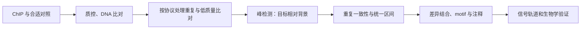

# 第11章 表观基因组分析

> DNA 像一本书。表观基因组学关心：哪些页摊开了，哪些页贴了标签，哪位“读者”停在哪一页，以及远处两页是否折到了一起。

本章先把几类实验分清，再围绕“比对 → 富集区间 → 比较 → 解释”建立分析路线。配套练习使用人工区间和计数，不把小数据的图形当作真实实验结果。

| 技术 | 可以理解成 | 主要测量 |
| --- | --- | --- |
| ChIP-seq | 找某个人在哪些书页停留 | 特定蛋白/组蛋白修饰的富集位置 |
| ATAC-seq | 找哪些书页容易打开 | 染色质可及性 |
| CUT&Tag / CUT&Run | 定位目标后在附近做标记或切割 | 特定蛋白/修饰附近的 DNA |
| DNA 甲基化测量 | 检查某些字上的化学标签 | 特定位点的甲基化信号 |
| Hi-C | 看折叠后哪些页靠在一起 | 基因组区间的接触频率 |

## 11.1 ChIP-seq：找到蛋白“停留”的区间

### 从实验原理理解输入

ChIP 是染色质免疫沉淀：使用抗体富集目标蛋白或修饰相关的 DNA，再测序。如果某个区间接收到的片段明显多于背景，就可能形成 **peak（峰，富集区间）**。

峰不是蛋白在每个细胞都精确占据的单个碱基，而是整个样本和实验分辨率下的富集证据。抗体特异性、细胞数、文库复杂度和对照直接影响结果。



**Input** 是未经过目标抗体富集的起始染色质对照，可帮助解释可比对性、开放程度和拷贝数等背景；IgG 对照用于观察非特异免疫沉淀，作用不同。不能随便从另一个实验拿一份 BAM 当对照。

### Peak calling：MACS2 / MACS3 在做什么

MACS 系列比较局部片段富集与背景，给出区间及统计证据。转录因子常形成相对窄峰；H3K27me3 等修饰常出现宽域，因此窄峰和宽峰策略不同。双端片段模式会直接利用片段边界，不能不分输入类型混用单端片段长度参数。

典型输出包括 narrowPeak/broadPeak、summit（部分窄峰的峰顶）和信号轨道。参数中有效基因组大小、对照、输入模式与过滤必须匹配数据。q 值阈值更严只表示筛选更保守，不保证剩余每个峰都是真结合。

看质量时综合考虑富集程度、重复间一致性、片段分布和 **FRiP（落入峰区间的片段比例）**。FRiP 的分母、过滤策略和峰集合会影响数值，不能把不同流程的数值直接比较。部分窄峰实验可用 IDR 等评估重复一致性；不把它当作所有宽峰实验的通用硬门槛。

### 差异结合：不要只数“各自检测出多少峰”

若 A 检出 5000 个峰、B 检出 3000 个峰，不能直接说“2000 个峰在 B 消失”。测序量、背景和阈值都会影响峰是否被检出。

更合理的思路是：建立有记录的共识/统一峰区间 → 在所有样本相同区间统计片段 → 结合生物学重复与设计做模型比较。DiffBind 可组织这类差异结合分析；采用 DESeq2/edgeR 等模型时同样需要正确的原始计数及归一化。全局信号变化很强时，常规相对归一化可能不足，要考虑实验设计中的校准/spike-in。

### Motif：从峰里找“喜欢的短语”

HOMER、MEME 等寻找峰序列中常见的短序列模式。输入一般是匹配参考提取的区间序列，以及长度、GC、可比对性等尽量适配的背景。

某 motif 富集表示这类序列在候选区域里较多。多个转录因子可能识别相似 motif；共同富集也可能反映共因子。**有 motif 不等于该蛋白实际结合，更不等于它导致了表达变化。**

### 信号图：同一把尺子才能比较

deepTools 常用 `bamCoverage` 生成 BigWig，用 `computeMatrix` 汇总在 TSS（转录起始位点）或峰中心附近的信号，再用 `plotHeatmap` / `plotProfile` 绘图。比较多样本时统一归一化、区域顺序和颜色尺度，记录链方向与窗口。每张图独立自动缩放，弱信号也可能看起来很亮。

## 11.2 ATAC-seq：哪里容易被打开

ATAC-seq 使用 Tn5 转座酶在容易接近的 DNA 上切入并加接头。开放区往往与启动子、增强子等调控活动有关，但可及不等于正在转录，更不能单独确定具体调控方向。

### 与普通 DNA 比对相比，特殊在哪里

1. 查看接头和片段长度，因为短片段常让 read 读到接头。
2. 处理线粒体 reads、低质量/多重比对、重复和参考黑名单区间，并保留每步数量。
3. 结合 **TSS enrichment（TSS 附近信号富集）**、片段长度周期、FRiP 和重复一致性判断质量。
4. 根据目标使用片段覆盖或 Tn5 插入位点，不能把两者混为一谈。

Tn5 插入位点分析常见正链 +4、负链 −5 的偏移约定，但有些工具已完成校正；重复平移会产生错误。单核小体/双核小体相关长度峰反映染色质组织，具体形状还取决于实验和过滤，不要求所有样本长得一模一样。

### 从开放区到差异可及性

与 ChIP 类似，在统一 peaks 上计数，按样本比较，纳入批次/配对等因素。单细胞 ATAC 的条件比较通常也要考虑供体层面的重复，不能把同一供体的每个细胞当作独立实验。

峰与最近基因的距离可以提供初步注释，但增强子可能作用于很远的基因。结合 RNA-seq、已知调控关系、染色体接触和实验验证，才能逐步缩小候选。

### 足迹分析为什么要谨慎

如果蛋白占据某个小区域，转座酶可能较难切进去，留下周围高、中间低的“脚印”。TOBIAS 等方法会考虑 Tn5 序列偏好。深度不足、酶切偏好和核小体也能塑造类似图形，所以 footprint 是结合证据之一，不是给单个位点直接盖章。

## 11.3 CUT&Tag / CUT&Run：把动作放在目标旁边

CUT&Run 通过抗体定位的核酸酶在目标附近切割，释放相关 DNA；CUT&Tag 通过抗体定位的转座酶在附近加接头。它们常能在较少细胞下获得较低背景，但结果仍依赖抗体、靶标和实验条件。

| 问题 | 为什么需要重新判断 |
| --- | --- |
| 是否沿用 ChIP 参数 | 片段背景、峰形和实验噪音不同，不能只改输入文件名 |
| 如何处理重复 | 高富集可产生生物学相关重复，需按协议和复杂度评估 |
| 是否有对照与 spike-in | 校准方案与对照用途需结合实验设计 |
| 选择哪种峰检测 | MACS、SEACR 等各有适用条件，不能只按峰数量选择 |

操作主线仍是质控、合适的 DNA 比对、记录过滤、按协议峰检测、重复评估、统一计数和功能解释。比较不同技术的数据时，先确认检测对象相同，不能把 ATAC 开放信号当成某种组蛋白修饰的直接测量。

## 11.4 DNA 甲基化：统计每个位置的“标签比例”

亚硫酸氢盐测序中，未甲基化 C 通常转为 U，并在读段里表现为 T；受保护的碱基保留为 C。Bismark 等软件利用这种转换特点比对并提取位点计数。普通 DNA 比对方法不适合直接照搬。

标准 bisulfite 测量通常不能区分 5mC 与 5hmC；需特定实验才可进一步分辨。转化效率、链方向、CpG/CHG/CHH 背景和覆盖都影响解释，不能把所有 C→T 都当成 DNA 突变。

**甲基化比例**可简化为甲基化支持数除以甲基化与未甲基化支持数之和：

```python
observations = [("CpG_A", 8, 2), ("CpG_B", 1, 1), ("CpG_C", 0, 0)]
for site, methylated, unmethylated in observations:
    coverage = methylated + unmethylated
    fraction = methylated / coverage if coverage else None
    print(site, "覆盖:", coverage, "甲基化比例:", fraction)
```

A 为 0.8，B 为 0.5，C 没有覆盖，应该是缺失而不是 0。8/10 与 80/100 比例相同，测量不确定性不同，因此组间比较应考虑覆盖和生物学变异，不能只对比例机械做 t 检验。

**DMS** 是差异甲基化位点，**DMR** 是差异甲基化区域。methylKit、DSS 等可按数据和设计建模；先过滤不足/异常覆盖，考虑转化偏差，再结合重复检验并校正多重比较。区域结果应报告坐标、方向、差异大小、位点数和统计依据。

启动子甲基化与表达降低有常见关联，但基因体、增强子、组织背景和细胞组成可能呈不同关系。“这个基因附近有甲基化”不等于“它被关闭”。

## 11.5 Hi-C / 3D 基因组：书在细胞核里怎样折叠

Hi-C 等技术通过空间接近的 DNA 片段连接，获得一对可能靠近的基因组位置。将基因组切成固定大小的 bin（小格），每对格子的接触次数组成矩阵。

- **A/B compartment，区室**：较大尺度的不同染色质环境。常与活跃/相对不活跃区域有关，计算得到的正负号需用外部信息定向。
- **TAD，拓扑关联域**：内部接触相对密集的一段区域，常在矩阵对角线附近呈三角形。
- **Loop，染色质环**：某对区域的接触比周围背景突出，可能提示特定远距离相互作用。

HiC-Pro、Juicer 等帮助完成比对、配对和过滤；cooler 保存/处理分箱后的接触矩阵。典型步骤为比对两端 → 去除不合格连接与重复 → 构建矩阵 → 评估覆盖/距离衰减 → 按合适方法归一化 → 分析区室、边界和环。

**分辨率来自有效数据量**。把 100 kb 的 bin 改成 1 kb 不会自动创造更精细的生物学证据，可能只得到大部分为空的矩阵。不同深度、酶切方案、归一化和细胞组成会影响比较。

矩阵中两个区域频繁接触，说明样本平均的空间接近证据较强，不保证所有细胞里它们都贴在一起，也不直接证明增强子调控某个基因。

## 11.6 动手：峰和基因重叠，究竟是什么意思

先运行第 6 章的数据生成命令，在项目根目录执行：

```python
import csv

def read_bed(path):
    with open(path, encoding="utf-8") as handle:
        return [(row[0], int(row[1]), int(row[2]), row[3])
                for row in csv.reader(handle, delimiter="\t") if row]

peaks = read_bed("demo-data/peaks.bed")
genes = read_bed("demo-data/genes.bed")
for chrom, start, end, name in peaks:
    overlaps = []
    for gchrom, gstart, gend, gene in genes:
        if chrom == gchrom:
            length = max(0, min(end, gend) - max(start, gstart))
            if length:
                overlaps.append((gene, length))
    print(name, overlaps)
```

预期 peak1 与 geneA 重叠 80 bp，peak2 与 geneB 重叠 100 bp，peak3 无重叠。这个区间运算是 BED 半开坐标的实际应用；**重叠本身不证明调控**，且这里的基因区间不是经过验证的启动子或增强子。真实大文件可用 BEDTools 做高效交集。

### 本章自查与交付

完成一个真实分析后，应能交付：输入与对照说明、参考及黑名单版本、过滤记录、信号轨道、峰/位点/区域结果、样本层面的统计比较和图表解释。峰多并不天然更好，轨道更亮也不等于真实结合更多。

练习：ATAC 开放峰能直接说某 TF 结合了吗？不能。甲基化无覆盖是否等于零甲基化？不等于。Hi-C 的热点是否证明直接调控？仍需结合其他证据。

参考：[MACS3](https://macs3-project.github.io/MACS/)、[ENCODE](https://www.encodeproject.org/)、[deepTools](https://deeptools.readthedocs.io/)、[Bismark](https://felixkrueger.github.io/Bismark/)、[cooler](https://cooler.readthedocs.io/)。

> **下一章**：[第12章 单细胞转录组](12-scrna.md) —— 从一碗混合汤，看到里面不同种类的食材。
