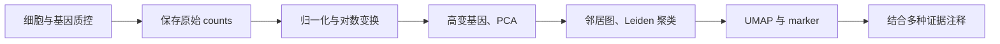

# 第12章 单细胞转录组分析（scRNA-seq）

> bulk RNA-seq 像尝一锅汤，知道整体咸淡；单细胞 RNA-seq 像把食材分开，观察里面有哪些细胞、各自处于什么状态。

本章使用公开 PBMC3k（外周血单个核细胞）数据跑通质控、聚类和 marker 查看。后续整合、轨迹、通讯和调控网络都建立在这张“细胞 × 基因”表上，但每一步都需要额外假设，不能因为软件能运行就自动得到可靠结论。

## 12.1 10X 原理：给每个细胞和分子贴标签

液滴式方法尽量把单个细胞与带条码的珠子放进同一小液滴。RNA 转成带标签的文库后混合测序，再根据标签分回各细胞。

| 名词 | 通俗含义 | 后续用途 |
| --- | --- | --- |
| Cell barcode，细胞条码 | 这个分子来自哪个“包裹” | 将 reads 分到细胞/液滴 |
| UMI，唯一分子标识 | 在扩增前给分子贴的标签 | 减少 PCR 重复计数影响 |
| Read sequence | 实际读取的转录本相关序列 | 定位基因 |
| Count matrix | 每个细胞每个基因的计数 | 通常统计经过规则合并的 UMI |

UMI 不是绝对不会重复的身份证，需要结合细胞、基因/位置及纠错规则。一个 barcode 也不保证就是一个完整健康细胞：可能是空液滴、碎片，或两个细胞共用的液滴。

3′/5′ 标签测序与全长转录本测序的覆盖不同，不能期望所有单细胞数据都适合精细剪接或融合检测。细胞数多也不等于生物学重复多：来自同一人的一万个细胞，仍是一个供体来源。

## 12.2 预处理：从测序文件到可信细胞

### Cell Ranger 与 STARsolo

Cell Ranger 根据具体 10X chemistry（建库版本）处理条码/UMI、比对、计数和细胞识别，输出矩阵及报告。STARsolo 提供开源替代，但必须正确设置条码位置、白名单、UMI 规则与文库类型，不能随便套另一版本参数。

10X 输出常包含 `raw_feature_bc_matrix` 和 `filtered_feature_bc_matrix`：前者保留更广泛条码集合，后者是算法判为细胞的集合。**filtered 不是所有生物学质控都已完成**。空液滴判断、环境 RNA 校正等方法可能需要未筛选矩阵，不能只下载过滤后文件再假装拥有全部信息。

### 质控要联合看哪些指标

| 指标 | 异常可能提示 | 不应机械理解成 |
| --- | --- | --- |
| 每细胞 UMI 总量 | 低复杂度、破损，或大细胞/双细胞 | 高的全部是双细胞 |
| 检出基因数 | 信息不足或异常混合 | 所有组织都用固定上下限 |
| 线粒体计数比例 | 应激、细胞破损，也可能是组织特点 | 超过 5% 一律删除 |
| 空液滴/环境 RNA | 背景分子污染了计数 | 某个 marker 微量表达就一定是真阳性 |
| doublet 分数 | 可能两个细胞被当成一个 | 算法预测等于确证 |

Scrublet、DoubletFinder 等通过模拟或邻域特征识别双细胞。通常按实际捕获批次评估，结合实验装载量、marker 冲突和群体结构检查；同类型双细胞更难识别。SoupX、CellBender 等针对环境 RNA 的方法也有输入和模型要求，不要重复校正却不保存原始计数。

## 12.3 标准流程：从矩阵看到细胞群



### 每一步究竟在做什么

**归一化**尽量减少细胞间测量总量不同的影响；简单方法将每细胞总量缩放到同一数值，再 `log1p`。这不意味着真实细胞的 RNA 总量相同，只是在当前分析中选择一种可比尺度。Seurat 的 LogNormalize、SCTransform 和 scran 的大小因子方法各有假设；SCTransform 是建模方案，不能当成任意对象都能再叠一次的“加强按钮”。

**高变基因 HVG**挑选较有区分信息的基因；有的方法使用原始计数，有的方法使用对数表达。Scanpy 的 `flavor='seurat'` 与 `'seurat_v3'` 的输入要求不同，必须查看文档。

**PCA**先把成千上万维压缩成几十个主要变化方向；**邻居图**连接表达相似的细胞；**Leiden**寻找图中联系密集的群；**UMAP/t-SNE**把高维邻近关系投影到二维，帮助展示。

聚类的数字是算法标签，不是细胞类型编号。UMAP 两座“岛”远，不保证生物学差异按比例更大；不同随机种子或参数可能改变形状。不要为了图漂亮反复挑参数却不说明。

### 真实小案例：PBMC3k

项目提供 [scrna_pbmc.py](../examples/scrna_pbmc.py ':ignore')。它使用 Scanpy 的 `pbmc3k()` 下载官方教学入口提供的 10X PBMC3k 计数数据，首次需要网络。用独立 Python 3.11 环境运行，下面是 Conda 终端命令：

```bash
conda create -n bioinfo-singlecell -c conda-forge python=3.11 -y
conda activate bioinfo-singlecell
python -m pip install scanpy==1.10.4 anndata==0.10.9 numpy==1.26.4 scipy==1.14.1 matplotlib==3.9.2 igraph==0.11.8 leidenalg==0.10.2
python examples/scrna_pbmc.py
```

安装解析出的其他依赖也影响环境，脚本会记录主要版本；正式复现还应保存完整的 `pip freeze`。不要把这些包直接混装进已有的重要分析环境。

脚本的关键处理是：统计 QC → 用该教学数据常见阈值保留细胞 → 原始计数保存到 `layers['counts']` → 归一化并对数变换 → HVG 与 PCA → 邻居图、Leiden、UMAP → marker 排序。PCA 在单独的高变基因副本上缩放，避免把缩放后的负值矩阵错误拿去计算基因表达差异。

| 输出到 `results/scrna/` | 用途 |
| --- | --- |
| `qc_before_filter.csv`、`qc.png` | 保存过滤前指标，了解剔除理由 |
| `umap.png` | 同时按 cluster 和样本来源着色 |
| `markers.png` | 查看 CD3D、MS4A1、LYZ、NKG7、PPBP 等 marker |
| `cluster_markers.csv` | Wilcoxon 排序结果，帮助探索群体身份 |
| `pbmc3k_processed.h5ad` | 保存细胞信息、原始计数、归一化表达与降维坐标 |
| `versions.json` | 主要包版本 |

该演示使用基因数 200–2499、线粒体比例 <5% 等历史 PBMC3k 教学阈值，**不是任何组织都照用的标准**。脚本没有把双细胞预测、环境 RNA、整合或疾病差异分析塞入单个小数据流程；这些应在有合适输入和实验设计时进行。

### 从 marker 到注释

| 组合线索 | 常见候选类型 | 需继续区分 |
| --- | --- | --- |
| CD3D、CD3E 等 | T 细胞 | CD4/CD8、记忆/效应等状态 |
| MS4A1、CD79A 等 | B 细胞 | 浆细胞可能不高表达 MS4A1 |
| LYZ、LST1、S100A8/A9 等 | 单核/髓系细胞 | 结合多个亚群 marker |
| NKG7、GNLY 等 | NK/细胞毒相关群 | 某些 T 细胞也表达 |
| PPBP、PF4 等 | 血小板相关群 | 环境 RNA 与小颗粒影响 |

不能只看到一个基因就命名。还要看互相排斥的 marker、群大小、组织背景和参考图谱。SingleR、CellTypist 等自动注释依赖参考覆盖与标签粒度；遇到新状态应允许“不确定”，不要强行给每个簇一个精确名称。

### marker 检验和疾病差异检验不同

同一份数据聚类后找 marker，主要是探索性描述，受同一数据选择与检验的影响。比较疾病/对照时，应在**同一种细胞类型内按供体汇总原始 counts（pseudobulk，伪 bulk）**或使用适合层级结构的模型，再考虑批次和配对。

把一位患者的一万个细胞当作一万个独立患者，会低估不确定性。细胞组成比例比较也要以独立样本为单位考虑分母和组成约束。

## 12.4 多样本整合：对齐尺子，同时保留真实差异

批次像不同相机的色调偏差。整合希望对齐测量偏差，同时保留疾病、发育等真正变化。若所有病例来自批次 A、所有对照来自 B，算法没有额外信息就不能可靠区分两者。

| 方法 | 大致思路 | 主要注意 |
| --- | --- | --- |
| Harmony | 校正低维表示中的批次结构 | 常用于邻居/聚类，不等于校正原始 counts |
| scVI / scANVI | 建模计数并学习潜在表示，后者利用标签 | 输入原始计数，检查样本数、批次和参考标签 |
| Scanorama | 依据数据中的相似细胞进行对齐 | 不共享类型不应硬对齐 |
| BBKNN | 在邻居图中平衡批次来源 | 修改图的构造，不直接输出“真实表达矩阵” |

比较整合前后：相同类型是否合理混合，已知不同类型是否仍分开，稀有群是否消失，marker 是否合理，结果是否稳定。只追求“按批次颜色完全混匀”，可能抹掉疾病特异群。

下游绘图/聚类可用整合表示；样本间差异分析通常继续使用保存的原始 counts 和适当模型，而不是直接把整合后的坐标当作表达量。

## 12.5 轨迹与拟时序：根据快照推测变化顺序

Monocle3、PAGA、Palantir 等从相似性和连通结构推断潜在路径。**拟时序不是实际经过了几小时**；它是某种模型和起点选择下的相对位置。

先选择有生物学理由的谱系 → 排除混入的无关类型 → 选择根/早期状态 → 推断路径 → 检查已知早晚 marker → 用真实时间点或实验验证。换一个根就可能反转顺序；UMAP 上相邻也不等于一定能相互转化。

RNA velocity 利用未剪接/已剪接等信息，在模型假设下推测局部表达变化趋势。scVelo 通常需要匹配的 spliced/unspliced 层，普通过滤表达矩阵不自动含这些信息。动力学假设、基因筛选和稳态偏差都会影响箭头；它不是直接追踪同一个细胞未来命运的实验。

## 12.6 细胞通讯：谁可能向谁发信号

细胞通讯工具常把 **配体**理解为“发出的信号”，**受体**理解为“接收设备”。CellChat、CellPhoneDB 结合数据库和群体表达评估候选配体–受体关系；NicheNet 进一步结合接收细胞的靶基因调控信息。

实际流程：可靠注释细胞群 → 选择物种匹配数据库 → 过滤过小群和低表达关系 → 计算候选及显著性 → 按样本/条件比较 → 检查关键分子和实验背景。

RNA 表达不等于蛋白分泌、空间接触或信号真的传递。群体细胞数、表达深度和数据库覆盖都会影响“线条多少”；增加了细胞数量后线变多，不能直接说通讯变强。组织空间信息或受体/配体实验能提供更直接的支持。

## 12.7 SCENIC / pySCENIC：哪些调控模块可能活跃

SCENIC 通常先从表达估计 TF（转录因子）与基因的共变化，再利用 motif 等证据筛选候选靶基因，构建 **regulon（调控模块）**，最后用 AUCell 等方法评估细胞中的模块活性。

输入包括合适的表达矩阵、TF 列表和物种/版本匹配的 motif ranking 数据库。数据库可能较大，基因 ID 不匹配会大幅损失候选。输出是模块与活性分数，不能等同于真实蛋白活性或直接结合证据。

分析时比较不同细胞类型/状态的模块、检查支持基因，再结合 ChIP/ATAC、扰动等资料验证。单个 TF 的 RNA 高，不保证对应 regulon 活跃；反过来也一样。

## 12.8 inferCNV / CopyKAT：从表达推测大尺度拷贝变化

某段染色体上的许多基因同时偏高，可能提示拷贝数扩增。inferCNV、CopyKAT 等方法利用沿基因组排序的表达模式推测大尺度变化，常用于辅助识别肿瘤群。

需要可靠基因位置、参考版本和合适的正常参照，并检查测序深度、细胞周期及类型差异。选择明显错误的“正常细胞”参照，会产生系统偏差。接近二倍体的肿瘤未必有明显 CNV，正常群也可能因表达状态看起来异常。

因此 CNV 推断只是肿瘤身份的证据之一，不能取代 DNA 层面的检测或把所有“红蓝明显”的细胞直接判为恶性。

## 12.9 单细胞多组学：同一个细胞，多种测量

| 技术/方法 | 多测到了什么 | 常见分析入口 |
| --- | --- | --- |
| scATAC-seq | 染色质开放区间 | ArchR、Signac；计数、TF-IDF/LSI、peak/motif 分析 |
| CITE-seq | 部分表面蛋白的抗体标签 | RNA 与 ADT 分别质控、归一化 |
| Multiome | 同一细胞 RNA + ATAC | 配对细胞的表达与可及性联系 |
| WNN | 联合不同模态的邻居信息 | Seurat 多模态框架 |
| MOFA+ | 寻找跨模态共同/特异变化因素 | 数据尺度与缺失结构需匹配模型 |

同一细胞的配对多组学，与来自不同细胞的跨数据整合不同。ADT 有背景和抗体特性，ATAC 非常稀疏；不能将所有原始矩阵拼在一起直接当作普通 RNA 表。

### 本章自查

一簇细胞是否一定是一种新细胞类型？不一定。三万个细胞是否能替代多个供体？不能。UMAP 箭头是否证明真实时间方向？不能。理解这些边界，才能让后续机制分析有扎实基础。

参考：[Scanpy PBMC3k 教程](https://scanpy.readthedocs.io/en/stable/tutorials/basics/clustering-2017.html)、[Seurat](https://satijalab.org/seurat/)、[单细胞分析最佳实践](https://www.sc-best-practices.org/)、[scvi-tools](https://docs.scvi-tools.org/)、[scVelo](https://scvelo.readthedocs.io/)。

> **下一章**：[第13章 空间转录组](13-spatial.md) —— 给表达信息补上组织中的地址。
