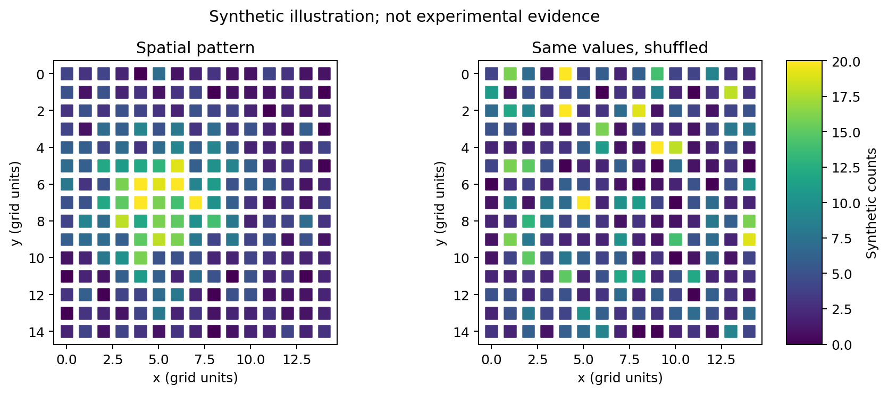

# 第13章 空间转录组分析

> 单细胞告诉你“城里有哪些居民”，空间转录组还告诉你“他们住在哪里、谁挨着谁”。同样的细胞，靠近肿瘤边界还是血管，可能扮演不同角色。

本章先理解数据和坐标，再用一个能在普通电脑运行的空间图案实验解释空间统计。最后介绍真实组织数据的区域识别、反卷积和通讯分析。

## 13.1 技术原理：测到了多少基因，地址有多精细

### 两大技术路线

| 路线 | 通俗理解 | 常见技术 | 核心取舍 |
| --- | --- | --- | --- |
| 基于测序 | 在带地址条码的载体上捕获 RNA，再测序 | Visium、Slide-seq、Stereo-seq、HDST | 捕获效率、bin/spot 大小、组织范围和成本 |
| 基于成像 | 在组织中通过多轮探针成像识别分子 | MERFISH、seqFISH、CosMx、Xenium | 基因面板/探针设计、成像与分割质量、组织兼容性 |

传统 Visium 一个 spot 常覆盖多个细胞，不能把每个 spot 都叫作“一个细胞”。高分辨率平台即使具有很小的捕获单元，也往往需要聚合 bin 或细胞分割；名义空间分辨率不等于每个细胞有足够的表达信息。

成像平台常使用选定基因面板，具体覆盖随产品和版本变化。某基因不在面板里，不能解释成“组织里不表达”。细胞分割像给地图画房屋边界，边界错误会把分子分到邻居家。

### 不止一张表达矩阵

真实空间分析至少要对齐：**表达矩阵、spot/细胞 ID、空间坐标、组织图像及尺度信息**。有的还有分子级坐标、细胞轮廓和质量分数。

| 信息 | 需要核实什么 |
| --- | --- |
| 表达值 | 原始 counts、归一化值还是处理后的估计 |
| 坐标 | x/y 顺序、像素或微米、原点位置 |
| 切片与文库 ID | 不同切片不能共用同一坐标系后连成邻居 |
| 图像缩放 | 高清/低清图与原始坐标的换算 |
| 细胞/spot 标识 | 与矩阵行一一匹配，不能独立排序后拼接 |

组织图像经常从左上角为原点，y 轴向下；普通散点图默认向上。如果图被上下翻转，先检查坐标约定，不能把它当成新的组织结构。

## 13.2 数据分析流程


### Space Ranger 与下游框架各负责什么

Space Ranger 根据支持的 10X 空间实验类型处理测序、位置和图像，输出表达矩阵及空间元信息。其输入与平台版本相关，要按官方对应文档准备；不要拿单细胞 Cell Ranger 输出代替完整空间输入。

Scanpy 可处理表达矩阵，Squidpy 补充空间邻居、空间统计和图像操作；Seurat 有空间数据对象和绘图流程；SPATA2 侧重空间组织探索与相关分析。选择框架后保留原始 counts、原始坐标和图像，不要让归一化或缩放覆盖唯一一份原始数据。

### 空间质控为什么不能照搬 PBMC

检查每 spot 的 UMI、基因数、线粒体比例、组织内外标签、图像对齐和空间分布。边缘、坏死区域、细胞密度较低的区域可能自然低计数；过滤时结合组织学，不能把所有低计数区域直接删除后再研究“坏死区在哪里”。

成像数据还要检查分子质量、阴性探针、细胞面积、核/细胞分割和每细胞分子数。一个特别大的“细胞”可能是分割合并，不一定是真实细胞类型。

### 先跑一个完全离线的小实验

项目的 [spatial_demo.py](../examples/spatial_demo.py ':ignore') 构造 15×15 网格和一个有局部高表达区域的人工基因，再把同一批表达值随机打散。它只需要 NumPy 与 Matplotlib：

```bash
python -m pip install numpy matplotlib
python examples/spatial_demo.py
```

建议在独立教学环境安装。默认输出到 `results/spatial/`：`spots.csv`、`spatial_pattern.png/pdf` 和 `statistics.json`。两张图使用相同色标，左边有局部高表达，右边数值相同但位置打乱。因为总和和直方图相同，**只看表达分布发现不了位置关系**。



图为人工演示，不是组织切片。脚本保存原始数值和随机种子约定，方便改变图案后重做。图上的网格单位不是微米。

### 转向真实公开组织数据

可从 [10X 公共数据](https://www.10xgenomics.com/datasets) 选择一个明确平台和版本的小样本，下载矩阵及对应 spatial 文件夹/图像。先在官方页面核实数据量、许可和处理说明，再按 Squidpy 或 Seurat 的对应读取教程加载。

以 AnnData/Squidpy 为例，目标是 `.obs` 保存 spot/细胞信息、`.var` 保存基因信息、`.layers['counts']` 保留计数、`.obsm['spatial']` 保存匹配的坐标。已有正确对象后，常见操作入口为 `sq.gr.spatial_neighbors`、`sq.gr.spatial_autocorr` 与 `sq.pl.spatial_scatter`；具体网格、邻接半径、library_id 和图像参数须按数据选择。

## 13.3 空间可变基因：哪里高，比平均多高更重要

“变异大”是表达值有高有低；“空间可变”强调高低与位置有系统关系。例如某基因在肿瘤边缘高，而另一个同等变化幅度的基因只是随机散布，空间意义不同。

**Moran's I** 衡量相邻位置的数值是否相似。用 `z_i = x_i − 平均值` 表示中心化表达，可写为：

```text
I = (位置数 N / 权重总和 W) ×
    [所有邻接对的 w_ij × z_i × z_j 之和] /
    [所有位置的 z_i² 之和]
```

在指定图和权重下，较大的正值常表示相似值聚在一起，负值可表示邻近值较不相似。其范围和零假设期望依图而定，不应简单当成普通相关系数的固定范围或认为随机时必为 0。

演示脚本使用上下左右四邻居、对称二元权重、999 次随机打乱，计算单侧置换 p 值 `(不小于观测值的次数+1)/(置换次数+1)`。这检验一个人工基因的正向空间聚集，不是完整真实数据差异检验。

**SpatialDE、SPARK/SPARK-X** 等针对空间表达模式提供统计方法。真实分析要考虑计数深度、组织密度、空间尺度和多重检验。测几千个基因时，不能把每个未校正 p<0.05 都报告为显著空间基因；多个切片也要考虑各自结构及样本层面的重复。

## 13.4 空间域识别：给组织地图划分区域

普通聚类主要看表达相似；空间域识别往往还利用位置或图像，让组织分区更贴合空间结构。

| 方法 | 使用的信息与常见思路 | 需核实 |
| --- | --- | --- |
| BayesSpace | 结合表达低维表示与空间邻接 | 支持的数据结构、分辨率和模型假设 |
| SpaGCN | 图模型结合表达、空间，部分流程结合组织图像 | 图像特征和邻接尺度 |
| STAGATE | 图注意力模型学习空间表示 | 邻域设置、训练稳定性 |
| stLearn | 融合表达、空间/形态等的多种分析 | 所用模块具体输入与假设 |

先按表达做基线聚类，再比较空间模型。看区域是否与病理结构、已知 marker、不同样本和参数敏感性一致。强行要求相邻点同类会抹掉组织边界；同一类型的散在免疫细胞也不一定形成一整块。

“预测分区和图像看起来很像”不够，需检查图像是否本就参与了建模，避免把输入信息再当独立验证。独立病理标注和其他切片更有说服力。

## 13.5 与 scRNA-seq 整合：一格里的细胞各占多少

传统 spot 像一杯混合果汁，反卷积尝试根据已知水果口味推测成分。单细胞参考提供各类型的表达特征，空间矩阵提供混合信号。

| 方法 | 常见目标 | 输出解释重点 |
| --- | --- | --- |
| Cell2location | 估计各空间位置细胞类型丰度等 | 丰度、后验不确定性与建模假设 |
| RCTD | 根据单细胞参考分解空间混合 | 模式、权重、平台差异处理 |
| SPOTlight | 结合参考特征和矩阵分解估计组成 | marker、参考代表性 |
| Tangram | 将细胞/类型映射到空间表达 | 映射分数不是天然的真实细胞比例 |

基本流程：检查物种/组织/状态是否可比 → 统一基因 ID → 用供体充分且注释可靠的参考 → 按工具要求提供计数/特征 → 拟合 → 检查未解释区域与残差 → 与组织学及已知 marker 对照。

参考缺少某种细胞时，模型可能把它错误分配给相似类型。不要为了得到漂亮饼图，先把任意分数除以总和就命名为“真实比例”。Cell2location 的丰度、RCTD 的权重和 Tangram 的映射矩阵有不同定义，绘图前先弄清单位。

### 小案例

某 spot 同时有上皮、T 细胞和成纤维细胞相关基因。它可能是三类细胞的混合，也可能有环境 RNA 或参考不匹配。反卷积给出一个候选解释，若同一区域病理图像和独立标记支持它，可信度才更强。

## 13.6 空间细胞通讯：信号双方是否真的有机会接近

空间信息可以约束候选通讯：相距很远的细胞，不应与紧邻细胞拥有完全相同的接触先验。但不同配体的扩散距离不同，接触依赖信号与远距离可溶性信号也不同。

COMMOT、SpaTalk、stLearn 的相关模块会用不同方式结合表达、空间距离、细胞类型和配体–受体先验。先定义有生物学意义的距离/邻居范围，再比较候选关系，进行适当的空间置换或样本层面验证。

普通随机打乱可能破坏组织区域结构，产生不合适的零假设；要说明置换保持了什么。表达、邻近和数据库关系同时存在，仍不等于已实测信号传递。受体蛋白、下游响应和阻断实验可进一步支持机制。

## 13.7 空间轨迹与动态：从位置梯度提出假说

组织中从干细胞区到成熟区，可能出现表达梯度。空间轨迹方法、stLearn 的相关流程和 STT 等尝试把位置、表达与动力学假设联系起来。

但**一张切片是空间快照，不是时间录像**。从肿瘤中心到边缘的梯度可能源于氧气、营养、细胞组成，不能自动解释成细胞迁移路线。需要真实时间点、谱系追踪或其他独立证据来验证方向。

进行这类分析时先提出明确问题：沿哪条组织轴？比较同类细胞还是混合 spot？是否存在分支、组织断裂和边界？将轨迹与已知解剖、marker、样本间重复以及参数稳定性一起报告。

### 本章交付与练习

保留矩阵/图像/坐标来源、坐标单位、过滤阈值、空间邻居定义、模型和随机种子、统计校正方式及结果不确定性。真实组织比较的重复是独立个体/样本层面的设计，不能把同一切片的几千个 spot 当作几千位患者。

练习：一个 spot 是否等于一个细胞？不一定。表达值打乱位置后总量是否改变？不变，但空间结构改变。反卷积结果是否直接观察到真实细胞数？通常是基于模型的估计。

参考：[Squidpy 教程](https://squidpy.readthedocs.io/en/stable/tutorials/index.html)、[Seurat 空间分析](https://satijalab.org/seurat/articles/spatial_vignette.html)、[Cell2location](https://cell2location.readthedocs.io/)、[spacexr / RCTD](https://github.com/dmcable/spacexr)、[Tangram](https://github.com/broadinstitute/Tangram)。

> 需要把分析可靠地批量执行时，继续阅读[第19章 工作流管理](19-workflow.md)；需要选择图表时，查阅[第20章 图表百科](20-visualization.md)。
