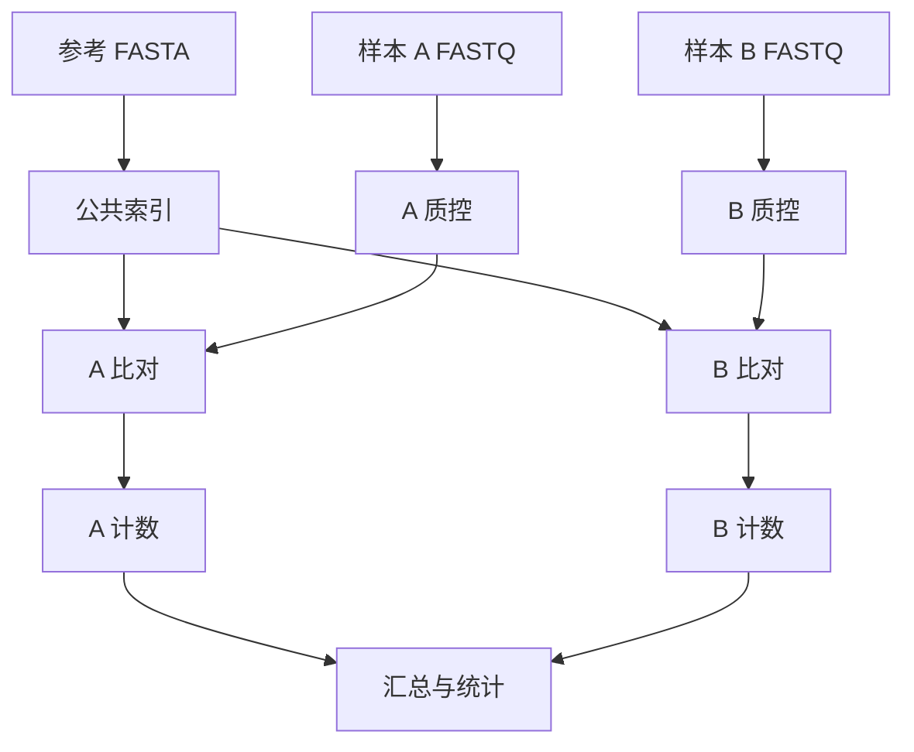

# 第19章 生信工作流管理

> 分析一个样本，像自己做一顿饭；分析一百个样本，就需要菜单、备料清单和出菜顺序。工作流把这些规则写清楚，让电脑知道哪些步骤能并行、哪些必须等前一步完成。

本章用第 6 章的人工双端 FASTQ 做一个最小流程：检查配对和格式，按样本统计 read 数、碱基数及 Q30 比例。先学会管理这个小流程，再把规则扩展成质控、比对和计数。

## 19.1 为什么需要工作流：可重复不只是“我记得怎么做”

一个可复现分析需要至少保留：输入与样本表、参考及注释版本、代码和参数、软件环境、随机种子、日志及输出。单独一张最终图无法说明中间如何得到它。

| 常见麻烦 | 工作流提供什么 |
| --- | --- |
| 多个样本重复敲命令 | 用规则和样本列表展开任务 |
| 一步失败，不知道从哪接着跑 | 根据输出与缓存恢复，保留失败日志 |
| 参考索引每个样本都重建 | 将共用依赖作为一个任务 |
| 并行程序把机器内存耗尽 | 声明资源，并按执行器调度 |
| 半年后结果不同 | 固定输入、代码与环境，记录变更 |



这种依赖结构叫 **DAG，有向无环图**。箭头表示“需要前一步产物”，不是一定按页面从左到右串行运行。A、B 样本互不依赖的任务可以并行，汇总要等它们都完成。

工作流管理器判断的是规则、输入输出及缓存信息，不会判断“疾病分组填反了”或“模型不科学”。自动化之前，先把单个样本和统计设计检查清楚。

## 19.2 Snakemake 入门与实战

### 一个规则说清四件事

`input` 是需要的文件，`output` 是要产生的文件，`shell`/`script` 是怎么做，`threads/resources` 是资源需求。文件名中的通配符 `{sample}` 让同一规则适用于多个样本。

本项目的 [Snakefile](../examples/workflow/Snakefile ':ignore') 从 [config.yaml](../examples/workflow/config.yaml ':ignore') 读取样本和目录。默认样本为 control、treated，输入为 `demo-data/{sample}_R1.fastq.gz` 和 R2，结果为 `results/workflow/{sample}.tsv`。

实际工作的 [fastq_summary.py](../examples/fastq_summary.py ':ignore') 会逐条检查常见四行 FASTQ、质量长度、双端名称及记录数。名字按空格前的 ID 和可选 /1、/2 后缀匹配；这覆盖本例与常见命名，特别的数据格式应使用相应解析工具。

### 第一次运行

以下在 **Linux/WSL Bash** 中运行。先进入项目根目录，创建单独环境：

```bash
conda create -n bioinfo-workflow -c conda-forge -c bioconda python=3.11 snakemake-minimal=8.25.5 -y
conda activate bioinfo-workflow
python examples/make_demo_data.py --out demo-data
snakemake --snakefile examples/workflow/Snakefile --cores 2 --dry-run
snakemake --snakefile examples/workflow/Snakefile --cores 2
```

`--dry-run` 是演习：列出要做的任务，不执行分析。第一次实际运行会生成两份 TSV 和日志，两个样本可同时执行。

预期每个样本均有 **20 对、40 条 reads、3000 个碱基**。control 的 Q30 比例为 1.0，treated 为 0.99，因为一对 reads 各有 15 个低质量碱基。这与第 6 章只查看第一条 treated read 时得到的 0.8 不矛盾：分母不同。

### 第二次运行与恢复

重复实际运行命令，输入和规则没有变化且输出完整时，通常会提示没有要做的工作。若改变统计脚本、配置或输入，需要检查 Snakemake 根据当前版本的重跑策略识别到哪些变化；恢复前先看 dry-run，不能只假设旧结果可复用。

单个任务失败时先读对应日志，修复原因再运行。对标记为不完整的产物，可在理解原因后使用 `--rerun-incomplete`。不要把一个未完成文件改名成“成功结果”来跳过报错。

### 怎样扩展成真实流程

把一次性准备的参考索引单独建规则，将质控和比对作为每个样本的规则，计数后统一汇总。把样本路径、参考、线程和参数放进配置，避免散落在多份脚本中。输出目录中保存运行报告、明确的日志和实际命令。

`threads: 8` 不会自动让任意程序使用八线程，shell 中还要把它传给该工具。声明 `mem_mb` 也不是给程序设置了硬内存限制：本地执行需配合总资源配置，集群上还需执行器将资源映射成调度请求。

版本基线为 Snakemake 8，不同大版本的集群参数不同。较新版本常使用 executor plugins（执行器插件），不要照搬旧教程的 `--cluster` 就认为可以运行。

## 19.3 Nextflow 与 nf-core

### Nextflow 的另一种表达方式

Snakemake 常从目标文件倒推规则；Nextflow 常用 **channel（数据通道）** 传递样本/文件组合，由 **process（任务）** 处理。两者都能管理依赖、并行和恢复，选择主要看团队生态和现有流程。

项目提供等价的 [main.nf](../examples/workflow/main.nf ':ignore')，使用 DSL2。它按 `*_R{1,2}.fastq.gz` 配对，给每个样本执行同一个 Python 统计程序。

先按 [Nextflow 安装文档](https://www.nextflow.io/docs/latest/install.html) 在 Linux/WSL 配好兼容 Java 与 Nextflow，Python 3 也需可用。下面命令以 Nextflow 24.10 系列为教学基线，在项目根目录执行：

```bash
python examples/make_demo_data.py --out demo-data
mkdir -p results/nextflow
nextflow run examples/workflow/main.nf --reads demo-data --outdir results/nextflow \
  -with-report results/nextflow/report.html -with-trace results/nextflow/trace.tsv
nextflow run examples/workflow/main.nf --reads demo-data --outdir results/nextflow -resume
```

第一次生成每样本 TSV，第二次用 `-resume` 尝试复用匹配的缓存。恢复依赖任务缓存和 work 目录等信息；随意删除工作目录后，不能指望只靠最终 TSV 恢复全部任务。

Nextflow 在各任务的工作目录运行命令，所以必须通过 `path` 输入声明数据和脚本，不能默认任务的当前目录就是项目根目录。本例也显式传入统计脚本，便于追踪其变化。

### nf-core：经过社区维护的标准流程

[nf-core](https://nf-co.re/) 提供许多基于 Nextflow 的生信流程，例如 **nf-core/rnaseq**、**nf-core/sarek**。它们包含模块、参数验证、环境和测试方案，适合从明确输入运行标准分析。

使用顺序是：读所选发布文档 → 检查 samplesheet 格式 → 选择参考及容器/profile → 先跑该发布提供的小测试 → 再跑一个真实样本 → 查看资源和结果 → 扩展到队列。

固定明确的 `-r` 发布版本，并保存参数文件、samplesheet、容器标识和软件版本。不能把任意 CSV 叫作 samplesheet；不同流程甚至不同版本所需列都可能变化。profile 也不是“越多越好”，它定义执行环境，需要与你的本地/集群配置匹配。

## 19.4 Docker / Singularity：把厨房工具装进箱子

Conda 管理软件包环境，容器把用户空间的软件及依赖打包成镜像。容器仍共享宿主内核，并受 CPU 架构、GPU 驱动、内存和文件权限影响；它不是包含一切的独立电脑。

| 方式 | 常见用途 | 要记录什么 |
| --- | --- | --- |
| Conda/Mamba | 灵活的分析环境 | channels、包版本、平台，最好有解析后的锁定记录 |
| Docker | 本地/服务器容器任务 | 镜像标签及 digest、挂载路径、资源 |
| Apptainer/Singularity | HPC 常见容器运行方式 | SIF 镜像、来源、绑定目录、集群约定 |

标签例如 `python:3.11-slim` 可能随维护更新而指向不同内容；严格复现应记录 digest。环境也要保留参考数据、数据库与模型版本，容器不会自动替你保存这些资源。

### 用 Docker 跑同一个小脚本

在已安装并启动 Docker 的 Linux/WSL Bash 中，位于项目根目录且已有 demo-data 时运行：

```bash
docker run --rm -v "$PWD:/work" -w /work python:3.11-slim \
  python examples/fastq_summary.py --sample control \
  --r1 demo-data/control_R1.fastq.gz --r2 demo-data/control_R2.fastq.gz \
  --out results/container/control.tsv
```

这里把当前目录绑定到容器的 `/work`，输出通过挂载保留在宿主机。镜像第一次需要下载；Linux 上默认用户可能使结果属于 root，真实项目可按用户/文件权限情况配置 UID/GID。

Apptainer 中也可按集群规范将镜像转换/获取为 SIF，再绑定输入和输出目录执行。不要让任务依赖容器里偶然存在的临时文件，更不要以为“文件在宿主机上”就代表容器自动看得见。

## 19.5 HPC 与云计算：让任务在合适的机器上跑

### SLURM 的基本心智模型

登录节点用于登录、编辑和提交任务；计算节点负责耗时分析。SLURM 根据你申请的 CPU、内存、时长和队列安排资源。

下面是一个最小提交脚本，保存为项目根目录的 `submit-summary.sh`，前提是集群已提供 Python 3，或你已按集群规范加载环境。在**集群上的项目根目录**提交，数据也要在那里：

```bash
#!/usr/bin/env bash
#SBATCH --job-name=bioinfo-summary
#SBATCH --cpus-per-task=1
#SBATCH --mem=1G
#SBATCH --time=00:10:00
#SBATCH --output=summary-%j.log
set -euo pipefail
cd "$SLURM_SUBMIT_DIR"
python examples/fastq_summary.py --sample control \
  --r1 demo-data/control_R1.fastq.gz --r2 demo-data/control_R2.fastq.gz \
  --out results/slurm/control.tsv
```

执行 `sbatch submit-summary.sh` 后得到 job ID，用 `squeue` 查排队/运行状态，完成后可用集群提供的 `sacct` 等查看退出状态与资源。partition、account、module 名称按所在集群填写，不能猜测通用名称。

**任务并行数 × 每任务线程**才是大致总 CPU 需求；内存也需按并发汇总。不要同时开 20 个各需要 40 GB 的 STAR 任务，却只给机器 64 GB。Snakemake/Nextflow 的资源设置要正确映射到 SLURM，不是把主进程提交上去就自动获得无限资源。

### 云端与在线平台怎么选

| 平台/方式 | 适合什么 | 先检查 |
| --- | --- | --- |
| AWS / Google Cloud 虚拟机 | 自定义工具与大型计算 | 区域、CPU/内存/磁盘、实例寿命和数据传输 |
| Terra | 基于云端工作空间与工作流协作 | 数据权限、工作流版本、计费项目 |
| Galaxy | 浏览器交互式分析与流程记录 | 服务器配额、工具版本、输入格式与历史记录 |

云计算成本不仅是 CPU，还包括磁盘、对象存储、数据读取/传输和空闲机器。先用小数据估计，再决定并发和实例规格。中断型实例适合可恢复任务，但需要检查中间结果保存和失败重试。

### 一份值得保留的运行记录

记录 Git 提交或代码快照、命令/配置、软件及镜像版本、输入校验值、参考版本、随机种子、执行机器/资源和日志。结束时核对退出状态、输出数量与基本内容，而不只是“目录里有文件”。

本章练习的正确结果是两个样本各 20 对 reads；如果故意删除一端的一条记录，统计程序应报错。这个检查比给损坏文件继续生成一张漂亮报告更有用。

参考：[Snakemake](https://snakemake.readthedocs.io/)、[Nextflow](https://www.nextflow.io/docs/latest/)、[nf-core](https://nf-co.re/)、[Apptainer](https://apptainer.org/docs/)、[SLURM](https://slurm.schedmd.com/documentation.html)。

> **下一章**：[第20章 图表百科](20-visualization.md) —— 把分析结果清楚、准确地展示出来。
