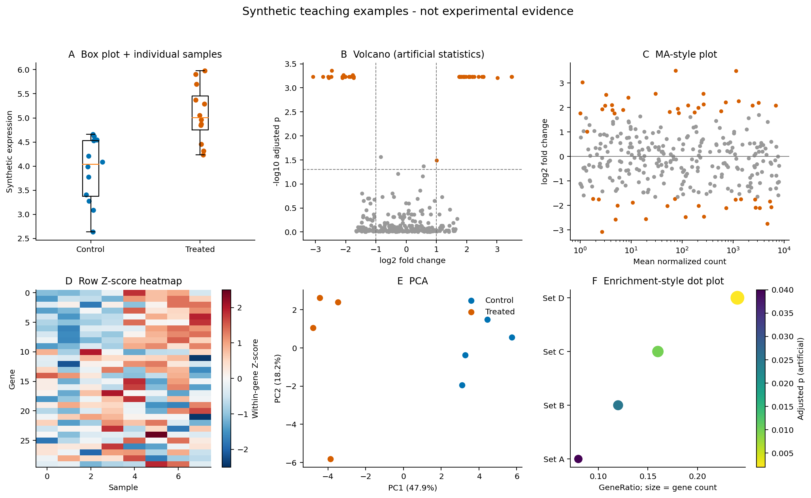
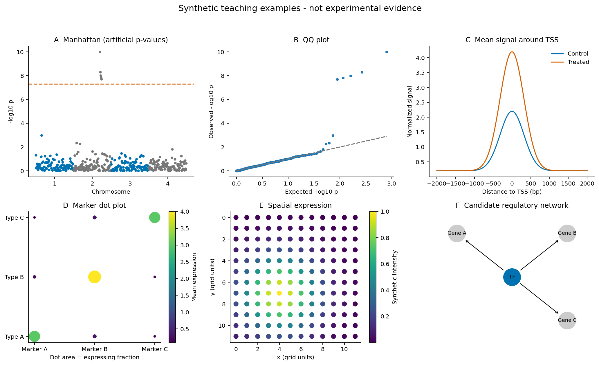
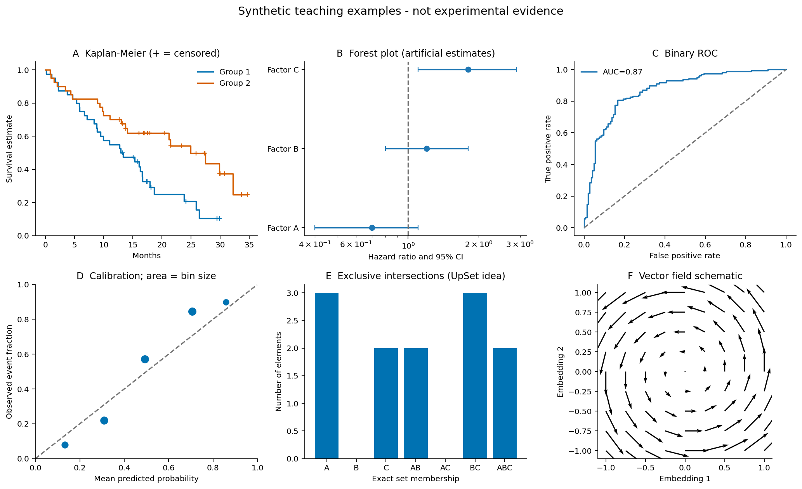

# 第20章 生信图表百科 —— 每种图怎么看、怎么画、表达什么

> 论文里满眼的图看不懂？这一章帮你建立"图感"
> 每种图都会讲清楚：长什么样 → 表达什么含义 → 怎么读图 → 用什么工具画。

读图先问四件事：**一个点/格子代表谁，横纵坐标是什么，颜色和大小编码什么，图里的证据支持哪一级结论。** 先认清这些，再看显著性星号和配色。

本章保留按用途组织的图表百科，并提供 [plot_gallery.py](../examples/plot_gallery.py ':ignore')，用 NumPy/Matplotlib 生成 18 个常见图形或原理示意，输出三组 PNG/PDF。所有数据都是人工构造，p 值和部分效应也用于演示，不能当成真实实验分析。

在项目根目录的独立 Python 教学环境运行：

```bash
python -m pip install numpy matplotlib
python examples/plot_gallery.py
```

默认结果保存到 `results/figures/`，包含三张图版的 PNG/PDF、人工差异表及环境说明。真实 RNA-seq 图请运行[第9章](09-rnaseq.md)的 airway 脚本，单细胞图请运行[第12章](12-scrna.md)的 PBMC3k 脚本。

| 想回答的问题 | 先考虑什么图 |
| --- | --- |
| 各组样本的分布怎样 | 箱线/小提琴 + 原始散点 |
| 哪些基因变化大且证据强 | 火山图 + 完整差异表 |
| 样本整体是否相似 | PCA、样本相关热图 |
| 某类细胞有哪些 marker | Dot Plot + Feature Plot |
| 信号位于组织哪里 | 空间表达图 + 组织图像 |
| 效应大小及不确定性怎样 | 森林图、置信区间 |
| 多个集合怎么重叠 | 少集合用韦恩，多集合用 UpSet |

## 20.1 出版级图表制作规范

### 先把变量和统计单位说清楚

图注中交代物种/组织、比较组、独立样本量、数据尺度、统计方法、误差线和多重检验。一个点若是一名患者，就不要把细胞数写成患者样本量。配对实验可用连线显示同一个体的前后变化。

**SD（标准差）**描述样本离散程度，**SEM（均值标准误）**描述均值估计的不确定性，**置信区间 CI**依模型和方法表达估计范围；它们不能混写。显著性星号要明确对应哪个比较、什么检验和是否校正。

### 尺寸、字体和格式

优先查看目标期刊的具体规范。曲线、文字和少量点的图常适合 PDF/SVG 等矢量格式；组织图像常用 TIFF/PNG，按最终版面尺寸选择像素量。300 dpi 常见于图像要求，但线稿/混合图可能要求更高，不存在所有图片统一一个 dpi 的标准。

缩放到论文实际栏宽后检查最小文字是否可读，基因名和单位是否截断。保存 PDF 时核对字体嵌入；本章脚本设置 TrueType 字体输出，并同时保存 PNG 方便网页阅读。数百万点的矢量图可能过大，可只将点层栅格化，保留文字和坐标轴为矢量。

### 颜色必须有含义

类别用可区分、色盲友好的离散配色；强度用单向渐变，例如 viridis；以零为中心的上调/下调用发散配色，明确零点与范围。RColorBrewer、viridis、ggsci 都能提供选项，但不应因为配色好看而改变数据含义。

多个面板比较同一指标时尽量统一轴和色标。如果每张热图都单独自动缩放，要明确说明，否则微小变化也可能看起来很强。柱长表达量时通常应从零起；散点/折线可按问题选择范围，但必须标明截断或对数轴。

### 拼图与可重复导出

R 可用 cowplot、patchwork，Python 可用 Matplotlib 的 subplots/GridSpec。图中加 A/B/C 面板标记，统一字体、线宽和组别颜色。Illustrator 等适合排版，但不要手工移动数据点或改统计值；分析结果和主图尽量由脚本生成。



上图由配套脚本生成。A 保留每个样本，B/C 展示不同统计视角，D 是行 Z-score，E 标明方差比例，F 的点大小与颜色分别编码两个变量。

## 20.2 基础统计图 —— 通用数据展示

- **20.2.1 柱状图 / 条形图（Bar Plot）**
  - 长什么样：一组矩形柱，高度代表数值大小
  - 表达什么：不同组/类别之间的数值比较
  - 怎么读图：比较柱子高度，注意误差线（标准差 vs 标准误）
  - 常见场景：基因表达量对比（RT-qPCR 验证图）、各组样本数统计
  - 注意事项：Y 轴是否从 0 开始？截断 Y 轴会误导！
  - 工具：ggplot2 `geom_bar()`（按记录计数）/ `geom_col()`（已有数值）, matplotlib `plt.bar()`

- **20.2.2 箱线图（Box Plot）**
  - 长什么样：一个"盒子"加两根"胡须"，可能有离群点
  - 表达什么：数据的分布（中位数、四分位、离群值）
  - 怎么读图：盒子中间线 = 中位数，盒子上下边 = Q1/Q3，常见 Tukey 胡须延伸到距 Q1/Q3 不超过 1.5×IQR 的最远实际观测，超出的点单独绘出
  - 常见场景：不同分组的基因表达水平分布比较
  - 变体：小提琴图（Violin Plot）= 箱线图 + 密度分布
  - 工具：ggplot2 `geom_boxplot()` / `geom_violin()`

- **20.2.3 散点图（Scatter Plot）**
  - 长什么样：坐标平面上的一堆点
  - 表达什么：两个连续变量之间的关系（相关性）
  - 怎么读图：点的分布趋势（正相关/负相关/无关），区分相关系数 r、拟合优度 R² 与 p 值；相关不等于因果
  - 常见场景：基因表达相关性、样本间一致性评估
  - 工具：ggplot2 `geom_point()`, seaborn `sns.scatterplot()`

- **20.2.4 密度图 / 直方图（Density / Histogram）**
  - 长什么样：平滑的曲线（密度）或一组柱状条（直方图）
  - 表达什么：数据的分布形态（正态？双峰？偏态？）
  - 常见场景：测序质量分数分布、基因表达值分布、甲基化 Beta 值分布
  - 工具：ggplot2 `geom_density()` / `geom_histogram()`

- **20.2.5 韦恩图（Venn Diagram）**
  - 长什么样：2-4 个重叠的圆圈
  - 表达什么：多个集合之间的交集与差集
  - 怎么读图：重叠区域 = 共有元素，非重叠 = 特有元素
  - 常见场景：不同比较组的 DEGs 交集、多个 peak 集合的重叠
  - 局限：超过 4 个集合就看不清了 → 用 UpSet 图替代
  - 工具：VennDiagram (R), matplotlib-venn (Python), UpSetR

### 基础图怎么画、怎么选

输入一般是每行一个独立样本的长表，至少有 sample、group、value；配对数据还要保留 donor。先画所有点，再决定是否叠加箱线、小提琴或均值/置信区间。小样本的小提琴形状对带宽很敏感，不宜只展示平滑密度。

配套脚本的图版 `chart_core` A 演示箱线叠加散点。已有汇总值用柱图时注明分母、误差线和样本量。直方图的 bin 数、密度图带宽、散点透明度都会改变视觉，应记录参数。

韦恩图的数字应来自真实集合运算，基因 ID 先统一并去重；每组的检出范围不同，也会改变交集。集合太多时转用 20.10 的 UpSet，不能用圆面积给无法准确表达的数量关系制造精确感。

## 20.3 转录组分析常用图

- **20.3.1 火山图（Volcano Plot）** ⭐ 生信最常见！
  - 长什么样：散点图，X 轴 = log2FC，Y 轴 = -log10(p) 或 -log10(padj)，须明确标注，像火山一样两头翘
  - 表达什么：差异表达分析结果，同时展示变化大小和统计显著性
  - 怎么读图：右上 = 显著上调，左上 = 显著下调，中间 = 不显著；注意阈值线（|log2FC|>1, padj<0.05）
  - 常见场景：DESeq2 / edgeR 差异分析结果展示
  - 工具：EnhancedVolcano (R), ggplot2, matplotlib

- **20.3.2 MA 图（MA Plot）**
  - 长什么样：散点图，X 轴 = 平均表达量（A），Y 轴 = log2FC（M）
  - 表达什么：差异表达结果，重点展示表达量依赖的变化趋势
  - 怎么读图：颜色含义以图例为准，常用于标记显著差异；参考线可能是零线或效应阈值
  - 与火山图区别：MA 图能看出低表达基因的 FC 估计不稳定
  - 工具：DESeq2 `plotMA()`, ggplot2

- **20.3.3 热图（Heatmap）** ⭐ 出镜率极高
  - 长什么样：矩阵格子，颜色深浅表示数值高低
  - 表达什么：基因在不同样本/条件下的表达模式
  - 怎么读图：行 = 基因，列 = 样本，颜色 = 表达水平；注意聚类树（dendrogram）
  - 常见场景：差异基因表达模式、样本聚类、通路活性
  - 关键参数：标准化方式（Z-score by row）、聚类方法、配色（蓝-白-红）
  - 工具：ComplexHeatmap (R, 支持复杂注释), pheatmap (R), seaborn `sns.clustermap()`

- **20.3.4 PCA 图 / 降维散点图**
  - 长什么样：二维散点图，每个点代表一个样本
  - 表达什么：样本之间的整体相似性（降维后的全局关系）
  - 怎么读图：距离近 = 表达模式相似，结合供体、组别与批次检查聚集和离群；未分开也可能是效应较弱
  - 常见场景：RNA-seq 质控、批次效应检查、处理分组验证
  - 注意：看 PC1/PC2 解释了多少方差；比例高不等于分析更正确，主要变化也可能是批次
  - 工具：ggplot2, prcomp() (R), sklearn.decomposition.PCA (Python)

- **20.3.5 富集分析气泡图（Dot Plot / Bubble Plot）**
  - 长什么样：散点图，但点的大小和颜色都有含义
  - 表达什么：富集分析结果（GO/KEGG 通路）
  - 怎么读图：Y 轴 = 通路名称，X 轴 = GeneRatio 或 Rich Factor，点大小 = 基因数，颜色常为校正 p 值；分母定义需注明
  - 常见场景：GO/KEGG 富集结果展示
  - 工具：clusterProfiler `dotplot()`, ggplot2

- **20.3.6 富集分析柱状图（Bar Plot for Enrichment）**
  - 长什么样：水平柱状图，按 p 值排序
  - 表达什么：显著富集的通路/功能类别
  - 怎么读图：柱子长度 = -log10(p-value) 或基因计数，颜色区分上调/下调
  - 工具：clusterProfiler `barplot()`

- **20.3.7 GSEA 富集山峰图（Enrichment Score Plot）**
  - 长什么样：上半部分是一条上升后下降的曲线（像山峰），下面有竖线标记基因位置
  - 表达什么：某基因集在排序列表中的富集趋势
  - 怎么读图：曲线相对零点的最大绝对偏离对应 ES，可能为正或负；结合排序方向读 leading-edge（主要贡献子集）
  - 常见场景：GSEA 分析核心结果图
  - 工具：enrichplot `gseaplot2()`（配合 clusterProfiler 结果）, fgsea

- **20.3.8 共表达网络图（WGCNA Module Plot）**
  - 长什么样：模块-表型关联热图 + 模块内基因网络图
  - 表达什么：基因共表达模块与表型特征的关联
  - 怎么读图：颜色 = 相关系数，数值 = p 值，显著模块值得深入分析
  - 工具：WGCNA (R)

### 一组 RNA-seq 图应当怎么搭配

按“样本质量 → 效应与证据 → 生物学概括”的顺序组织：PCA/样本关系图，MA/火山图，候选基因热图，富集图。热图先说明用的是 VST、logCPM 还是其他量；行 Z-score 只显示同一个基因在各样本的相对变化，不能跨行比较绝对表达量。

图版 `chart_core` B–F 给出绘图形式；真实结果可由第 9 章脚本生成 PCA、MA 与火山图。使用 GSEA 时配合排序方向、NES、FDR 和 leading-edge，不能只截取漂亮山峰。WGCNA 的模块关联热图要标注表型编码、有效样本数和多重比较策略，Hub 不等于驱动。

MA 图与 Bland–Altman 图都可采用“差值/比值对平均”的结构，但目的、尺度和统计解释不同，不应简单当作同名图。

## 20.4 基因组与变异分析图

- **20.4.1 Manhattan 图**
  - 长什么样：X 轴 = 染色体位置，Y 轴 = -log10(p-value)，像城市天际线
  - 表达什么：全基因组上哪些位点与表型的关联信号突出；不是测序变异检测的质量图
  - 怎么读图：常见人类 GWAS 阈值 p=5×10⁻⁸ 对应 Y≈7.30；其他设计须采用匹配的多重检验阈值
  - 常见场景：GWAS 结果、eQTL 分析
  - 工具：qqman (R), manhattan_plot (Python)

- **20.4.2 QQ 图（Quantile-Quantile Plot）**
  - 长什么样：散点图，对角线上方有偏离
  - 表达什么：观测 p 值 vs 期望 p 值，评估统计膨胀
  - 怎么读图：点贴近对角线 = 分布正常，整体上抬可能涉及混杂、模型失配或多基因性；需进一步诊断，不能只靠 λ 下结论
  - 常见场景：GWAS 质控、差异分析结果评估
  - 工具：qqman (R)

- **20.4.3 突变全景图（Oncoplot / Waterfall Plot）**
  - 长什么样：矩阵图，行 = 基因，列 = 样本，彩色方块 = 突变类型
  - 表达什么：多个样本中多个基因的突变模式全景
  - 怎么读图：每列是一个病人，颜色编码突变类型（错义/无义/移码等），侧边柱 = 突变频率
  - 常见场景：TCGA 肿瘤突变分析
  - 工具：maftools `oncoplot()` (R)

- **20.4.4 突变特征谱图（Mutational Signature Profile）**
  - 长什么样：96 种三碱基替换类型的柱状图
  - 表达什么：突变产生的机制特征（紫外线/吸烟/DNA修复缺陷等）
  - 怎么读图：每个颜色块 = 一种替换类型（C>A, C>G, C>T 等），特征谱形状对应 COSMIC 数据库已知特征
  - 工具：maftools, SigProfiler, MutationalPatterns (R)

- **20.4.5 拷贝数变异图（CNV Plot）**
  - 长什么样：沿染色体位置的折线/散点，红色 = 扩增，蓝色 = 缺失
  - 表达什么：基因组上的拷贝数变化
  - 怎么读图：若 Y 轴为相对参考的 log2 ratio，正负表示相对增减；绝对拷贝数还依赖纯度、倍性与参考
  - 工具：CNVkit, GISTIC2, inferCNV (单细胞)

- **20.4.6 Lollipop 图（突变位点棒棒糖图）**
  - 长什么样：蛋白质结构域示意图上方有"棒棒糖"标记突变位点
  - 表达什么：突变在蛋白质上的位置和频率
  - 怎么读图：棒棒糖高度 = 突变频率，颜色 = 突变类型，底部色块 = 蛋白域
  - 常见场景：展示某基因热点突变（如 TP53, EGFR, KRAS）
  - 工具：maftools `lollipopPlot()`, trackViewer (R)

### 变异图的输入与核查

Manhattan/QQ 输入应有位点坐标和经过适当模型得到的 p 值；染色体按自然顺序排，不要变成 1、10、11、2。QQ 的期望分布是零假设下的参照，大量真实关联也会产生偏离。

Oncoplot 需要样本、基因及变异分类；显式保留“检测过但无合格变异”的样本，才能得到正确频率分母。Lollipop 需要匹配的转录本/蛋白位置；不要把基因组坐标直接画在蛋白长度上。CNV 图标明参考、数值尺度、分段和纯度/倍性处理；突变特征还要说明计数、拟合方法与不确定性。



图版 A/B 的 p 值为人工构造；C 是平均信号，D 点大小表示检出比例，E 使用真实网格坐标而非 UMAP，F 箭头只是候选关系示意。

## 20.5 表观基因组分析图

- **20.5.1 Peak 信号热图与 Profile 图**
  - 长什么样：热图（每行一个峰/基因，列 = 位置窗口）+ 上方的平均信号曲线
  - 表达什么：ChIP-seq/ATAC-seq 信号在特定区域的分布模式
  - 怎么读图：信号集中在 TSS？基因体内？增强子处？比较不同样本的信号强度
  - 工具：deepTools `computeMatrix` + `plotHeatmap` / `plotProfile`

- **20.5.2 基因组浏览器轨道图（Genome Browser Track）**
  - 长什么样：多轨道叠放的水平图，每轨是一种信号
  - 表达什么：某个基因组区域上多种信号的叠加展示（表达+ChIP+ATAC+甲基化）
  - 怎么读图：对齐观察同一区域不同数据层的信号变化
  - 工具：IGV, UCSC Genome Browser, pyGenomeTracks, Gviz (R)

- **20.5.3 甲基化密度图 / Beta 值分布图**
  - 长什么样：密度曲线，X 轴 = 甲基化水平 (0~1)
  - 表达什么：全基因组甲基化水平的分布
  - 怎么读图：分布与组织、测量平台和位点选择有关；不能单凭双峰或中间态判断肿瘤
  - 工具：ggplot2, methylKit (R)

- **20.5.4 Motif Logo 图（Sequence Logo）**
  - 长什么样：一串堆叠的字母（A/T/G/C），字母高度不同
  - 表达什么：转录因子结合位点的序列偏好
  - 怎么读图：先看纵轴是概率还是信息量；常见信息量 logo 中，总高度表示该位置保守程度，字母高度还依赖频率
  - 常见场景：ChIP-seq peak 中心的 motif 分析结果
  - 工具：HOMER, MEME, ggseqlogo (R)

### 表观组图的制作顺序

先从匹配参考的 BAM/位点结果生成规范化轨道，再围绕同一组区域提取信号矩阵。deepTools 的热图与 profile 应使用相同的区域顺序、窗口、链方向和尺度。平均曲线可能掩盖“少数峰很强、多数峰不变”，所以常把 profile 与逐区域热图一起展示。

浏览器轨道先固定基因组版本、窗口和每条轨道的 Y 轴，必要时加基因注释。Motif logo 需要位置频率/权重矩阵或对齐序列，并说明背景校正；甲基化分布要先过滤合适覆盖，保留无覆盖为缺失。

## 20.6 单细胞分析图

- **20.6.1 UMAP / t-SNE 降维图** ⭐ 单细胞标志性图
  - 长什么样：二维平面上的彩色点云，形成多个"岛屿"
  - 表达什么：单个细胞在高维空间中的相似关系投影到二维
  - 怎么读图：同色/同簇 = 相似细胞群，不同岛可能代表类型、状态或技术差异，需结合 marker 判断；颜色可标注聚类、样本、基因表达
  - 注意事项：距离远不一定代表差异大！只反映局部邻近关系
  - 变体：按基因表达着色（Feature Plot）、按样本着色、按分组着色
  - 工具：Seurat `DimPlot()` / `FeaturePlot()`, Scanpy `sc.pl.umap()`

- **20.6.2 Dot Plot（细胞类型 marker 气泡图）**
  - 长什么样：网格图，行 = 基因，列 = 细胞群，每个交叉点是一个圆
  - 表达什么：某个基因在各细胞群中的表达比例和表达强度
  - 怎么读图：圆的大小 = 表达该基因的细胞百分比，颜色深浅 = 平均表达量
  - 常见场景：展示各细胞群的 marker 基因
  - 工具：Seurat `DotPlot()`, Scanpy `sc.pl.dotplot()`

- **20.6.3 Feature Plot（基因表达投影图）**
  - 长什么样：UMAP 上每个细胞按某基因表达量着色（灰→红）
  - 表达什么：特定基因在降维表示中的表达分布；UMAP 位置不是组织空间坐标
  - 怎么读图：较高表达集中于某些簇，可提供候选 marker 线索；需与其他群和多个标记比较
  - 工具：Seurat `FeaturePlot()`, Scanpy `sc.pl.umap(color='gene')`

- **20.6.4 轨迹分析图（Trajectory / Pseudotime）**
  - 长什么样：UMAP 上叠加了箭头/渐变色标注分化方向
  - 表达什么：模型推断的潜在状态路径，需验证谱系和起点
  - 怎么读图：颜色代表相对拟时序；早晚依根节点和模型定义，箭头不是直接追踪结果
  - 工具：Monocle3, scVelo (RNA Velocity 流场图)

- **20.6.5 RNA Velocity 流场图**
  - 长什么样：UMAP 上叠加了小箭头，像"风向图"
  - 表达什么：基于动力学假设推测的局部表达状态变化方向
  - 怎么读图：箭头方向 = 预测的分化方向，箭头密度还受绘图网格和平滑设置影响，不能据此直接判断分化活跃
  - 工具：scVelo `scv.pl.velocity_embedding_stream()`

- **20.6.6 细胞通讯图（Cell Communication）**
  - 长什么样：弦图/气泡矩阵/圈图，连线代表细胞群间的通讯
  - 表达什么：哪些细胞群之间存在模型支持的候选配体-受体关系
  - 怎么读图：线的粗细 = 通讯强度，颜色 = 信号通路类型
  - 工具：CellChat `netVisual_chord_cell()`, CellPhoneDB

- **20.6.7 inferCNV 热图（单细胞 CNV 推断）**
  - 长什么样：行 = 细胞，列 = 染色体位置，颜色 = 与拷贝变化相关的表达信号或模型估计，需看图例
  - 表达什么：从单细胞表达数据推断的染色体级别拷贝数异常
  - 怎么读图：常见红/蓝表示相对参考表达偏高/偏低，可辅助推测大尺度拷贝变化；需结合其他证据判断肿瘤身份
  - 工具：inferCNV, CopyKAT

- **20.6.8 SCENIC regulon 活性热图**
  - 长什么样：热图，行 = regulon（转录因子），列 = 细胞/细胞群
  - 表达什么：各转录因子调控模块在不同细胞群中的活性
  - 怎么读图：高分表示相关 regulon 基因集合的模型活性较高，不是直接测得 TF 蛋白活性
  - 工具：pySCENIC, SCENIC (R)

### 单细胞图怎么连起来读

先看按样本/批次着色的 UMAP，再看聚类和多个 marker 的 Feature/Dot Plot，最后赋予有证据支持的标签。多个 Feature Plot 比较时，留意每个基因/样本是否独立缩放；一个小群颜色很亮可能只说明相对高，不表示绝对表达强。

Dot Plot 应说明颜色为原始均值、对数均值还是按基因标准化值，点面积的分母是该群多少细胞。图版 `chart_omics` D 是人工例子，第 12 章脚本会生成真实 PBMC marker 图。

轨迹、velocity、通讯、CNV 和 regulon 都是带假设的推断结果；在图注说明输入、参考和模型。二维箭头、线条粗细和热图红蓝不能代替验证。条件间比较要保留供体信息，不能只拿几万细胞得出的极小 p 值当作很多患者的证据。

## 20.7 空间转录组分析图

- **20.7.1 空间基因表达图（Spatial Feature Plot）**
  - 长什么样：组织切片上叠加的基因表达着色图
  - 表达什么：某个基因在组织空间上的表达分布
  - 怎么读图：颜色强弱 = 表达高低，观察表达是否有空间模式/区域特异性
  - 工具：Seurat `SpatialFeaturePlot()`, Scanpy + Squidpy

- **20.7.2 空间聚类图（Spatial Cluster Map）**
  - 长什么样：组织切片上按聚类标签着色
  - 表达什么：组织上不同区域的转录组分区
  - 怎么读图：同色区域 = 转录组相似的空间域，与组织解剖结构对比
  - 工具：BayesSpace, SpaGCN, STAGATE

- **20.7.3 反卷积饼图（Deconvolution Pie Chart）**
  - 长什么样：每个 Visium spot 上放一个小饼图
  - 表达什么：每个空间位点上不同细胞类型的混合比例
  - 怎么读图：先确认输出为丰度、权重还是映射分数；只有定义允许且规范化明确时，扇区才能解释为比例
  - 工具：Cell2location, RCTD, SPOTlight, Tangram

### 空间图要先对齐地址

表达矩阵的行、空间坐标和切片 ID 必须一一对应；确认 x/y、像素/微米、缩放比例和 y 轴方向。跨切片同一基因的颜色尽量统一，并报告色标截断，避免每幅图自动归一化后“都一样亮”。

空间聚类图与组织图像并排看；反卷积输出按其实际单位画丰度热图或合法定义下的组成图。太密的饼图可改成每类型一张地图。第 13 章的离线例子演示“同样的值，位置不同”；真实分析需保留组织图像和物理尺度。

## 20.8 临床与生存分析图

- **20.8.1 Kaplan-Meier 生存曲线** ⭐ 临床生信必备
  - 长什么样：阶梯状递减曲线，通常两条或多条
  - 表达什么：不同分组的生存概率随时间的变化
  - 怎么读图：曲线越高 = 生存概率越好；两组分离越远 = 差异越大；看 p 值（log-rank）和中位生存时间
  - 下方数字：Number at risk 表
  - 工具：survminer `ggsurvplot()` (R)

- **20.8.2 森林图（Forest Plot）**
  - 长什么样：水平方向的点+置信区间线，有一条竖直参考线（HR=1）
  - 表达什么：Cox 回归各变量的风险比（HR）及 95% 置信区间
  - 怎么读图：HR>1/<1 分别提示较高/较低事件瞬时风险；结合 CI、参照组、单位和比例风险假设，不直接解释成因果
  - 常见场景：多因素 Cox 分析结果展示
  - 工具：forestplot (R), survminer

- **20.8.3 列线图（Nomogram）**
  - 长什么样：多行刻度尺叠放，底部是生存概率刻度
  - 表达什么：基于多个变量预测个体的生存概率
  - 怎么读图：每个变量的值对应一个得分（最上面的 Points），加总得到总分 → 对应下方的预测概率
  - 工具：rms `nomogram()` (R)

- **20.8.4 校准曲线（Calibration Curve）**
  - 长什么样：散点+折线图，对角虚线为理想线
  - 表达什么：预后模型预测值 vs 实际观测值的一致性
  - 怎么读图：曲线越贴近 45° 对角线 = 模型校准越好
  - 工具：rms `calibrate()` (R)

- **20.8.5 ROC 曲线（Receiver Operating Characteristic）**
  - 长什么样：从左下到右上的弧线，对角虚线为随机线
  - 表达什么：分类模型在不同阈值下的灵敏度 vs 特异度
  - 怎么读图：曲线越靠近左上角越好，AUC 面积越大越好（0.5 = 随机, 1.0 = 完美）
  - 常见场景：诊断标志物评估、预后模型评估
  - 工具：pROC (R), sklearn.metrics (Python)

- **20.8.6 决策曲线（DCA, Decision Curve Analysis）**
  - 长什么样：多条曲线，X 轴 = 阈值概率，Y 轴 = 净获益
  - 表达什么：在不同阈值概率下，使用模型比"全治"或"全不治"的净获益
  - 怎么读图：模型曲线在某阈值范围内高于参考线 = 在该范围、模型与效用假设下估计净获益更高，还需外部验证
  - 工具：rmda / dcurves (R)

### 生存与预测图，最容易遗漏什么

KM 曲线标明终点、时间单位、删失标记、风险人数和置信区间；曲线未降到 0.5 时不能硬报中位生存时间。后半段只剩很少受试者，曲线看起来分离也可能很不稳定。多变量 Cox 的森林图要写清参照组和连续变量单位，检查比例风险假设。

普通二分类 ROC 需要真实标签与连续评分，不能只输入预测的 0/1 标签；有删失的生存预测需使用合适的时间依赖方法。AUC 衡量排序区分度，校准图检查概率是否可信，两者不能互相替代。列线图只是已拟合模型的展示方式，不是额外验证。

校准和 DCA 应考虑独立验证或合理重采样，生存终点要正确处理删失。数据划分、特征筛选和阈值选择均应避免泄漏；在同一训练数据挑最佳截断值再展示极显著 KM，往往过于乐观。



图版 A 演示含删失的 KM 点估计，未绘置信区间/风险人数，正式图应补全；B 使用人工 HR/CI；C/D 为人工二分类数据；E 演示精确交集计数，还不是完整 UpSet 点阵；F 是人工向量场，未运行任何扰动模型。

## 20.9 网络与关系图

- **20.9.1 蛋白互作网络图（PPI Network）**
  - 长什么样：节点（蛋白）+ 连线（互作关系）的网络图
  - 表达什么：蛋白质之间的物理或功能互作关系
  - 怎么读图：节点大小 = 连接度（度中心性），颜色 = 模块/功能分类，线粗 = 互作置信度
  - 常见场景：Hub 基因鉴定、功能模块发现
  - 工具：Cytoscape, STRING 在线可视化, igraph (R), networkx (Python)

- **20.9.2 基因调控网络图（GRN Visualization）**
  - 长什么样：有向网络图，箭头从转录因子指向靶基因
  - 表达什么：转录因子-靶基因的调控关系
  - 怎么读图：箭头 = 调控方向，红/蓝 = 激活/抑制，线粗 = 调控强度
  - 工具：Cytoscape, CellOracle 可视化模块

- **20.9.3 ceRNA 网络图**
  - 长什么样：三角形/多层网络（miRNA → mRNA → lncRNA/circRNA）
  - 表达什么：竞争性内源 RNA 调控关系
  - 怎么读图：miRNA 居中，两侧连接 mRNA 和 ceRNA
  - 工具：Cytoscape

### 网络图的线究竟代表什么

先准备节点表和边表，边表至少说明来源、方向、类型和权重。STRING 的功能关联并不都等于直接物理结合；GRN 的箭头可能是模型假设的方向，只有方法明确支持时才标注激活/抑制；ceRNA 网络须保留关联与实验支持的区别。

用 Cytoscape、igraph 或 networkx 布局时保存参数/随机种子。中心位置由布局算法决定，不表示天然重要；节点度高也可能因为数据库对它研究较多。先筛选与问题相关的子网络，避免上千条线形成不可读的“毛线团”。

## 20.10 特殊图表

- **20.10.1 圈图（Circos Plot）**
  - 长什么样：圆环上排列染色体，中间用弧线连接
  - 表达什么：染色体间/内的结构变异、融合基因、多组学数据叠加
  - 怎么读图：外环 = 染色体，内环 = 各种数据层（CNV/表达/突变），连线 = 染色体间关系
  - 工具：Circos (Perl), circlize (R)

- **20.10.2 UpSet 图**
  - 长什么样：点-线矩阵 + 柱状图的组合
  - 表达什么：多个集合的交集（替代韦恩图，可处理 5+ 集合）
  - 怎么读图：底部点阵 = 参与交集的集合，上方柱子 = 该交集的元素数量
  - 工具：UpSetR (R), upsetplot (Python)

- **20.10.3 桑基图 / 冲积图（Sankey / Alluvial Plot）**
  - 长什么样：左右多列，彩色条带在列间流动
  - 表达什么：分类变量之间的流向和比例关系
  - 常见场景：细胞类型在不同条件/时间点的组成变化、样本分组对应关系
  - 工具：ggalluvial (R), plotly (Python)

- **20.10.4 弦图（Chord Diagram）**
  - 长什么样：圆环上的节点之间用弧线连接，弧线宽度不同
  - 表达什么：节点间的关系或流量，是否有方向需看编码和图例
  - 常见场景：细胞通讯、染色体交互、通路间的基因共享
  - 工具：circlize `chordDiagram()` (R)

- **20.10.5 瀑布图（Waterfall Plot）**
  - 长什么样：按大小排序的柱状图，从正到负像瀑布
  - 表达什么：每个样本的某个指标（肿瘤缩小百分比、突变负荷等）
  - 常见场景：临床试验疗效展示、TCGA 样本突变负荷排序
  - 工具：ggplot2, maftools

- **20.10.6 河流图 / 鱼图（Riverplot / Fishplot）**
  - 长什么样：随时间变化的彩色流带，像河流分叉
  - 表达什么：肿瘤克隆演化的时间动态
  - 怎么读图：每种颜色 = 一个克隆，宽度 = 细胞比例，分叉表示模型/图中假设的克隆分支，不是直接观察到新克隆产生
  - 工具：fishplot (R), timescape (R)

- **20.10.7 蜂群图（Beeswarm / Swarm Plot）**
  - 长什么样：像散开的散点图，每个点不重叠
  - 表达什么：与箱线图类似但展示每个数据点
  - 常见场景：样本量较少时展示分布（替代箱线图）
  - 工具：ggbeeswarm (R), seaborn `sns.swarmplot()`

### 特殊图的输入和制作要点

| 图 | 先准备什么 | 容易出错的地方 |
| --- | --- | --- |
| Circos | 染色体长度、区间、信号和连接表 | 不同参考坐标混用，连接太多无法辨认 |
| UpSet | 统一 ID 后的成员集合 | 区分“恰好属于这些集合”和“至少属于这些集合” |
| Sankey/Alluvial | 同一对象跨类别的对应关系或明确定义的流量 | 不同时间采样的独立细胞不能直接当追踪到的转化 |
| Chord | 节点对的关系权重 | 是否有方向、对称矩阵是否重复计数 |
| Waterfall | 每样本一个效应量及基线 | 肿瘤百分比变化分母、排序和缺失样本 |
| Fishplot | 有证据支持的克隆比例和演化关系 | 推断关系不能包装成直接观察 |
| Beeswarm | 每个独立观测的组别与数值 | 密集点的抖动只为排布，不能改真实数值 |

图版 `chart_clinical` E 用普通柱图展示精确集合交集，便于理解 UpSet 下方点阵的含义；正式多集合图可用 upsetplot/UpSetR 等。上图中的 AB 只计同时属于 A、B 而不属于 C 的元素，与简单 A∩B 的总数不同。

## 20.11 虚拟扰动分析图

- **20.11.1 扰动向量场（Perturbation Vector Field）**
  - 长什么样：UMAP 上叠加箭头，展示 KO 后细胞状态的位移方向
  - 表达什么：虚拟基因敲除后细胞命运的预测变化
  - 怎么读图：箭头方向 = 预测的细胞状态改变方向，箭头长度受预测值、嵌入与绘图缩放共同影响，不能直接当作真实命运变化量
  - 工具：CellOracle 对应版本的 perturbation simulation 与 quiver 绘图接口

- **20.11.2 蛋白活性热图（Protein Activity Heatmap）**
  - 长什么样：行 = 蛋白/转录因子，列 = 样本/细胞群，颜色 = 推断的活性
  - 表达什么：VIPER 推断的蛋白活性在不同条件下的差异
  - 工具：VIPER / decoupleR

### 虚拟扰动图如何报告

箭头应与原始嵌入、对照/扰动定义、预测模型和随机化检验一起说明。相同模型在不同嵌入缩放下，箭头长度可能不可直接比较。真实实验扰动数据可提供验证，但训练和验证不能使用同一批数据却称作独立预测。

活性热图必须标注 VIPER、decoupleR 或其他具体方法、先验网络、分数单位和标准化方式。它展示的是从表达和先验推断的活性，不是蛋白质组直接定量。图版中的旋转向量场仅解释箭头读法。

## 20.12 从结果表到可交付图：最后检查一遍

1. 确认数值来源和单位，缺失值没有被偷偷改成零，样本顺序与分组一致。
2. 选择适合问题的图，注明转换、归一化、阈值和筛选规则。
3. 核对坐标、图例、颜色、分母、独立样本量、误差线及统计方法。
4. 保存绘图脚本、输入表、随机种子、环境及矢量/位图文件。
5. 用最终展示尺寸阅读，检查文本是否截断、颜色是否可区分、重要信息是否被遮挡。

配套脚本的核心结构是：读/生成表 → 计算用于绘图的变量 → `subplots` 建面板 → `scatter/imshow/step/errorbar` 等画图 → 添加标签与图例 → `savefig` 输出。替换真实数据时，首先核对其列名和统计意义，不要只替换数组长度。

练习：行 Z-score 热图某基因更红，是否表示比另一基因绝对表达高？不能。PCA 前两轴解释率更高是否一定更好？不一定。AUC 高能否证明预测概率校准好？不能。理解这些问题，比记住一组默认配色更重要。

参考：[Matplotlib](https://matplotlib.org/stable/)、[ggplot2](https://ggplot2.tidyverse.org/)、[ComplexHeatmap](https://jokergoo.github.io/ComplexHeatmap-reference/book/)、[enrichplot](https://bioconductor.org/packages/enrichplot/)、[survminer](https://rpkgs.datanovia.com/survminer/)、[Cytoscape](https://cytoscape.org/)。
